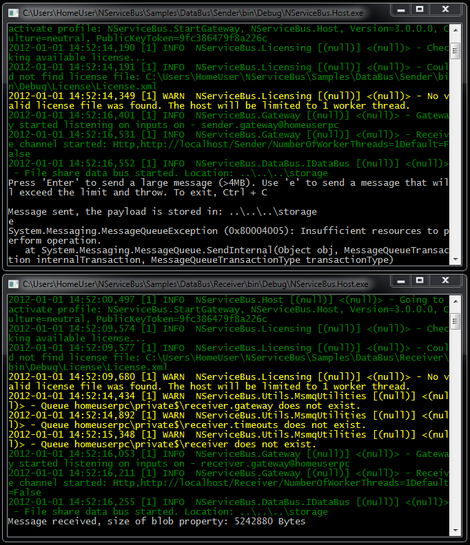

<!--
title: "Attachments / DataBus Sample"
tags: ""
summary: "Large chunks of data such as images or video files can be transported using NServiceBus V3 data bus."
-->

Large chunks of data such as images or video files can be transported using NServiceBus V3 data bus.

You only have to put an attribute over your large property and NServiceBus takes care of the rest. This is particularly important when running in cloud environments where limits on message size are usually much lower than on-premise.

To see how to send and receive attachments in NServiceBus, open the
[Databus sample](https://github.com/NServiceBus/NServiceBus/tree/3.3.8/Samples/DataBus)
:

1.  Run the solution. Two console applications start.
2.  Find the Sender application by looking for the one with "Sender" in
    its path and pressing Enter in the window to send a message.

     You have just sent a message that is larger than the allowed 4MB by
    MSMQ. NServiceBus sends it as an attachment, allowing it to reach
    the Receiver application.
3.  Click 'e' and Enter.

     A message larger than the allowed 4MB is sent, but this time
    without utilizing the NServiceBus attachments mechanism. An
    exception is thrown at the "Sender" application as shown below:



Let's look at the code.


Code walk-through
-----------------

This sample contains three projects:

-   Receiver.Messages – A class library containing the sample messages.
    Only one of the message types utilizes the NServiceBus DataBus.
-   Sender – A class library, hosted by NServiceBus host. It is
    responsible for sending the large messages.
-   Receiver – A class library, hosted by NServiceBus host. It is
    responsible for receiving the large messages being sent from the
    server.

### Receiver.Messages project

Let's look at the Receiver.Messages project, at the two defined messages. We start with the large one that is not utilizing the DataBus mechanism. The message is a simple byte array command:


```C#
public class AnotherMessageWithLargePayload : ICommand
{
    public byte[]LargeBlob { get; set; }
}
```

 The other message utilizes the DataBus mechanism:


```C#
[TimeToBeReceived("00:01:00")]
public class MessageWithLargePayload : ICommand
{
    public string SomeProperty { get; set; }
    public DataBusProperty<byte[]> LargeBlob { get; set; }
}
```

 DataBusProperty<byte[]> is an NServiceBus data type that instructs NServiceBus to treat the LargeBlob property as an attachment. It is not transported in the NServiceBus normal flow.

When sending a message using the NServiceBus Message attachments mechanism, the message's payload resides in the folder. In addition, a
'signaling' message is sent to the Receiving endpoint.

The TimeToBeReceived attribute instructs the NServiceBus framework that it is allowed to clean the MSMQ message after one minute if it was not received by the receiver. The message payload remains in the Storage folder after the MSMQ message is cleaned by the NServiceBus framework.

Following is an example of the signaling message that is sent to the receiving endpoint:


```XML
<?xml version="1.0"?>
<Messages xmlns:xsi="<a data-cke-saved-href="http://www.w3.org/2001/XMLSchema-instance" href="http://www.w3.org/2001/XMLSchema-instance" target="_blank">http://www.w3.org/2001/XMLSchema-instance</a>" 
        xmlns:xsd="<a data-cke-saved-href="http://www.w3.org/2001/XMLSchema" href="http://www.w3.org/2001/XMLSchema" target="_blank">http://www.w3.org/2001/XMLSchema</a>" 
        xmlns="http://tempuri.net/Receiver.Messages">
  <MessageWithLargePayload>
    <SomeProperty>This message contains a large blob that will be sent on the data bus</SomeProperty>
    <LargeBlob>
        <Key>2012-01-02_10\f83e3641-4588-4cb2-8c4f-4077342ed32e</Key>
        <HasValue>true</HasValue>
    </LargeBlob>
  </MessageWithLargePayload>
</Messages>
```


### Sender project

The Sender project shows how to configure NServiceBus to handle attachments, starting with the Sender project app.config:


```XML
<MessageEndpointMappings>
    <add Messages="Receiver.Messages" Endpoint="Receiver" />
</MessageEndpointMappings>
```

 The sender instructs NServiceBus to send messages with Namespace equal to Receiver.Messages to the Receiver endpoint.

Open EndpointConfig in the Sender project:


```C#
public class EndpointConfig : IConfigureThisEndpoint, AsA_Client, IWantCustomInitialization
{
    public static string BasePath = "..\\..\\..\\storage";
    public void Init()
    {
    	Configure.With()
	  .AutofacBuilder()
          .FileShareDataBus(BasePath)
          .UnicastBus();
    }
}

```

 This code instructs NServiceBus to use the FileSharing transport mechanism for the attachment. The message payload is stored in the file system, in the Storage folder.

<p> The following sender project code sends the MessageWithLargePayload message, utilizing the NServiceBus attachment mechanism:


```C#
bus.Send<MessageWithLargePayload>(m =>
{
    m.SomeProperty = "This message contains a large blob that will be sent on the data bus";
    m.LargeBlob = new DataBusProperty<byte[]>(new byte[1024 * 1024 * 5]);//5MB
});
```


</p>
<p> The following Sender project code sends the AnotherMessageWithLargePayload message without utilizing the NServiceBus attachment mechanism:


```C#
bus.Send<AnotherMessageWithLargePayload>(m =>
{
    m.LargeBlob = new byte[1024 * 1024 * 5];//5MB
});
```


</p> In both cases, a 5MB message is sent, but in the MessageWithLargePayload it goes through, while AnotherMessageWithLargePayload fails.

Go to the Receiver project to see the receiving application.

### Receiver project

The endpoint configuration code of Receiver is identical to that of the Sender. Open EndpointConfig in the Sender project:


```C#
public class EndpointConfig : IConfigureThisEndpoint, AsA_Server, IWantCustomInitialization
{
    public static string BasePath = "..\\..\\..\\storage";
    public void Init()
    {
    	Configure.With()
    	  .NinjectBuilder()
	  .FileShareDataBus(BasePath)
	  .UnicastBus();
    }
}

```

 Following is the receiving message handler:


```C#
public class MessageWithLargePayloadHandler : IHandleMessages<MessageWithLargePayload>
{
    public void Handle(MessageWithLargePayload message)
    {
        Console.WriteLine("Message received, size of blob property: " + message.LargeBlob.Value.Length + " Bytes");
    }
}
```

 Next steps
----------

If you are not familiar with [Unobtrusive messaging](unobtrusive-mode-messages.md) mode, read the documentation or see the [working sample](unobtrusive-sample.md) .

