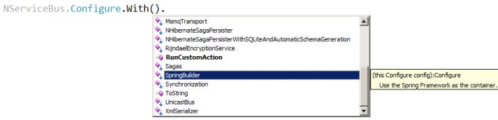
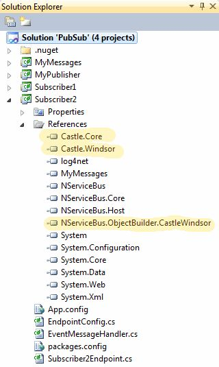
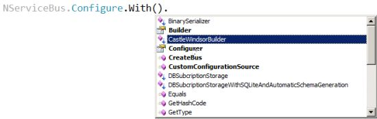

<!--
title: "Containers"
tags: ""
summary: "NServiceBus is a container-agnostic framework. While autofac is merged into its core, it is easily replaced by any other container."
-->

NServiceBus is a container-agnostic framework. While autofac is merged into its core, it is easily replaced by any other container.

With five other container technologies available out of the box, including Castle, Ninject, Spring, StructureMap, and Unity, you don't have to change to something new.

NServiceBus automatically registers all its components as well as user-implemented handlers and sagas so that all instancing modes and wiring are done correctly by default and without error.

Standard container usage
------------------------

When hosting NServiceBus in your own process, you will see the following:

When using the generic host, AutofacObjectBuilder is configured by default.

Other containers available
--------------------------

In the binary distribution of NServiceBus, you can find adapters to the other containers available under /binaries/containers. There is a directory for each one: autofac, castle, ninject, spring, structuremap, and unity. Each directory contains an assembly for the adapter that connects it to NServiceBus. This assembly is called NServiceBus.ObjectBuilder.SpecificContainerName.dll. If you want to use one of these containers, add a reference to the relevant adapter assembly for the specific container.

Using a different container
---------------------------

In the Pub/Sub sample you can see how a different container is used by looking at the Subscriber2 project. In this project, the Castle container is used, adding references to all the Castle assemblies as well as the adapter assembl,y NServiceBus.ObjectBuilder.CastleWindsor.dll.

This sample showns that different processes can use different containers.

While it is unlikely that a single team will want to use multiple containers within a given solution, if multiple teams are working together each with its own preferred container NServiceBus does not require that all processes use the same container. This is also useful when using NServiceBus to integrate with legacy code that may have been built using an older or different container, or even when talking to an application that was designed without a container.

After all the necessary references have been added, an additional extension method becomes available on the NServiceBus.Configure class, as shown:

Using a different container with the host
-----------------------------------------

When using the generic host that comes with NServiceBus, changing the container is very similar to the process described above and is illustrated in the "Containers and Dependency Injection" section of the generic host page.

Plugging in your own container
------------------------------

To use a container other than the ones that come with NServiceBus, implement the IContainer interface in the NServiceBus.ObjectBuilder.Common namespace from the NServiceBus.Core dll.

    public interface IContainer : IDisposable
    {
        object Build(Type typeToBuild);
        IContainer BuildChildContainer();
        IEnumerable BuildAll(Type typeToBuild);
        void Configure(Type component, DependencyLifecycle dependencyLifecycle);
        void Configure(Func component, DependencyLifecycle dependencyLifecycle); //In V4
        void ConfigureProperty(Type component, string property, object value);
        void RegisterSingleton(Type lookupType, object instance);
        bool HasComponent(Type componentType);
        void Release(object instance); // in V4
    }

To tell NServiceBus to use your container, create an extension method to the NServiceBus.Configure class and pass an instance of your object, as follows:

    namespace NServiceBus
    {
        public static class YourExtensionMethodHolder
        {
            public static Configure NameOfYourContainer(this Configure config)
            {
                ConfigureCommon.With(config, new YourClassImplementingIContainer());

                return config;
            }
        }
    }

It is recommended to put this class in the NServiceBus namespace so that users of this container won't need to add another 'using' directive for them to see the option of using your container when intellisense shows them what's available after NServiceBus.Configure.With().

