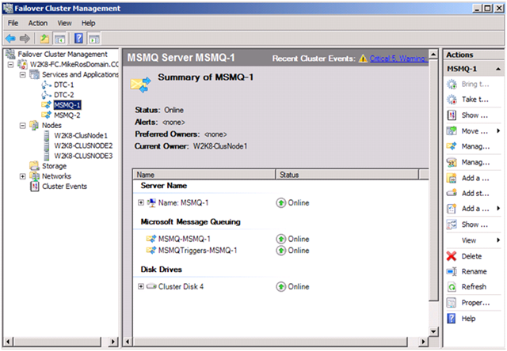

NServiceBus is designed for scalability and reliability, but to take advantage of these features, you need to deploy it in a Windows Failover Cluster. Unfortunately, information on how to do this effectively is, as yet, incomplete and scattered. This article describes the process for deploying NServiceBus in a failover cluster. This article does not cover the generic setup of a failover cluster. There are other, better resources for that, such as [Creating a Cluster in Windows Server 2008](http://blogs.msdn.com/b/clustering/archive/2008/01/18/7151154.aspx). The focus here is the setup related to NServiceBus.

Planning your infrastructure
----------------------------

A simple setup for scalability and reliability includes at least two servers in a failover cluster, and two additional servers for worker endpoints. The failover cluster servers run the following:

-   A Distributor process for each logical message queue.
-   A `TimeoutManager`, if you require one to support Sagas.
-   Commander application(s):
    -   A Commander application contains one or more classes that
        implement IWantToRunAtStartup and coordinate tasks among the
        other handlers, doing very little work itself but sending
        messages to start other processes based on timers or other
        stimuli.
    -   It is important to set up these applications during the Start
        method and tear them down during the Stop method, as the Start
        method is called when the service starts, and the Stop method is
        called when the service stops (and is transferred to the other
        cluster node).
    -   The Commander application can also have message handlers of its
        own, usually to subscribe to events published from other
        endpoints in the service as a kind of feedback loop to control
        overall processing flow.


The two other servers are worker nodes, and contain only endpoints with simple message handlers. The endpoints request work from the clustered distributors, do the work, and then ask for more.


Setting up the clustered service
--------------------------------

While technically it shouldn't matter from which clustered server you set up, generally it is more reliable to set up everything from whichever server currently holds the Quorum disk. Find the server that has it (it moves around when the server holding it restarts), and open up Failover Cluster Management under Administrative Tools.

Set up a clustered DTC access point:

1.  Right click Services and Applications and select Configure a Service or Application.
2.  Go past the intro screen, select Distributed Transaction Coordinator (DTC) and click Next.
3.  Follow the wizard, assigning a DNS name for the clustered DTC (e.g., ClusterNameDTC), IP address, and storage.
4.  When finished, you should get a service with the DTC icon.

Configure DTC for NServiceBus:

1.  On each server, in Administrative Tools - Component Services, expand
    Component Services - Computers - My Computer - Distributed
    Transaction Coordinator.
2.  For the Local DTC, if the clustered DTC is on the current node, you
    will see a Clustered DTCs folder with your clustered DTC name inside
    it.
3.  For both instances (so three times counting each node and the
    clustered instance), right-click, select Properties, and switch to
    the Security tab.
4.  At the very least, check "Network DTC Access" and "Allow Outbound."
5.  Optionally, check "Allow Remote Clients" and "Allow Inbound."

Set up a MSMQ Cluster Group. Cluster group is a group of resources that have a unique DNS name and can be addressed externally like a computer.

-   In order to create a cluster group up in Windows 2003, you would
    create a "cluster group" in the admin
-   In Windows 2008, you would create a "cluster service or application"
-   In Windows 2012, you would create a "cluster role"

For more information, see
[http://technet.microsoft.com/<wbr>en-us/library/cc753575.aspx](http://technet.microsoft.com/en-us/library/cc753575.aspx)

For NServiceBus endpoint destination, we address the queues by the MSMQ cluster group's name, where we will later add all the rest of our clustered resources. In non-cluster terms, we typically add the machine name to address the queue, i.e. queue@MachineName. In cluster terms we address it by queue@MSMQ Network name.

In Failover Cluster Management, from the server with Quorum:

1.  Right click Services and Applications and select Configure a Service
    or Application.
2.  Skip the intro, and select Message Queuing.
3.  Finish the wizard, configuring the MSMQ Network Name, IP address,
    and storage.

This should give you a clustered MSMQ instance. Click the instance under Services and Applications to see the summary, which contains the Server Name, Storage, and MSMQ instance. Right click the MSMQ instance, select Properties, and the Dependencies tab. Make sure that it contains dependencies for the MSMQ Network Name AND IP Address AND Storage.

View the MSMQ MMC snap-in by right clicking the MSMQ cluster in the left pane and selecting Manage MSMQ, which opens the Computer Management tool geared toward the clustered instance.

Go to MSMQ by expanding Services and Applications - Message Queuing.

Keep in mind that this only seems to work if you're viewing Failover Cluster Management from the server where the MSMQ Network Name currently resides. If you are on Server A and you try to manage MSMQ on a MSMQ Network residing on Server B, you won't see Message Queuing in the Computer Management window.

Try swapping the MSMQ Network Name back and forth between nodes a few times. It's best to make sure that everything is working properly now before continuing.

More about MSMQ Network Name
----------------------------

The "cluster name" is a Network Name created for the cluster as part of the core Cluster Group - a group created by default for each cluster. The core cluster group is different than the MSMQ cluster group and it has a Different network name. One of the most common confusions while using MSMQ on a cluster is using the Cluster Name in the client instead of the MSMQ Network Name.



In this picture:

-   The Cluster Name is W2K8-FC (you can see that in the upper left
    corner of the picture)
-   The MSMQ cluster group's name is MSMQ-1
-   The MSMQ network name is named MSMQ-1 (this is the first resource in
    the group - under "Name: MSMQ-1"). We don't actually see the MSMQ
    Network Name (DNS Name) in this picture - to see it you would have
    to right click "Name: MSMQ-1" and select "Properties". You will see
    something like (Note - this was taken from another resource):


NOTE: Under "DNS Name" you will find the MSMQ DNS Name, which may or may not be "MSMQ-1".

Installing the clustered services
---------------------------------

Before you can cluster the NServiceBus.Host.exe processes, you need to install them as services on all clustered nodes.

Copy the Distributor binary as many times as you have logical queues, and then configure each one as described in the [NServiceBus Distributor](load-balancing-with-the-distributor.md) page. To keep everything straight, the queues are named according to the following convention:

-   Distributor Data Bus: ProjectName.QueueName
-   Distributor Control Bus: ProjectName.QueueName.Distributor.Control
-   Distributor Storage Queue: ProjectName.QueueName.Distributor.Storage

**A review of how the distributor works:** Other endpoints send messages to the queue specified by the Distributor Data Bus, where they accumulate if no worker is running. When a worker comes online, it sends a ReadyMessage to the queue specified by the Distributor Control Bus. If there is work to be done, the distributor sends an item from the Data Bus to the endpoint's local input queue, otherwise, it files it in the Distributor Storage Queue so that when work does come in, the distributor knows who is ready to process it.

Using this naming convention, all of your applications' queues are grouped together, and all of the queues for a logical QueueName are also grouped together in alphabetical order.

Install each distributor from the command line:


```C#
NServiceBus.Host.exe
/install
/serviceName:Distributor.ProjectName.QueueName
/displayName:Distributor.ProjectName.QueueName
/description:Distributor.ProjectName.QueueName
/userName:DOMAIN\us
/password:thepassword
NServiceBus.Production NServiceBus.Distributor
```

 It's easier to set the service name, display name, and description to be the same. It helps when trying to start and stop things from a NET START/STOP command and when viewing them in the multiple graphical tools. Starting each one with Distributor puts them all together alphabetically in the Services MMC snap-in.

Don't forget the "NServiceBus.Production" at the end, which sets the profile for the NServiceBus generic host, as described in the [Generic Host page](the-nservicebus-host.md) and the "NServiceBus.Distributor" which sets up the host in distributor mode.

Do not try starting the services. If you do, they will run in the scope of the local server node, and will attempt to create their queues there.

Now, add each distributor to the cluster:

1.  Right-click your MSMQ cluster group, and select Add a Resource - \#4
    Generic Service.
2.  Select your distributor service from the list. The services are
    listed in random order but typing "Distributor" will get you to the
    right spot if you named your services as directed above.
3.  Finish the wizard. The service should be added to the cluster group,
    but not activated. Don't activate it yet!
4.  Right click the distributor resource and select Properties.
5.  Now this is where it gets weird. You will eventually check "Use
    Network Name for computer name" and add a dependency, but do not do
    both at the same time! If you do it will complain that it can't
    figure out what the network name is supposed to be because it can't
    find it in the dependency chain, which you told it, but it hasn't
    been saved yet. To get around it, switch to the Dependencies tab and
    add a dependency for the MSMQ instance. From there, it finds
    everything else by looking up the tree. Click Apply to save the
    dependency.
6.  Switch back to the General tab and check the "Use Network Name for
    computer name" checkbox. This tells the application that
    Environment.MachineName should return the cluster name, not the
    cluster node's computer name. Click Apply.
7.  Repeat for your other distributors.

With your distributors installed, you can repeat the same procedure for any Commander applications, if you have them. You may want to skip the Commander application for now, however. It's sometimes easier to get everything else installed first as a stable system that reacts to events but has no stimulus, and then add the Commander application which will get the whole system in motion.

Again, try swapping the cluster back and forth, to make sure it can move freely between the cluster nodes.

​Setting up the workers
-----------------------

Set up your worker processes on both worker servers (not the cluster nodes!) as services, as you did for the distributors. But instead of using NServiceBus.Distributor, use NServiceBus.Worker profile instead.

Configure the workers' UnicastBusConfig sections to point to the distributor's data and control queues as described on the Distributor Page under "[Routing with the Distributor](load-balancing-with-the-distributor.md)".

With your distributors running in the cluster and your worker processes coming online, you should see the Storage queues for each process start to fill up. The more worker threads you have configured, the more messages you can expect to see in each Storage queue.

While in development, your endpoint configurations probably don't have any @ symbols in them, in production you have to change all of them to point to the Data Bus queue on the cluster, i.e., for application MyApp and logical queue MyQueue, your worker config looks like this:


```XML
<?xml version="1.0" encoding="utf-8" ?>
<configuration>
  <configSections>
    <!-- Other sections go here -->
    <section name="MasterNodeConfig" type="NServiceBus.Config.MasterNodeConfig, NServiceBus.Core" />
    <section name="UnicastBusConfig" type="NServiceBus.Config.UnicastBusConfig, NServiceBus.Core"/>
  </configSections>
  <!-- Other config options go here -->
  <MasterNodeConfig Node="MachineWhereDistributorRuns"/>

  <UnicastBusConfig DistributorControlAddress="distributorControlBus@MsmqNetworkName" 
                    DistributorDataAddress="distributorDataBus@MsmqNetworkName">
    <MessageEndpointMappings>
      <!-- regular entries -->
    </MessageEndpointMappings>
  </UnicastBusConfig>

</configuration>

```

 Conclusion
----------

This article shows how to set up a Windows Failover Cluster and two worker node servers to run a scalable, maintainable, and reliable NServiceBus application infrastructure.

-   Scaling up can be achieved by adjusting the number of threads on
    each worker process.
-   Scaling out can be achieved by starting up another server to run
    another worker process connected to the clustered distributor.
-   For maintenance, the worker processes on either worker server can be
    stopped for server maintenance or application updates, while worker
    processes on the other server continue to process messages. All
    clustered resources can be failed over to one node without
    disrupting the system, allowing message processing to continue while
    the other clustered node is available for updates.
-   Reliability is achieved by never requiring that any one component be
    completely shut down.

(This article has some minor updates to the originally written and published article by [David Boike](http://www.make-awesome.com/2010/10/deploying-nservicebus-in-a-windows-failover-cluster/).)

