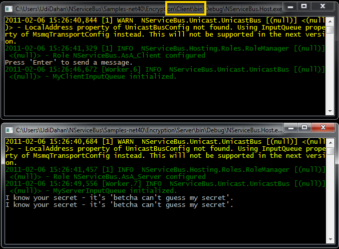
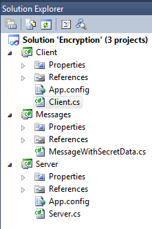

To see how to encrypt message data, open the [Encryption sample](https://github.com/NServiceBus/NServiceBus/tree/3.3.8/Samples/Encryption)
.

1.  Run the solution.
     You should see two console applications start up.
2.  Find the client application by looking for the one with "Client" in its path and press 'Enter' a couple of times in the window.

     The server application outputs "I know your secret - it's 'betcha can't guess my secret'."

Your screen should look like this:



Now let's look at the code.



Code walk-through
-----------------

Starting with the Messages project, open the MessageWithSecretData.cs file and look at the following code:


```C#
public class MessageWithSecretData : IMessage
{
  public WireEncryptedString Secret { get; set; }
}
```

 This class implements the NServiceBus IMessage interface, indicating that it is a message. It contains a single property of the type WireEncryptedString. This is an NServiceBus type specifying that the contents of the property are encrypted on the wire when transmitted by NServiceBus.

How does the encryption happen? Open the Client.cs file in the Client project and see one piece at a time:

The [configuration of the endpoint as a client](the-nservicebus-host.md) :


```C#
public class EndpointConfig : IConfigureThisEndpoint, AsA_Client {}
```

 This code indicates how encryption is configured:


```C#
public class SecurityConfig : IWantCustomInitialization
{
    public void Init()
    {
        NServiceBus.Configure.Instance.RijndaelEncryptionService();
    }
}
```

 A class implements the NServiceBus interface IWantCustomInitialization. This interface allows implementors to hook into the NServiceBus initialization pipeline and specify additional configuration before the endpoint starts. This case accesses the current instance of the NServiceBus configuration via "NServiceBus.Configure.Instance" and then specifies RijndaelEncryptionService. Read background information on the
[Rijndael algorithm](http://en.wikipedia.org/wiki/Advanced_Encryption_Standard) .

The rest of the file shows that you can set the contents of the encrypted property just like any other property, and then use the bus to send the message. Read about [sending messages](how-do-i-send-a-message.md) and
[here](http://support.nservicebus.com/customer/portal/articles/862387-how-do-i-specify-to-which-destination-a-message-will-be-sent-) too.

Look at the app.config file in the client project. There is an additional configuration section for the Rijndael encryption service:


```XML
<configSections>
	<section name="RijndaelEncryptionServiceConfig" 
             type="NServiceBus.Config.RijndaelEncryptionServiceConfig, NServiceBus.Core"/>
</configSections>

<RijndaelEncryptionServiceConfig Key="gdDbqRpqdRbTs3mhdZh9qCaDaxJXl+e6"/>
  
```

 The key is used to encrypt all data in properties of type WireEncryptedString.

**IMPORTANT** : The key specified must be the same in the configuration of all processes that are communicating encrypted information, both on the sending and on the receiving sides. Open the app.config file of the server project and verify that the key is the same.

Now stop the server process and click 'Enter' one more time in the client process.

Go to the server queue (called "MyServerInputQueue") and examine the message in it. Read how to do this in the
[FAQ](how-can-i-see-the-queues-and-messages-on-a-machine.md) . Your message should look like this:


```XML
<?xml version="1.0" ?>
<Messages xmlns:xsi="http://www.w3.org/2001/XMLSchema-instance"
          xmlns:xsd="http://www.w3.org/2001/XMLSchema" 
          xmlns="http://tempuri.net/Messages">
  <MessageWithSecretData>
    <Secret>
      <EncryptedValue>
         <EncryptedBase64Value>+eeBont5Lzlre4cxDi8QT/M6EbAGxTerniqywbpLBVA=</EncryptedBase64Value>
         <Base64Iv>u8n8ds0Ssf/AdJCxpOG7AQ==</Base64Iv>
      </EncryptedValue>
    </Secret>
  </MessageWithSecretData>
</Messages>
```

The data in the property is encrypted, but the rest of the message is clear text. This keeps the performance impact of encryption as low as possible.

Finally, keep in mind that the security is only as strong as the keys; if the key is exposed, then an attacker can decipher the information. As such, you may not want to have your encryption keys stored on the client (if deployed remotely) or even on a web server in the DMZ. Also, you may want to change the keys used by all processes simultaneously, by overriding the source of configuration for [the RijndaelEncryptionService](customizing-nservicebus-configuration.md) .

