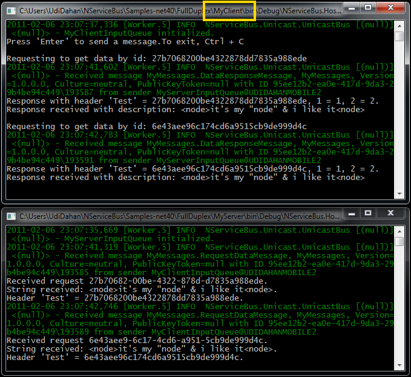

To see full-duplex, request/response communication, open the [Full Duplex sample](https://github.com/NServiceBus/NServiceBus/tree/3.3.8/Samples/FullDuplex)
.

Run the solution. Two console applications should start up. Find the client application by looking for the one with "Client" in its path and click Enter a couple of times in the window. Your screen should look like this:




Code walk-through
-----------------

Look at the Messages.cs file in the MyMessages project:


```C#
namespace MyMessages
{
  public class RequestDataMessage : IMessage
  {
    public Guid DataId { get; set; }
    public string String { get; set; }
  }
  
  public class DataResponseMessage : IMessage
  {
    public Guid DataId { get; set; }
    public string String { get; set; }
  }
}
```

 The two classes here implement the NServiceBus IMessage interface, indicating that they are messages. The only thing these classes have are properties, each with both get and set access. The RequestDataMessage is sent from the client to the server, and the DataResponseMessage replies from the server to the client.

In the references of the MyClient and MyServer projects, you can see that both reference the MyMessages project. This is quite common when building smaller systems. In larger systems, it is recommended to keep the messages project in a solution separate from both client and server, which reference a compiled DLL of the messages project instead.

In the EndpointConfig.cs file in the MyClient project is code instructing the NServiceBus.Host.exe (referenced by the MyClient project) to configure the endpoint using the defaults for clients:


```C#
public class EndpointConfig : IConfigureThisEndpoint, AsA_Client {}
```

 For more information about the host process, see the ["Built-in Configurations" section](the-nservicebus-host.md) .

Open the ClientEndpoint.cs file in the MyClient project and find a class that implements IWantToRunAtStartup. NServiceBus invokes the Run method for implementers of this interface when the endpoint starts up. Look at the Run method:


```C#
public class ClientEndpoint : IWantToRunAtStartup
{
  public IBus Bus { get; set; }

  public void Run()
  {
    Console.WriteLine("Press 'Enter' to send a message.To exit, Ctrl + C");

    while (Console.ReadLine() != null)
    {
        Guid g = Guid.NewGuid();

        Console.WriteLine("==========================================================================");
        Console.WriteLine("Requesting to get data by id: {0}", g.ToString("N"));

        Bus.OutgoingHeaders["Test"] = g.ToString("N");

        var watch = new Stopwatch();
        watch.Start();
        Bus.Send<RequestDataMessage>(m =>
                                         {
                                             m.DataId = g;
                                             m.String = "<node>it's my \"node\" & i like it<node>";
                                         })
            .Register<int>(i => 
                {
                    Console.WriteLine("==========================================================================");
                    Console.WriteLine(
                        "Response with header 'Test' = {0}, 1 = {1}, 2 = {2}.",
                        Bus.CurrentMessageContext.Headers["Test"],
                        Bus.CurrentMessageContext.Headers["1"],
                        Bus.CurrentMessageContext.Headers["2"]);
                });

        watch.Stop();

        Console.WriteLine("Elapsed time: {0}", watch.ElapsedMilliseconds);
      }
  }

  public void Stop()
  {
  }
}
```

 This code performs the following action every time the 'Enter' key is pressed:

1.  A new Guid is created and then set in the outgoing headers of the
    bus under the "Test" key.
2.  All headers in the outgoing headers are appended to all messages
    sent from that point on. You will see how to access these headers in
    the receiving code shortly.
3.  The bus sends a RequestDataMessage whose DataId property is set to
    the same Guid, and whose String property is set to an XML fragment.
4.  A callback is registered and invoked when a response arrives to the
    request sent. In the callback, the values of several headers are
    written to the console.

Open the app.config file of the MyClient project, and look at the UnicastBusConfig section:


```XML
<UnicastBusConfig ForwardReceivedMessagesTo="audit">
  <MessageEndpointMappings>
    <add Messages="MyMessages" Endpoint="MyServer"/>
  </MessageEndpointMappings>
</UnicastBusConfig>
```

 The bus is mapped from message types to an endpoint address. In this case, all the classes that implement the IMessage interface from the MyMessages assembly are mapped to the endpoint called MyServer. This means that when the client code calls Bus.Send<requestdatamessage>, the bus knows that that message needs to be sent to the MyServer endpoint.

The NServiceBus framework or the user determine the MyServer endpoint name (similar to the MyClient endpoint name). This sample does not explicitly change the endpoint name, so the NServiceBus framework does it using standard convention.

Read [how to change the endpoint name](how-to-specify-your-input-queue-name.md) .

This sample also shows how to use an audit queue. In this case, the ForwardReceivedMessagesTo attributes instruct NServiceBus to forward all successfully received messages (on the client endpoint) to the audit endpoint.

When a RequestDataMessage arrives in the server queue, the bus dispatches it to the message handler found in the RequestDataMessageHandler.cs file in the MyServer project. The bus knows which classes to call, based on the interface they implement.


```C#
public class RequestDataMessageHandler : IHandleMessages<RequestDataMessage>
```

 At start up, the bus scans all assemblies and builds a dictionary indicating which classes handle which messages. So when a given message arrives in a queue, the bus knows which class to invoke.

The Handle method of this class contains this:


```C#
var response = Bus.CreateInstance<DataResponseMessage>(m => 
                { 
                    m.DataId = message.DataId;
                    m.String = message.String;
                });

```

 Here, the bus creates an instance of the DataResponseMessage class rather than just newing up the class. This technique is useful primarily when using interfaces for messages (rather than classes) as interfaces can't be instantiated directly. [Read more](how-do-i-define-a-message.md) .

Next, the Test header that was set on the request is copied to the response, and a couple of additional headers are set on the response message.


```C#
response.CopyHeaderFromRequest("Test");
response.SetHeader("1", "1");
response.SetHeader("2", "2");
```

 Finally, the bus replies with the response message, sending it to the InputQueue specified in the MsmqTransportConfig section, in the app.config of the MyClient endpoint.


```C#
 Bus.Reply(response); //Try experimenting with sending multiple responses
```

 In the MyServer project you can see that the UnicastBusConfig section does not map the bus to send messages to "MyClientInputQueue". The bus knows to send the responses to where the message is sent every time the bus sends a message from the queue.

When configuring the routing in the bus, continue with the premise of regular request/response communication such that clients need to know where the server is, but servers do not need to know about clients.

Look back at ClientEndpoint.cs to see that it gets the header information from the handler on the server.

Open DataResponseMessageHandler.cs in the MyClient project and find a class whose signature looks similar to the message handler on the server:


```C#
class DataResponseMessageHandler : IHandleMessages<DataResponseMessage>
```

 In NServiceBus, clients can also have message handlers, just like servers. This is useful for separating the concerns on the client. Put logic that needs the context of the request in the callback code. Put logic that doesn't need that context in a separate message handler class.

To unit-test the server, open the Tests.cs file in the MyServer.Tests project. You should see this:


```C#
[Test]
public void TestHandler()
{
  Test.Initialize();

  var dataId = Guid.NewGuid();
  var str = "hello";
  WireEncryptedString secret = "secret";

  Test.Handler<RequestDataMessageHandler>()
      .SetIncomingHeader("Test", "abc")
      .ExpectReply<DataResponseMessage>(m => m.DataId == dataId && m.String == str)
      .OnMessage<RequestDataMessage>(m => { m.DataId = dataId; m.String = str; });
}
```

 In the references of the MyServer.Tests project, see the NServiceBus.Testing reference in addition to the other NServiceBus assemblies. NServiceBus.Testing provides an additional API to simplify testing NServiceBus code.

To walkthrough the unit testing code, read the [unit testing documentation](unit-testing.md) .

