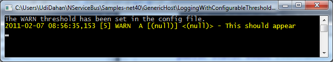

This [sample](https://github.com/Particular/NServiceBus/tree/3.3.8/Samples/GenericHost) demonstrates the various kinds of logging you can use with the NServiceBus Host process. Each project shows a different approach and there are no relationships between them.

Even though NServiceBus uses Log4Net as its logging infrastructure, the default configuration model is different from Log4Net. This default logging configuration model is shown in the LoggingWithConfigurableThreshold project.

## LoggingWithConfigurableThreshold

Open the app.config file. See the Logging configuration section at the top as well as its contents:


```XML
<configSections>
  <section name="Logging" type="NServiceBus.Config.Logging, NServiceBus.Core" />
</configSections>

<Logging Threshold="WARN" />
```

This code instructs NServiceBus to only output logs at a level of WARN or higher. Now look at the EndpointConfig.cs file which makes two calls to the log: at the level of DEBUG, and at the level of WARN. When you run the project (right click, Debug, Start new instance), you only see the entry saying "This should appear", as shown:



The rest of the logging configuration is already in NServiceBus and you can control it using profiles. Read background on [what profiles are and how to use them](profiles-for-nservicebus-host.md) .

## LoggingFromAppConfig

This project tells NServiceBus to use standard log4net configuration.

Open the EndpointConfig.cs file in the LoggingFromAppConfig project:


```C#
public class EndpointConfig : IConfigureThisEndpoint, AsA_Client, IWantCustomLogging
{
    public void Init()
    {
        Console.WriteLine("I'm using the logging configured in the app.config.");
        NServiceBus.SetLoggingLibrary.Log4Net(log4net.Config.XmlConfigurator.Configure);
    }
}
```


NOTE : This class implements the NServiceBus interface `IWantCustomLogging`. It instructs NServiceBus to stop using its standard logging configuration.

The `Init` method contains the call to `SetLoggingLibrary`, which tells NServiceBus to use Log4Net but to use the `XmlConfigurator` from Log4Net. In short, this returns NServiceBus to the standard Log4Net model.

Open the `app.config` file and see the regular Log4Net configuration:


```XML
<configSections>
    <section name="log4net" type="log4net.Config.Log4NetConfigurationSectionHandler,log4net"/>
</configSections>


<log4net debug="false">
  <appender name="console" type="log4net.Appender.ConsoleAppender">
    <layout type="log4net.Layout.PatternLayout">
      <param name="ConversionPattern" value="%d [%t] %-5p %c [%x] <%X{auth}> - %m%n"/>
    </layout>
  </appender>
  <root>
    <level value="DEBUG"/>
    <appender-ref ref="console"/>
  </root>
</log4net>
```

This instructs Log4Net to output to the console using a pattern including data like the date and time, the number of the thread, and more; output calls at a level of DEBUG or higher.

The reason that this technique isn't used by default is that NServiceBus tries to prevent administrators from being able to accidentally change things they shouldn't touch; for example, the pattern. NServiceBus takes things that should be managed by developers and provides an API for them. This is shown in the next example.

## Logging

While you may want to change the logging of a process without having to recompile it, the most common scenario is switching between a few well-defined configurations, known as [profiles](profiles-for-nservicebus-host) in NServiceBus.

When you open up EndpointConfig.cs in the Logging project, this is what you see:


```C#
namespace Logging
{
    /*  In this sample, we want our own production logging while leaving the regular NServiceBus
        configuration of the endpoint so we specify "Logging.MyProductionProfile" on the command line.
     */

    public class Endpoint : IConfigureThisEndpoint {}

    public class MyProductionProfile : Production {}

    public class MyProductionLogging : IConfigureLoggingForProfile<MyProductionProfile>
    {
        public void Configure(IConfigureThisEndpoint specifier)
        {
            Console.WriteLine("I'm going to do my custom logging setup in here using my own profile.");
        }
    }
}
```

Look at the signature of the `MyProductionLogging` class, which implements `IConfigureLoggingForProfile<myproductionprofile>`. This means that when the profile `MyProductionProfile` is specified, NServiceBus invokes this class to configure the logging for the process. In the Configure method, it is likely that you would call NServiceBus.SetLoggingLibrary.Log4Net but pass in some other value.

Read about using [SetLoggingLibrary](logging-in-nservicebus.md) .

Now open the properties of the Logging project, and click the Debug tab:


See the command line arguments for `Logging.MyProductionProfile`, which specify which profile the host should use, via the command line.

## Next steps

If you have not yet done so, read about [profiles](profiles-for-nservicebus-host.md) .

Read more information on [logging](logging-in-nservicebus.md) .

