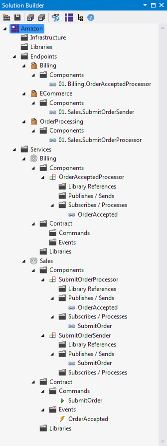

In the [previous section](getting-started-with-nservicebus-using-servicematrix-2.0---fault-tolerance.md) we learnt about fault tolerance. 

Now that we've gone through the basics of NServiceBus communication and configuration, let's move on to publish/subscribe.

Now take things a step forward and add Publish Subscribe to your system.

<a id="Adding Publish/Subscribe Communication" name="Adding Publish/Subscribe Communication"></a> Adding Publish/Subscribe Communication {dir="ltr"}
----------------------------------------------------------------------------------------------------------------------------------------

Now that you have established the basics of NServiceBus communication and configuration, move on to publish/subscribe.

Make your solution look like the image shown.

[](https://particular.blob.core.windows.net/media/Default/images/documentation/ServiceMatrixv2.0GettingStarted/014.png)

Only a few steps are needed to introduce pub/sub:

1.  Add an event

2.  Add a subscriber

3.  Deploy component

1.  Add an event: Right click your 'SubmitOrderProcessor' component and
    select 'Publish Event...'. Type 'OrderAccepted' as the name of the
    event and press Enter.

2.  Add a subscriber: Right click the 'OrderAccepted' event you just
    created (under Sales\> Contact\> Events) and select 'Add
    Subscriber...'. Type 'Billing' as the name of the new service and
    press Enter. 


    [](https://particular.blob.core.windows.net/media/Default/images/documentation/ServiceMatrixv2.0GettingStarted/015.png)


     ​Double click the 'OrderAcceptedProcessor' component in the Billing
    service and look at the code generated to handle the 'OrderAccepted'
    event:

3.  Deploy component: Right click the 'OrderAcceptedProcessor' component
    from the 'Billing' service and click 'Deploy to…'. In the dialog
    box, type 'Billing' in the 'Create New Endpoint…' text box, make
    sure the selected type is NServiceBus Host, and click OK. 


      


     At this point, your solution structure should look like the picture
    shown. 


     ​
    [](https://particular.blob.core.windows.net/media/Default/images/documentation/ServiceMatrixv2.0GettingStarted/017.png)

Views in ServiceMatrix {dir="ltr"}
----------------------

Select an endpoint and click 'ServiceMatrix View' in the Solution Builder Toolbar. Look at the ServiceMatrix Details view, shown.

[](https://particular.blob.core.windows.net/media/Default/images/documentation/ServiceMatrixv2.0GettingStarted/018.png)

You can see three tabs: Components, Commands, and Events. On the top left you can select the aspect you want to use in the master view (you can select Endpoint View, Components View, Messages View, and Libraries View).

[](https://particular.blob.core.windows.net/media/Default/images/documentation/ServiceMatrixv2.0GettingStarted/019.png)

**NOTE** : When you double click an item in the Details view, the Master view changes, depending on the item you selected.

For more details, refer to Udi Dahan's presentation, " [Modelling Distributed Systems With ServiceMatrix](http://vimeo.com/67044479#at=0)
" at NDC 2012.

Diagram view in ServiceMatrix {dir="ltr"}
-----------------------------

Go back to Visual Studio, in Solution Builder right click the 'Amazon' application, and select 'Show Diagram'. You should see visualizations of the message flows, like this:


You can do the same fro each endpoint to get a diagram discribing the endpoint's interaction flow.

To publish the event, double click 'SubmitOrderProcessor' and select
'HandleImplementation'. To navigate to the generated part of the partial class, hit F12 and see the code generated as shown.


```C#
using System;
using NServiceBus;
using Amazon.InternalMessages.Sales;

namespace Amazon.Sales
{
    public partial class SubmitOrderProcessor : IHandleMessages<SubmitOrder>
    {
  	public void Handle(SubmitOrder message)
		{
			this.HandleImplementation(message);

			this.Bus.Publish<Amazon.Contracts.Sales.OrderAccepted>(
                e => { /* set properties on e in here */ });
		}

		partial void HandleImplementation(SubmitOrder message);

		public IBus Bus { get; set; }
    }
}
```

 Compile and run the code. To watch it running, lay out the various consoles and web UI so that you can see it all, then click 'About' a couple of times.


You did it!

You have created a complete working solution for communicating via publish/subscribe messaging.

Additional Exercise {dir="ltr"}
-------------------

Try writing another solution yourself, such that Billing publishes an
'OrderBilled' event, and another service (call it 'Shipping') subscribes to it. If you want, you can create another endpoint to host Shipping or deploy the component to 'OrderProcessing' or 'Billing'.

Also, Shipping subscribes to the 'OrderAccepted' event and deploys the corresponding component to the same endpoint.

Once you're done, run it and check that everything works.

As you see, it's very easy to get started with NServiceBus. You're all set now and can build your own distributed systems with NServiceBus.

Next step
---------

Join the 1500 other developers in our community.

View some [videos](http://particular.net/Videos-and-Presentations) we made for you.

We'd also love to hear your thoughts about NServiceBus: what you like, what you think should be improved... anything.

