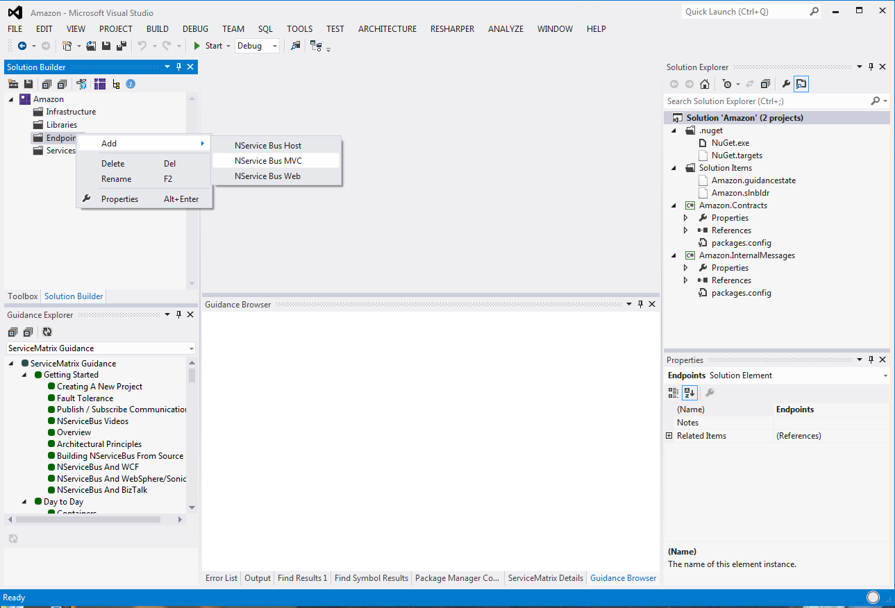
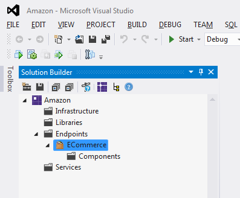
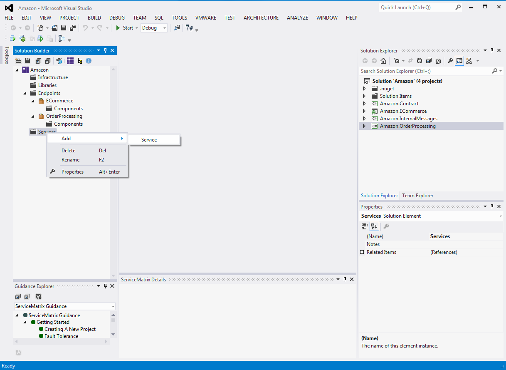
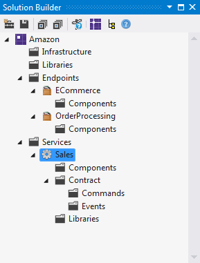
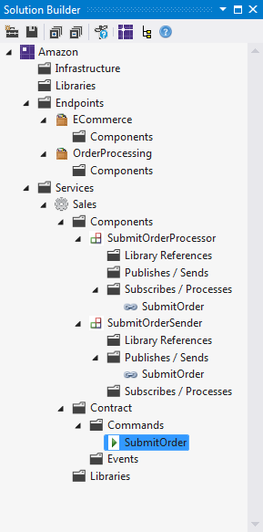
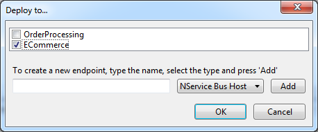
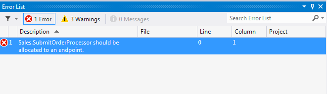
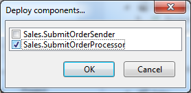
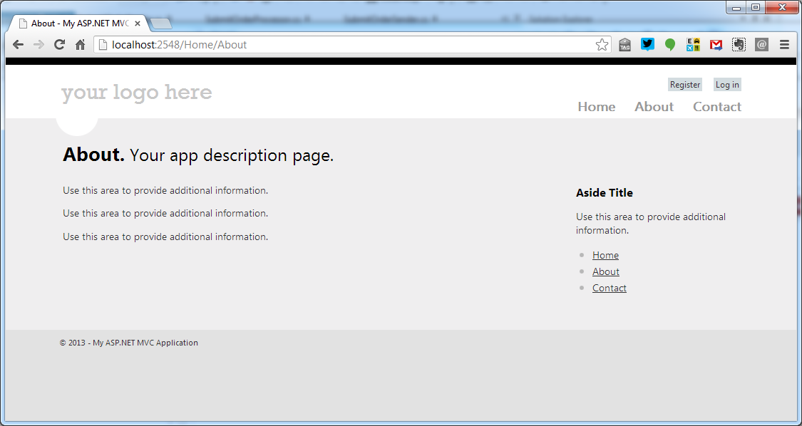
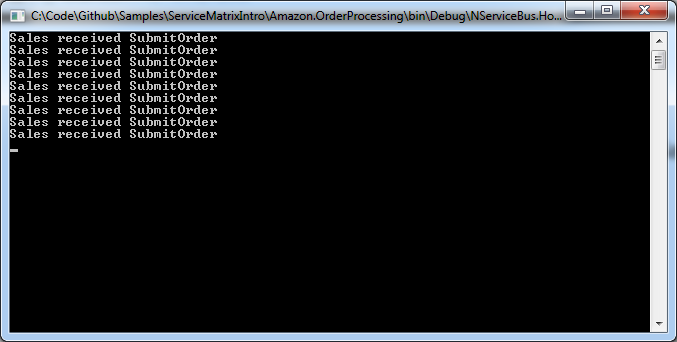

<script type="text/javascript">
$(document).ready(function() {
    $(".fancybox").fancybox();
});
</script> ServiceMatrix v2.0 for Visual Studio 2012 {dir="ltr"}
=========================================

ServiceMatrix is a Visual Studio integrated development environment for developing NServiceBus distributed System.

This step-by-step guide will walk you through the creation of a send-and-receive NServiceBus distributed application using ServiceMatrix v2.0 for Visual Studio 2012, using the following steps:

1.  [Installing ServiceMatrix](#Installing%20ServiceMatrix)
2.  [Creating a new project](#Creating%20a%20new%20project)
3.  [Creating Endpoints](#Creating%20Endpoints)
4.  [Creating Services](#Creating%20Services)
5.  [Deploying Components](#Deploying%20Components)
6.  [Sending a Message](#Sending%20a%20Message)
7.  [Running the Application](#Running%20the%20Application)

The complete solution code can be found
[here](https://github.com/sfarmar/Samples/tree/master/ServiceMatrixIntro)

<a id="Installing ServiceMatrix" name="Installing ServiceMatrix"> </a> Installing ServiceMatrix v2.0 for Visual Studio 2012 {dir="ltr"}
---------------------------------------------------------------------------------------------------------------------------

System requirements:

-   Visual Studio 2010 or Visual Studio 2012

-   ASP.NET MVC 4 (
    [http://www.asp.net/downloads](http://www.asp.net/downloads) )

To install ServiceMatrix:

1.  Download the latest version from
    [http://particular.net/downloads](http://particular.net/downloads)

2.  Run the installer.

**NOTE** : If you have both Visual Studio 2010 and Visual Studio 2012 installed on your machine, you can install ServiceMatrix for one Visual Studio version. This document guides the use of ServiceMatrix v2.0 for Visual Studio 2012.

<a id="Creating a new project" name="Creating a new project"> </a> Creating a new project {dir="ltr"}
-----------------------------------------------------------------------------------------

To get started with ServiceMatrix, create a new project:

1.  In Visual Studio select 'File\> New\> Project' and Select
    'NServiceBus System' under the Visual C\# project type. 


    [](https://particular.blob.core.windows.net/media/Default/images/documentation/ServiceMatrixv2.0GettingStarted/001.png)

2.  In Solution name, type 'Amazon' (or any other name) for the name of
    your application. 

     You'll see that a solution folder has been created for your
    solution, as shown. 


    [](https://particular.blob.core.windows.net/media/Default/images/documentation/ServiceMatrixv2.0GettingStarted/002.png)


     <span style="color: rgb(67, 67, 67);">A number of projects have
    been created for you, as shown in the Solution Explorer pane.</span>


     <span style="color: rgb(67, 67, 67);">The '.nuget' (we use Nuget
    for our dependencies and the '.nuget' folder is there to support
    </span> enabling Package Restore
    <span style="color: rgb(67, 67, 67);"> ) and 'Solution Items'
    folders are part of the ServiceMatrix infrastructure


     The important folders are the 'Contract' and 'InternalMessages'
    projects as they are where all message types are placed:</span>

-   All defined events will be put in the 'Contract' project.

-   All commands will be put in the 'InternalMessages' project. 


     Later you will see how messages from different services are
    partitioned in these projects. 

     Now look at the design environment in Solution Builder. If you
    don't see a docked window in Visual Studio called Solution Builder,
    open it via the View menu. 


    [](https://particular.blob.core.windows.net/media/Default/images/documentation/ServiceMatrixv2.0GettingStarted/003.png)


     <span style="color: rgb(67, 67, 67);">You should see folders in
    Solution Builder called 'Infrastructure', 'Libraries', 'Endpoints',
    and 'Services':</span>

-   Infrastructure is where cross-cutting concerns like authentication
    and auditing are handled.

-   Libraries are units of code that can be reused, including logging
    and data access.

-   Endpoints are where code is deployed as executable processes. They
    can be web applications (both Web Forms and MVC) or NServiceBus
    Hosts (a special kind of Windows Service that allows you to debug it
    as a Console Application).

-   Services are logical containers for code that provide the structure
    for publish/subscribe events and command-processing.Services are
    made of Components which will be shown later.

<a id="Creating Endpoints" name="Creating Endpoints"></a> Creating Endpoints
----------------------------------------------------------------------------

1.  Right click Endpoints, select Add \>NServiceBus ASP.NET MVC, as
    shown. 

     **IMPORTANT** : ASP.NET MVC Endpoints require that ASP.NET MVC be
    installed on the local machine. If you haven't installed ASP MVC on
    your machine, choose a Web Endpoint instead. 


    [](https://particular.blob.core.windows.net/media/Default/images/documentation/ServiceMatrixv2.0GettingStarted/004.png)

2.  Name the endpoint 'ECommerce' (or another name) and the Visual
    Studio project creates it for you. 

     We will examine the generated code in detail later to understand
    how things work behind the scenes. For now, see the Components
    folder that has been created under the 'ECommerce' endpoint, which
    is where the components will be deployed. 


    [](https://particular.blob.core.windows.net/media/Default/images/documentation/ServiceMatrixv2.0GettingStarted/005.png)


     <span style="color: rgb(67, 67, 67);">Components are the units of
    code inside a Service. Components can only send commands to other
    components in the same service but they can subscribe to events that
    are published by components in any service. Components are deployed
    to an Endpoint.</span>

3.  Create another endpoint called 'OrderProcessing' as an 'NServiceBus
    Host.

<a id="Creating Services" name="Creating Services"></a> Creating Services {dir="ltr"}
-------------------------------------------------------------------------

1.  Right click the Services folder in Solution Builder and choose Add,
    as shown. 


    [](https://particular.blob.core.windows.net/media/Default/images/documentation/ServiceMatrixv2.0GettingStarted/006.png)

2.  Name the service 'Sales' and you should see the image shown. ​​ 

     ​
    [](https://particular.blob.core.windows.net/media/Default/images/documentation/ServiceMatrixv2.0GettingStarted/007.png)


     <span style="color: rgb(67, 67, 67);">There isn't currently much to
    see. You might notice that no code has been generated at this point.
    It is only when components are allocated to endpoints that code is
    generated.</span>

3.  Now, right-click 'Commands', select 'Add', and name it
    'SubmitOrder'. 


     Several things happen:

-   A command is created under the 'Commands' folder, as expected.

-   Two components have been created in Sales: a 'Processor' component
    and a 'Sender' component named after the command you created.

-   There is a link to the command under the Subscribes/Process folder
    of the 'Processor' component and a link under the Publishes/Sends
    folder of the 'Sender' component.

4.  <p dir="ltr">
    To open the class file, double click the 'SubmitOrder' command: 


    [](https://particular.blob.core.windows.net/media/Default/images/documentation/ServiceMatrixv2.0GettingStarted/008.png)


     You can add all sorts of properties to your message: strings,
    integers, arrays, dictionaries, etc. Just make sure to provide both
    a get accessor and a set accessor to each property. 

    
```C#
using System;

namespace Amazon.InternalMessages.Sales
{
    public class SubmitOrder
    {
    }
}

```


     Double clicking the components won't open any code just yet as
    their code is only created when they are deployed to an endpoint.
    So, go ahead and deploy.


<a id="Deploying Components" name="Deploying Components"></a> Deploying Components {dir="ltr"}
----------------------------------------------------------------------------------

1.  Right click the 'SubmitOrderSender' component, choose 'Deploy to…',
    and select the 'ECommerce' endpoint from the list. 

     ​  

     If you try to build your solution at this point, you will get an
    error: 

      


     The error tells you that 'Sales.SubmitOrderProcessor' should be
    allocated to an endpoint. 

     This is also due to the fact that the code for the
    'SubmitOrderProcessor' component is not generated yet as we don't
    know in which project it should be put.

2.  To allocate the component to its endpoint, starting at the endpoint,
    right click the Components folder of the 'OrderProcessing' endpoint,
    choose 'Deploy Component...' and then tick the box beside the
    'Sales.SubmitOrderProcessor' component. 

     

3.  Click 'OK'.

4.  Build the solution and see how everything turns out.

5.  <p dir="ltr">
    Now, double click the 'SubmitOrderProcessor': 

     There isn't much here all you need to do is add your logic. 

     You can also F12 on the class to see its counterpart, but there
    isn't much to see there either; just a class that implements
    'IHandleMessages<submitorder>' and has a reference to 'IBus' that
    you can use to send out other messages, publish events, or reply
    with.
    
```C#
using System;
using NServiceBus;
using Amazon.InternalMessages.Sales;

namespace Amazon.Sales
{
    public partial class SubmitOrderProcessor
    {  	
        partial void HandleImplementation(SubmitOrder message)
        {
            // Implement your handler logic here.
            Console.WriteLine("Sales received " + message.GetType().Name);
        }
    }
}
```


<a id="Sending a Message" name="Sending a Message"></a> Sending a Message {dir="ltr"}
-------------------------------------------------------------------------

The last thing to do is make the 'ECommerce' website send a message.

**IMPORTANT** : If you created the ASP MVC application, take the following action; otherwise, skip to the ' **For Regular ASP.NET** ' section.

To send a new SubmitOrdermessage, find the HomeController in the Controllers folder in the Amazon.ECommerce project. In the 'About()' action handler, add 'MvcApplication.Bus.Send(newSubmitOrder()); ' as shown:


```C#
using System;
using System.Collections.Generic;
using System.Linq;
using System.Web;
using System.Web.Mvc;
using Amazon.InternalMessages.Sales;

namespace Amazon.ECommerce.Controllers
{
    public class HomeController : Controller
    {
        public ActionResult Index()
        {
            ViewBag.Message = "Modify this template to jump-start your ASP.NET MVC application.";

            return View();
        }

        public ActionResult About()
        {
            MvcApplication.Bus.Send(new SubmitOrder());

            ViewBag.Message = "Your app description page.";

            return View();
        }

        public ActionResult Contact()
        {
            ViewBag.Message = "Your contact page.";

            return View();
        }
    }
}

```


### For Regular ASP.NET

Make sure the page is in "Design" view. Open Default.aspx and drag a button object from the toolbox onto the page. Double click the button you just added, which opens the code-behind button-click handling method.

In the method, type:


```C#
Global.Bus.Send(new SubmitOrder());

```


<a id="Running the Application" name="Running the Application"></a> Running the Application
-------------------------------------------------------------------------------------------

Now press F5 to debug the application. You should see something similar to the image shown: a new tab in your browser and a console application. If you click "About" in the UI a couple of times, you should see the console application get a message each time.

If you're in a regular ASP.NET web project, you'll see a different image, so just click the button on the form. 

 ​ 



Congratulations! You've just built your first NServiceBus application. Wasn't that easy?

Next steps
----------

The production-time benefits of NServiceBus (let's face it, interprocess communication isn't that exciting and has been done many times before): see how NServiceBus handles [Fault Tolerance](getting-started-with-nservicebus-using-servicematrix-2.0---fault-tolerance.md)
.

