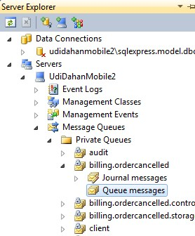
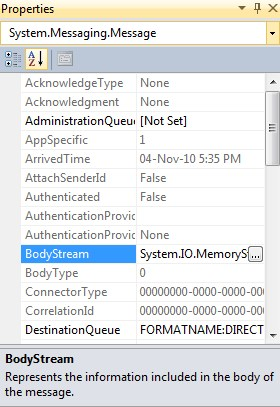
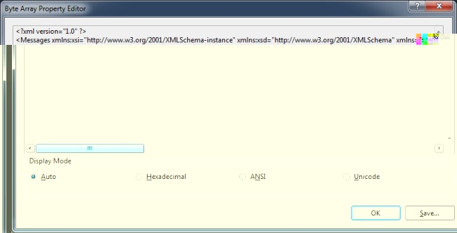

You can see all the queues on the local machine using Server Explorer in Visual Studio:

If there is a message in one of the queues, select it and view the properties of the message in the property panel in Visual Studio
(usually on the bottom right):

The most interesting property is the BodyStream as it allows you to see the contents of the message:

