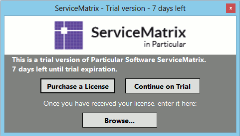
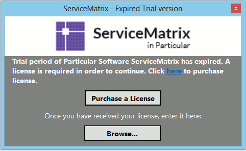
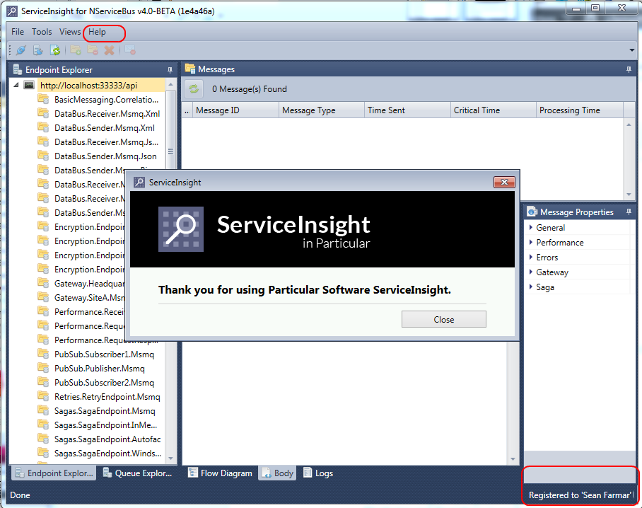

To install your License:

### Go to Help \> Register

### Find the File

When the dialog box opens, browse and find your license file, select it and click Open. The dialog box will then close.

### Verify

Go to Help \> Register and make sure that the license registration has finished.

