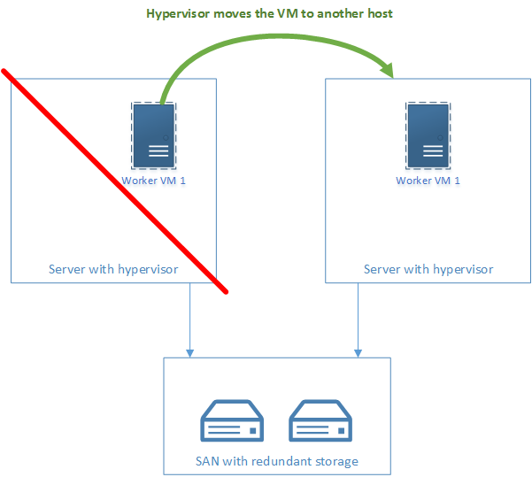

A shown in [How does the distributor work?](load-balancing-with-the-distributor.md#how-does-it-work-) a worker subscribes to its master when it sends a register message to it. From that moment the worker pulls messages from the master.

If a worker goes down messages can get stuck in the master or the worker:

## What happens with the messages stored in the master pointing to the down worker?
The master forwards the message to the worker and relies on the store and forward messaging provided by MSMQ to make sure that it gets there. The message is stored in a outgoing queue and processed when the worker returns to working order.

## What happens with the messages that are already in the worker when the worker breaks?
The solution to a "broken worker" or a "worker node's hard disk going up in smoke" is virtualization, where worker nodes run in a VM whose image is stored redundantly in a SAN. That way any messages stored locally in the worker node end up physically stored in the image on the SAN. So if the host machine fails the hypervisor then brings up the VM that went down on a different host machine and all the messages are then processed.

