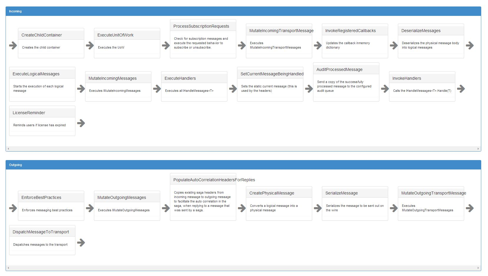

NServiceBus has always had the concept of a pipeline execution order that is executed when a message is received and also when a message is dispatched. NServiceBus v5 makes this pipeline a first level concept and exposes it to the end user.
This now allows the end users to take full control of the incoming and/or the outgoing built-in default functionality.

In NServiceBus v5, there are two explicit pipelines, one for the outgoing messages and one for the incoming messages. Each pipeline is composed of "Steps". The steps have built-in behavior and this behavior can now be easily replaced. A completely new step containing new behavior can also be added to the pipeline. 

The steps in the processing pipeline are dynamic in nature. They are added or removed based on what features are enabled. For example, if an endpoint has Sagas, then the Saga feature will be enabled by default, which in turn adds extra steps to the incoming pipeline to facilitate the handling of sagas. 

##Some of the commonly used steps

Following there is the list of the basic pipeline steps, incoming and outgoing, that are configured by default in a NServiceBus endpoint.

###Incoming Message Pipeline

1. `CreateChildContainer`: NServiceBus heavily relies in IoC to work properly and requires every message to be handled in its own context, to achieve that every message that arrives to an Endpoint will at first create a new child container to generate a new dependency resolution scope; 
* `ExecuteUnitOfWork`: the ExecuteUnitOfWork behavior is responsible to handle the creation of the Unit of Work, that wrap every message execution, whose role is to guarantee the execution of message in a transaction fashion;
* `MutateIncomingTransportMessage`: NServiceBus has the concept of message mutators (link to docu) this behavior is responsible to execute each registered `TransportMessage` mutator;
* `DeserializeMessages`: The DeserializeMessages behavior will deserialize the incoming message from its raw form, the `TransportMessage`, to a well known `class` or `interface` instance using the configured serializer;
* `ExecuteLogicalMessages`: This behavior is responsible to create a dedicated context for each incoming message and to determine if there is any message, other than built-in control messages, that must be executed;
* `MutateIncomingMessages`: Once a TransportMessage has been deserialized is is passed through a new set of message mutators, this behavior is responsible to execute each registered message mutator;
* `LoadHandlers`: The LoadHandlers behavior will load all the handlers registered for the incoming messages and coordinate the execution logic of all the loaded handlers;
* `InvokeHandlers`: This behavior is responsible to physically invoke each message handler;

###Outgoing Message Pipeline

1. `EnforceBestPractices`: this behavior is responsible to ensure that best practices are respected, for example, among all, that the user is not trying to `send` an event or to `publish` a command;
* `MutateOutgoingMessages`: each message, as for incoming messages, is passed to a set of message mutators that have the opportunity to manage and mutate the outgoing message;
* `CreatePhysicalMessage`: this behavior transform the logical messages that need to be sent to the corresponding `TransportMessage`;
* `SerializeMessage`: The SerializeMessage behavior takes care of using the configured serialization engine to serialize the outgoing message;
* `MutateOutgoingTransportMessage`: Before the `TransportMessage` is dispatched to the physical transport all the outgoing message mutators are invoked;
* `DispatchMessageToTransport`: The last step is to dispatch the `TransportMessage` to the underlying transport;

**NOTE**: the execution order of the built-in pipeline steps cannot be changed

##How do you code behaviors?

A message behavior is a class that implements the `IBehavior<TContext>` interface:

```c#
public class SampleBehavior : IBehavior<IncomingContext>
{
    public void Invoke(IncomingContext context, Action next)
    {
    	next();
    }
}
```

In the above code snippet the `SampleBehavior` class implements the `IBehavior<IncomingContext>` interface. This tells the framework to execute this behavior against the incoming pipeline. If you want to create a behavior that needs to be applied to the outgoing pipeline, implement the `IBehavior<OutgoingContext>` instead. 

Sometimes a parent behavior might need to pass in some information relating to a child behavior and vice versa. The context facilitates this passing of data between behaviors in the pipeline steps. The context is simply a dictionary. You can add information to this dictionary in a parent behavior and retrieve this value from a child behavior and vice versa. 

## How does the pipeline execute its steps?

The pipeline is implemented using the [Russian Doll](http://en.wikipedia.org/wiki/Matryoshka_doll) Model. Russian dolls are a series of progressively smaller dolls nested within each other. Similarly, the pipeline model is a series of progressively nested steps within each other. 

At runtime, the pipeline will call the `Invoke` method of each registered behavior passing in as arguments the current message context and an action to invoke the next behavior in the pipeline. It is responsibility of each behavior to invoke the next behavior in the pipeline chain.

##How do you register a behavior?

Once a behavior is created the last step is to register it in the message handling pipeline:

```c#
public class RegisterSampleBehavior : INeedInitialization
{
    public void Init(Configure config)
    {
        config.Pipeline.Register( "step unique id", typeof( SampleBehavior ), "Description of the sample step");
    }
}
```

In the above sample, this behavior now becomes the innermost step of the pipeline. Sometimes the step you are trying to register might be dependent on other steps.To ensure that your step is executed before or after a dependent step, you need to create a custom registration. 

To do this:

1. Create a class that implements `RegisterStep`.
2. Register the step itself in the pipeline.

```c#
class TriggerWarning : RegisterStep
{
    public TriggerWarning()
        : base("TriggerWarning", typeof(TriggerWarningBehavior), "Logs a warning when a message takes too long to process")
    {
    	// Specify where it needs to be invoked in the pipeline
	InsertBefore(WellKnownStep.InvokeHandlers);
    }
}

// Register the new step in the pipeline
class TriggerWarningRegistration : INeedInitialization
{
    public void Init(Configure config)
    {
        config.Pipeline.Register<TriggerWarning>();
    }
}
```

## How to replace a well known behavior?
We can also replace existing behaviors using the `Replace` method and passing as the first argument the `id` of the step we want to replace. For example:
```c#
public class ReplaceExistingBehavior : INeedInitialization
{
    public void Init(Configure config)
    {
        config.Pipeline.Replace( "id of the step to replace", typeof( NewBehaviorType ), "description" )
    }
}
```


##Diagnostics Tool

Because of the dynamic nature of the pipeline, it is hard to visualize what the incoming and outgoing steps are at any given time. To make this easier an instrumentation tool has been added to help visualize the exact steps for an endpoint. 

The following picture summarize the message lifecycle pipeline for an endpoint as depicted by the instrumentation tool:



###How to visualize the pipeline of your endpoint with Diagnostics
<TODO>
