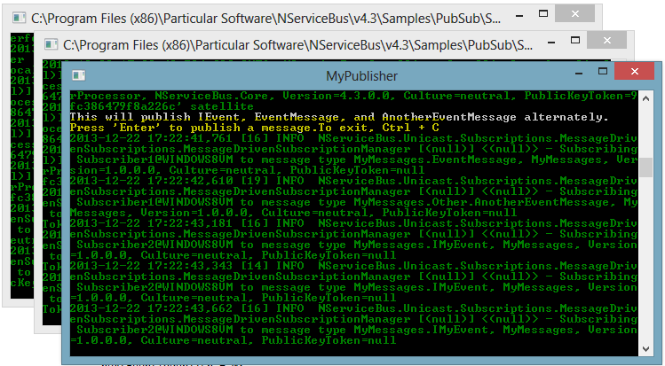
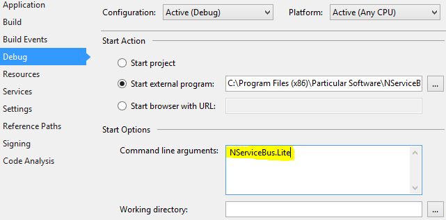

Preparing the Solution
----------------------

Locate the Publish/Subscribe sample in the `NServiceBus\vX.X\Samples` folder within your Particular install directory. Open the `PubSub.sln` solution in Visual Studio and compile the solution.

Outdated references will be repaired if you have [NuGet configured](staying-updated-with-nuget.md) .

Prequisites:

-   The sample is dependent on Log4Net for logging.
-   The sample is dependent on Castle Windsor to demonstrate alternative IOC containers.
-   You must have RavenDB installed as running.

Reviewing the solution
----------------------

Before running the sample, look over the solution structure, the projects, and the classes. The projects `MyPublisher`, `Subscriber1`, and `Subscriber2` are their own processes, even though they look like regular class libraries. They represent endpoints on the bus that will each be [hosted in NServiceBus host process](the-nservicebus-host) and have a reference to the NServiceBus.Host.exe. This host process will run as a console application during development but can be installed as a Windows service at runtime.

### Defining messages

The "MyMessages" project contains the definition of the messages that are sent between the processes. Note that there are no project references to NServiceBus. Open "Messages.cs" to see that it contains a standard `IMyEvent` interface and two different class definitions. This sample uses the [unobtrusive mode message definition](unobtrusive-mode-messages.md) where each endpoint is responsible for designating the message behavior for each of these classes. Look in the `EndpointConfig.cs` file to see how the namespace designates the events in each of the endpoint projects. In this example, everything in a namespace starting with the text "MyMessages" will be defined as an event message.

```C#
class EndpointConfig :  IConfigureThisEndpoint, AsA_Publisher,IWantCustomInitialization
    {
        public void Init()
        {
            Configure.With()
                .DefaultBuilder()
                //this overrides the NServiceBus default convention of IEvent
                .DefiningEventsAs(t => t.Namespace != null && t.Namespace.StartsWith("MyMessages"));}
    }

```

### Creating and publishing messages

As the name implies, the "MyPublisher" project is a publisher of event messages. It uses the bus framework to send alternatively three different types of messages every time you click Enter in its console window. The first message is constructed using the provided factory function `Bus.CreateInstance(<messagetype>)`, which creates a message that implements a specified interface or a specific type. This is in keeping with the suggested practice of [using interfaces for events](messages-as-interfaces.md) . The other messages are created simply using the 'new' keyword. The created message is populated and
[published](how-to-pub/sub-with-NServiceBus.md) using `Bus.Publish`.

```C#
 IMyEvent eventMessage;

switch (nextEventToPublish)
{
    case 0 :
        eventMessage = Bus.CreateInstance<IMyEvent>();
        nextEventToPublish = 1;
        break;
    case 1 :
        eventMessage = new EventMessage();
        nextEventToPublish = 2;
        break;
    default:
        eventMessage = new AnotherEventMessage();
        nextEventToPublish = 0;
        break;
}

eventMessage.EventId = Guid.NewGuid();
eventMessage.Time = DateTime.Now.Second > 30 ? (DateTime?)DateTime.Now : null;
eventMessage.Duration = TimeSpan.FromSeconds(99999D);

Bus.Publish(eventMessage);
```

### Implementing subscribers

To receive messages from the publisher, the subscribers [must subscribe to the message types](how-to-pub/sub-with-NServiceBus.md) they are designed to handle. A subscriber must have a handler for the type of message and a [configuration](publish-subscribe-configuration.md) that tells the bus where to send subscriptions for messages:

-   The "Subscriber1" process handles and subscribes to both the "EventMessage" and "AnotherEventMessage" types.
-   The "Subscriber2" handles and subscribes to any message implementing the interface "IMyEvent".

The handlers in each project are in files that end in with the word
*Handler;* for example `EventMessageHandler.cs`. Since both the
`EventMessage` and `AnotherEventMessage` classes in the `MyMessages` project implement the `IMyEvent` interface, when they are published both subscribers receive it. When the specific message types of
`EventMessage` and `AnotherEventMessage` are published, only the handlers of that specific type in `Subscriber1` are invoked.

-   `Subscriber1` uses the default auto-subscription feature of the bus where the the bus automatically sends subscription messages to the configured publisher.
-   "`Subscriber2` explicitly disables the auto-subscribe feature in the `EndpointConfig.cs` file.

The subscriptions are therefore done explicitly at startup, in the `Subscriber2Endpoint.cs` file.

Run the sample
--------------

When running the sample, you'll see three open console applications and many log messages on each. Almost none of these logs represent messages sent between the processes.

Identify the `MyPublisher` process:



If you are using the default installation location, the title may be too long to distinguish the publisher from the subscribers. You can locate the publisher because it will prompt you to hit 'Enter' as highlighted. Alternatively, you can change the title of the publisher window by adding the line `Console.Title="MyPublisher"` immediately in the Start method of the `ServerEndpoint.cs` file, as shown.

Spread out the various console windows so that you can see all three fully.

Click Enter repeatedly in the `MyPublisher` processes console window, and see how the messages appear in the other console windows.
`Subscriber2` handles every published message and `Subscriber2` only handles `EventMessage` and `AnotherEventMessage`.

Now let's see some of the other features of NServiceBus.

Fault-tolerant messaging
------------------------

Shut down `Subscriber1` by closing its console window. Return to the `MyPublisher` process and publish a few more messages by clicking Enter several more times. Notice how the publishing process does not change and there are no errors even though one of the subscribers is no longer running.

In Visual Studio, right click the project of the closed subscriber, and restart it by right clicking the "Subscriber 1" project and selecting
['Debug' and then 'Start new instance'](http://liveparticularwebstr.blob.core.windows.net/media/Default/images/documentation/pubsubsample/pubsubsample-restartpub1.PNG). Note how `Subscriber1` immediately receives the messages that were published while it was not running. The publisher safely places the message into the transport in this case MSMQ without knowledge of the running status of any subscriber. MSMQ safely places the message in the inbound queue of the subscriber where it awaits handling, so you can be sure that even when processes or machines restart, NServiceBus protects your messages so they won't get lost.

Durable subscriptions by default
--------------------------------

With both subscribers still running, close and restart the `MyPublisher` process. After it restarts, click Enter several times in the publisher's console window.

Even though the subscribers only send their subscription messages to the publisher at startup, note that the publisher is still sending the subscribers the appropriate events. This is because the publisher stores the list of subscribers that were interested in the events into durable storage. From V3 onwards, the default durable subscription storage is RavenDB. To see the subscriptions as stored in RavenDB for this example you can view them in the [RavenDB management website](http://localhost:8080/raven/studio.html#/documents?database=MyPublisher) on your local system.

NServiceBus has two other durable subscription storage options in addition to RavenDB: MSMQ, and SqlServer using NHibernate subscription storage. The MSMQ option is suitable for integration environments where you do not require scalability. If needed, a publisher can be scaled out on multiple machines but all the instances must share a common subscription storage. The DB subscription storage options RavenDB or SqlServer work well in this scenario.

**Contrast with in-memory subscription**

To switch from the durable storage suitable for production to in-memory storage suited for development, use "[profiles](profiles-for-nservicebus-host.md)", which are preconfigured combinations of infrastructure technologies suitable for various scenarios. Change the publisher's profile to NServiceBus.Lite. In Visual Studio, stop debugging, right click MyPublisher", and select "Properties" at the bottom of the context menu. Click the "Debug" tab. In the "Start Options" section, in the "Command line arguments" textbox, type "NServiceBus.Lite" instead of "NServiceBus.Integration", as shown:



**NOTE** : The default profile when no profiles are specified is NServiceBus.Production, which is the profile suited for production deployment.

Restart the publisher and subscribers. Now when you click Enter in the publisher's console, you will see that the subscribers receive the events, but if you restart just the publisher while the subscribers are running, the subscribers no longer receive events. It is for this reason that NServiceBus is safe by default, starting in NServiceBus.Production profile if no profiles are specified, and setting up durable subscriptions.

Additional features
-------------------

In addition to basic publish and subscribe, the sample demonstrates a few additional features of the NServiceBus framework.

### Subscriber authorization

A publisher has control over the subscriptions it receives. By implementing the authorization methods of the `IAuthorizeSubscriptions` interface the publisher can return a Boolean operator indicating to the framework whether a subscription should be accepted. See the `SubscriptionAuthorizer.cs` file in the `MyPublisher` project for a basic example of this feature.

### Configuration override

NServiceBus endpoints are configurable through the app.config file as well as through the Fluent configuration at startup. The configuration file settings can be overridden through the use of the `IProvideConfiguration` interface. In the `Subscriber1` project the name of the error queue is set using this extension point in the `ConfigOverride.cs` file.

### Alternative IOC containers

NServiceBus uses inversion of control as the default container but [additional containers are supported](containers.md). In the `EndpointConfig.cs` file of `Subscriber2`, the Fluent configuration API is used to specify `CastleWindsorBuilder` as the container adapter for that endpoint. No other code changes are needed but note that the `Castle.Core`, `Castle.Windsor`, and `NServiceBus.ObjectBuilder.CastleWindsor` assemblies must be referenced.

Next steps
----------

Scale out your publishers and subscribers. 

See the other NServiceBus pieces that handle this for you in [how pub/sub works](how-pub-sub-works.md) .

