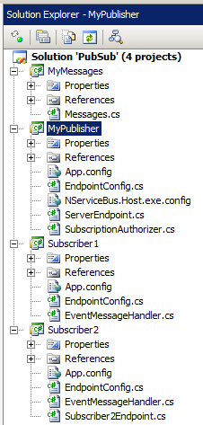
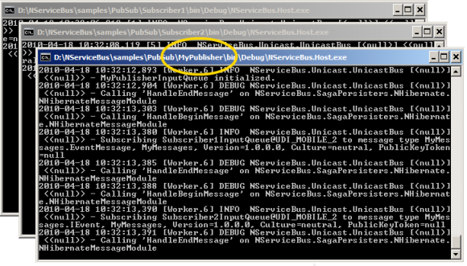
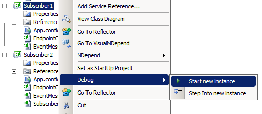

<!--
title: "Publish/Subscribe Sample"
tags: ""
summary: ""
-->

 Open the solution in Visual Studio. You should see the picture on the left.

Before running the
[sample](https://github.com/NServiceBus/NServiceBus/tree/master/Samples/PubSub), look over the solution structure, the projects, and the classes. The projects "MyPublisher", "Subscriber1", and "Subscriber2" are their own processes, even though they look like regular class libraries.

The "Messages" project contains the definition of the messages that are sent between the processes. Open the "Messages.cs" class to see the
"EventMessage" class and the "IEvent" interface.

The "MyPublisher" process publishes each of these message alternately, every time you click Enter in its console window.

The "Subscriber1" process subscribes to "EventMessage", while
"Subscriber2" subscribes to the interface "IEvent". Since the
"EventMessage" class implements the "IEvent" interface, when the
"MyPublisher" process publishes "EventMessage", both subscribers receive it.

When running the sample, you'll see three open console applications, and many log messages on each. Almost none of these logs represent messages sent between the processes.

Run the sample
--------------

Run the code and see the three console applications open.

Identify the "MyPublisher" process by its window title, as shown:

Spread out the various console windows so that you can see all three fully.

Click Enter repeatedly in the "MyPublisher" processes console window, and notice how the messages appear in the other console windows. One click appears on only one other console, and the next click causes messages to be sent to both subscriber consoles.

Let's see what else NServiceBus can do.

Fault-tolerant messaging
------------------------

Pick one of the subscriber processes (say, Subscriber1) and close it. Now go back to the "MyPublisher" process, and click Enter several more times. In Visual Studio, right click the project of the closed subscriber, and start it up again by selecting 'Debug' and then 'Start new instance', as shown:

 

See how the subscriber processes all the messages that were sent by the
"MyPublisher" process while it was down. This is how you can be sure that even when processes or machines restart, NServiceBus ensures that your messages don't get lost.

Examine some more failure scenarios.

Durable subscriptions by default
--------------------------------

Restart just the "MyPublisher" process while the subscribers are running. Click Enter several times in the publisher's console window.

See that the subscribers are still receiving these events. That is because the publisher stores the list of subscribers that were interested in the events into a durable storage. From Version 3 onwards, the default durable subscription storage is RavenDB.

NServiceBus also has two other durable subscription storage options in addition to RavenDB: MSMQ, and SqlServer using NHibernate subscription storage. The MSMQ option is suitable for integration environments where you want to test various kinds of fault scenarios but do not require scalability. To scale out a publisher over multiple machines, the MSMQ subscription storage does not work correctly; for that, you need the DB subscription storage like RavenDB or SqlServer.

**Contrast with In-Memory Subscription:**

To switch from the durable storage suitable for production to in-memory storage suited for development, use
"[profiles](profiles-for-nservicebus-host.md)", which are preconfigured combinations of infrastructure technologies suitable for various scenarios. Change the publisher's profile to NServiceBus.Lite. In Visual Studio, stop debugging, double click the "Properties" node located immediately under the "MyPublisher" process, and click the "Debug" tab. In the "Start Options" section, in the "Command line arguments" textbox, type "NServiceBus.Lite" instead of "NServiceBus.Integration" as shown:

 NOTE: The default profile when no profiles are specified is NServiceBus.Production, the profile suited for production deployment.

Restart the publisher and subscribers. Now when you click Enter in the publisher's console, you will see that the subscribers receive the events, but if you restart just the publisher while the subscribers are running, the subscribers no longer are receiving events. It is for this reason that NServiceBus is safe by default, starting in NServiceBus.Production profile if no profiles are specified, setting up durable subscriptions.

Next steps
----------

Scale out your publishers and subscribers.

See the other NServiceBus pieces that handle this for you in [how pub/sub works](how-pub-sub-works.md) .

