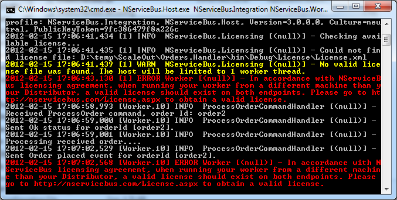

Sometimes a single endpoint for handling messages is not enough so there is a need to scale out. The following sample demonstrates how easy it is to use NServiceBus to scale out your existing message processing by adding more workers on different machines.

Scaling out workers does not require code changes. It requires a few configuration changes in the app.config file, to make your worker point to the distributor and simply use the NServiceBus.Worker profile at the command line when the endpoint starts up.

Run the ScaleOut sample in Visual Studio. The sample starts with Orders.Sender (an endpoint which simulates message load), Orders.Handler
(an endpoint which processes the message and configured to the distributor), Orders.Handler.Worker1 and Orders.Handler.Worker2
(endpoints configured to be workers). The order processing code in the distributor and the worker endpoints are exactly the same.

While running the sample for the first time, if you get a "queue not found" exception (a common race condition on an initial run, when the queues were not yet created), start the Orders.Handler project first and once the queue has been created, start the rest. 

Find the sender application by looking for the one with "Orders.Sender" in its path. Click Enter in the window. Your screen should look like this:


NOTE: Either the distributor or one of the workers could process the messages from the Orders.Sender endpoint

Now let's look at the code.

Code walk-through
-----------------

There are five projects in the solution.

-   Orders.Handler handles the PlaceOrder command from the sender
    endpoint. Upon receiving the PlaceOrder command it returns the
    PlaceOrderStatus.Ok status code and publishes an OrderPlaced event.

-   Orders.Sender sends the Place order command, receives the OK status,
    and handles the published OrderPlaced event after Orders.Handlers
    completes "processing" the order and publishes the event.

-   Orders.Messages contains the PlaceOrder command, the error codes
    enumeration, and the OrderPlaced event.

-   Orders.Handler.Worker1 contains the exact same code as the
    Orders.Handler. The only change is in the app.config and is setup to
    run using the Worker profile.

-   Orders.Handler.Worker2 contains the exact same code as the
    Orders.Handler. The only change is in the app.config and is setup to
    run using the Worker profile.

Scaling out
-----------

Assuming business is booming, orders are flowing in, and PlaceOrder commands are stacking up in the Orders.Handler endpoint, you need to scale out.

You can scale out by having the same Orders.Handler project function as a distributor and another copy of the Orders.Handler function as a worker as illustrated by the Orders.Handler.Worker1 and Orders.Handler.Worker2. Starting the Orders.Handler with the Master profile, among other things, turns on the Distributor at this endpoint. Starting the Orders.Handler with the Worker profile makes it enlist with the Distributor and function as a worker. Being a
[distributor](load-balancing-with-the-distributor.md) means that Workers can send an "I'm ready" message to the control endpoint of the Distributor, and the Distributor forwards messages to them in a round robin manner. Steps to scale out

Following are the steps required to scale out message handlers by deploying more workers on additional machines.

### **1. Setting up the Master (and Distributor) node**

No changes are needed to the Master Orders.Handler. Start it directly from Visual Studio. The profiles are setup as command line arguments.

Otherwise, you can start Orders.Handler from the command line, as follows:


    > NServiceBus.Host.exe NServiceBus.Integration NServiceBus.Master


Profiles:

-   NServiceBus.Master: Turns on the Distributor within the
    Orders.Handler endpoint and starts a worker on that same endpoint.
-   NServiceBus.Integration: The production and integration profiles
    configure NServiceBus to use RavenDB for storing the subscriptions.
    As stated earlier, this store is shared among all Orders.Handler
    endpoints (all workers). Read about [publish
    subscribe](how-pub-sub-works.md) .

If running from Visual Studio, when configuring the NServiceBus.Production profile, NServiceBus creates the queues for you. If running from the command line, use NServiceBus.Integration to create the queues.

For the Master node to function, the machine needs to be accessible to RavenDB from where the Worker is deployed. By default, RavenDB accepts calls on port 8080, so you can check access to this machine by getting to the RavenDB management console on http://<ip-of-masternode>:8080. If the management page does not load, open the port in your incoming firewall.

### 2. Setting up an additional Worker

To scale out, you need another worker to handle PlaceOrder messages. Orders.Handler.Worker1 and Orders.Handler.Worker2 were setup as workers using the following steps:

1.  Stop the Orders.Handler.

2.  Copy the Orders.Handler bin folder to another machine (or another
    folder on the same machine if you are just testing the sample). This
    instance of Orders.Handler is the additional Worker.

3.  
    In Orders.Handler.dll.config add the MasterNodeConfig section and
    add the Distributor address in the UnicastBusConfig as shown:

    
```XML
<?xml version="1.0" encoding="utf-8" ?>
<configuration>
  <configSections>
    <section name="MessageForwardingInCaseOfFaultConfig" type="NServiceBus.Config.MessageForwardingInCaseOfFaultConfig, NServiceBus.Core" />
    <section name="MasterNodeConfig" type="NServiceBus.Config.MasterNodeConfig, NServiceBus.Core" />
    <section name="UnicastBusConfig" type="NServiceBus.Config.UnicastBusConfig, NServiceBus.Core"/>
  </configSections>

  <MessageForwardingInCaseOfFaultConfig ErrorQueue="error"/>
  <MasterNodeConfig Node="localhost"/>

  <UnicastBusConfig
    DistributorControlAddress="orders.handler.distributor.control@localhost"
    DistributorDataAddress="orders.handler@localhost">
  </UnicastBusConfig>
</configuration>
```


    The Node in the MasterNodeConfig points to the host name where the
    MasterNode is running. If running the Worker from the same machine
    as the Distributor, Node should equal "localhost".

That's it. To start the worker node, type the following at the command line:

    > NServiceBus.Host.exe NServiceBus.Integration NServiceBus.Worker

1.  NServiceBus.Integration: Orders.Handler is a publisher that stores
    its subscribers' addressing information to know where the published
    event should go to.

     Since the workers run from different machines, they need to share
    the subscriptions.

     NServiceBus.Integration and NServiceBus.Production profiles
    register RavenDB as their underlying store.

2.  NServiceBus.Worker profile: Order.Handler with this profile sends
    "ready to accept incoming messages" to the master node.

By specifying the NServiceBus.Integration and NServiceBus.Worker profiles along with the MasterNodeConfig Node setting in the configuration file, NServiceBus directs the Orders.Handler Worker to use the same RavenDB instance as the Orders.Handler Master instance. This database stores the subscription information.

NServiceBus.Host.Exe uses the NServiceBus.Worker profile to enlist the worker endpoint at the Distributor.

Read about [profiles,](profiles-for-nservicebus-host.md) and
[here](more-on-profiles.md) too.

### 3. Setting up the Sender

Nothing has to be done to the Sender; NServiceBus does all the distribution work, leaving the sender agnostic to the fact that it is sending messages to a bunch of workers. As far as the sender is concerned, it sends the message to a single endpoint. It is configured to send a PlaceOrder command to the Orders.Handler endpoint. If the Distributor runs on a different machine than the Sender, then use the queue@machine notation.


```XML
 <UnicastBusConfig>
    <MessageEndpointMappings>
      <add Messages="Orders.Messages" Endpoint="Orders.Handler" />
    </MessageEndpointMappings>
  </UnicastBusConfig>
```

 Once Orders.Handler is set up as a distributor and the Orders.Handler starts as a worker on another machine, the following diagram demonstrates the flow of messages and the queues that exist on both machines:


What is going on here?
----------------------

As can be seen from the diagram, nothing changes for the Orders.Sender. It still sends messages to the Orders.Handler endpoint.

Orders.Handler that started with the NServiceBus.Master profile is responsible for receiving the messages that arrive at its Orders.Handler endpoint and forwarding them to its workers. Since Orders.Handler started with the NServiceBus.Master profile, besides being a Distributor, it also starts a Worker, which processes messages from the Orders.Handlers.Worker endpoint. Both this worker and Order.Handlers
(running on another machine with the NServiceBus.Worker profile) send
"I'm ready to process messages" to the Distributor, to its Orders.Handler.Control endpoint. After the Distributor forwards the ProcessOrder command to one of its workers, the receiving worker processes the PlaceOrder command (replies with a status to the Orders.Sender and publishes the OrderProcess event).

When the workers finish handling the ProcessOrder command, they re-send
"I'm ready to process messages" to the Distributor control endpoint: Orders.Handler.Control. The workers share the subscription storage so they can both publish the OrderPlaces event. NServiceBus is responsible for informing the workers to which database to connect. The database should be accessible to the workers.

Worker at work
--------------

The following snapshot shows the Worker console window at work (the worker is running from a different machine than the Distributor).



You can see from the Worker console window (above) that the worker receives the Process Order (order2) and replies with 'OK', processes the order, and publishes an Order Placed event.

The error messages appear when there is no valid license for the worker and it works on a different node from the distributor. This message is logged for every received message from the remote worker. In this case, a [valid NServiceBus License](licensing) should be obtained.

Next steps
----------

Read about [the distributor](load-balancing-with-the-distributor.md) .

