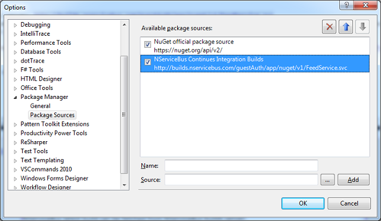
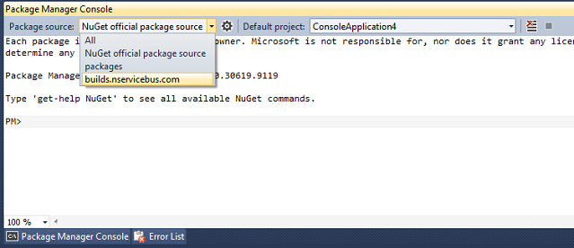

NuGet is an open source project that simplifies integration of third parties into your Visual Studio projects during development. To learn more or to download it, go to the [NuGet web site](https://www.nuget.org/).

NServiceBus and NuGet
---------------------

NServiceBus uses NuGet as a vehicle to ease its inclusion into your projects.

You can install the latest NServiceBus Build or the latest stable version straight from Visual Studio, depending on your requirements.

Getting the latest stable NServiceBus release using NuGet
---------------------------------------------------------

After installing NuGet you have a few ways to get NServiceBus using NuGet. Right click your project references and choose "Manage NuGet Packages". Search for "NServiceBus", and select "Install". Alternatively you can get to the NuGet package manager via "Library Package Manage" and selecting "Manage NuGet Packages for Solution".

To install NServiceBus core libraries, open the [Package Manager Console](http://docs.nuget.org/docs/start-here/using-the-package-manager-console) and type this:

    PM> Install-Package NServiceBus

NServiceBus package comes with all the necessary dependencies to start using NServiceBus immediately. The NServiceBus NuGet package installs NServiceBus core libraries plus all the other libraries required for it to work straight after installation (for example, Log4Net for logging).

To use the [NServiceBus hosting process](the-nservicebus-host.md) , install the following package, which also installs the NServiceBus core libraries:

    PM> Install-Package NServiceBus.Host

If you already downloaded the latest release and just want to an update, use this:

    PM> Update-Package NServiceBus

Downloading NServiceBus latest build
------------------------------------

The NServiceBus latest build can be downloaded from NServiceBus builds server `http://builds.nservicebus.com/guestAuth/app/nuget/v1/FeedService.svc`. You can add this package source to your list of available package sources from within Visual Studio:

`Tools > Library Package Manager > Package Manager Settings`, under 'Package Manager' choose 'Package Sources'. Type a name and type the URL in the source text box, and click 'Add'. This is how the package sources look:

 

To install NServiceBus continuous integration builds (latest), in the NuGet console windows (from Visual Studio `Tools > Library Package Manager > Package Manager Console`), choose the builds.nservicebus.com package source, as follows:

To install the latest NServiceBus build, at the Package Manager Console, type this:

    PM> Install-Package NServiceBus -IncludePrerelease

Or, if you already installed NServiceBus core libraries:

    PM> Update-Package NServiceBus -IncludePrerelease

**NOTE** : NServiceBus continuous integration packages are marked as a pre-release so you need to install using the [`-IncludePrerelease` switch](http://nuget.codeplex.com/wikipage?title=Pre-Release%20Packages).

Additional NServiceBus NuGet packages
----------------------------------------

There are additional NServiceBus NuGet packages, to make your integration with NServiceBus even easier. Each package specifies libraries and configures NServiceBus to utilize them.

 * [List of all nugets produced by Particular](http://www.nuget.org/profiles/nservicebus)
 * [List of all nugets that integrate with NServiceBus](http://www.nuget.org/packages?q=nservicebus)

