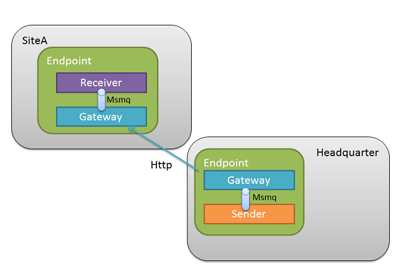

The number of multi-site deployments of enterprise .NET systems are increasing due to the challenges of high availability and the requirement for faster response times for users, as the servers and data they access is closer. 

RPC technologies quickly run into trouble in these environments as they make machines in the same site and those in remote sites look the same.

In these cases, messaging is better than RPC, but many developers mistakenly represent physical site boundaries as logical boundaries, resulting in problems. NServiceBus prevents developers from going down the wrong path but may leave them wondering how NServiceBus handles multi-site communication.

Disaster recovery and physical sites
------------------------------------

In some cases, physical sites are replicas of one other. This is a common configuration for the purposes of disaster recovery and is largely influenced by technology, cost, and performance.

 

NServiceBus provides no special facilities for disaster recovery other than to enable developers to plug in their own specific technologies. This can take the form of database replication of subscription information, configuring MSMQ to store its message data on a SAN, etc. The difference in price and performance of the various options is quite large and is not covered here.

The next section describes the use of NServiceBus in logically significant, physical sites.

Logically significant physical sites
------------------------------------

While each branch of a bank or retail store has significance in each domain, when looking at the behavior of each site we see a great deal of similarity even to the point of identical functionality. This may not be true across all sites, especially when examining sites that serve as regional centers or headquarters.


The logical services that make up the business solution can have components installed at multiple physical sites. Some of the components may be the same; others may be different. Multiple logical services in the same site often collaborate closely with each other, and possibly less closely than with their own components at other sites.

For example, you expect the Sales service in a store to talk to the pricing service in the same store for every transaction. On the other hand, the pricing service at the headquarters most likely pushes updated prices daily at most to the stores. Similarly, you expect an end-of-day push of transactions from the sales service at each store to the headquarters.


This approach is not only common but is recommended for use in situations where physical sites have logical significance, keeping all inter-site communication within logical service boundaries.

Intra-service cross-site messaging
----------------------------------

When sites have logical significance, the messages passed between them are different from the messages sent within the site.

For example, the act of publishing prices from the headquarters has logical significance. The manager of a store explicitly performs an end-of-day operation after collecting and counting all cash in the tills. Therefore, you design separate classes for the messages passed between sites.

Cross-site data transfer
------------------------

Depending on your network technology, you can set up a virtual private network (VPN) between your sites. This provides Windows networking visibility of queues in the target site from the sending site. You can use standard NServiceBus APIs to direct messages to their relevant targets, in the form of `Bus.Send(toDestination, msg);`.

This model is recommended as it provides all the benefits of durable messaging between unreliably connecting machines; at several sites, the same as within a single site. You can read a great deal of information on [setting up and managing a Windows VPN](http://technet.microsoft.com/en-us/network/bb545442.aspx) .

In cases where you only have access to HTTP for connection between sites, you can enable the NServiceBus Gateway feature on each site so it transmits messages from a queue in one site to a queue in another site, including the hash of the messages to ensure that the message is transmitted correctly. The following diagram shows how it works:



The sending process in site A sends a message to the gateway's input queue. The gateway then initiates an HTTP connection to its configured target site. The gateway in site B accepts HTTP connections, takes the message transmitted, hashes it, and returns the hash to site A. If the hashes match, the gateway in site B transmits the message it receives to a configured queue. If the hashes don't match, the gateway in site A retransmits.

Configuration and code
----------------------

When you configure the client endpoint, make sure that the UnicastBusConfig's `MessageEndpointMappings` element has an entry indicating that the relevant message types go to the gateway's input queue.

To send a message to a remote site, use the `SendToSites` API call, as shown:


```C#
Bus.SendToSites(new[] {"SiteA","SiteB"}, new MyCrossSiteMessage());
```

 Did you notice the list of strings as the first parameter? This is the list of remote sites where you want the message(s) sent. While you can put the URLs of the site directly in the call, we recommend that you put these settings in `app.config` so your administrators can change them should the need arise. To do this, add this config section:


```XML
<?xml version="1.0" encoding="utf-8" ?>
<configuration>
  <configSections>
    <!-- Other sections go here -->
    <section name="GatewayConfig" type="NServiceBus.Config.GatewayConfig, NServiceBus.Core" />
  </configSections>
  <!-- Other config options go here -->
  <GatewayConfig>
    <Sites>
      <Site Key="SiteA" Address="http://SiteA.mycorp.com/" ChannelType="Http"/>
      <Site Key="SiteB" Address="https://SiteB.mycorp.com/" ChannelType="Http"/>
    </Sites>
  </GatewayConfig>
</configuration>
```

NServiceBus automatically sets the required headers that enable you to send messages back over the gateway using the familiar `Bus.Reply`.
**NOTE** : All cross-site interactions are performed internally to a service, so publish and subscribe are not supported across gateways.

Since the gateway is located in the NServiceBus core you can enable it by flipping a switch. If you run the NServiceBus host, enable it by specifying the `MultiSite` profile [more on profiles](more-on-profiles.md) ). If you self host NServiceBus, you can turn on the gateway by adding a call to `Configure.RunGateway()` in your configuration.

Securing the gateway with SSL
-----------------------------

To provide data encryption for messages transmitted between sites, configure SSL on the machines in each site where the gateway is running.

Follow the steps for [configuring SSL](http://msdn.microsoft.com/en-us/library/ms733768.aspx) and make sure to configure the gateway to listen on the appropriate port, as well as to contact the remote gateway on the same port.

Automatic de-duplication
------------------------

Going across alternate channels like HTTP means that you lose the MSMQ safety guarantee of exactly one message. This means that communication errors resulting in retries can lead to receiving messages more than once. To avoid burdening you with de-duplication, the NServiceBus gateway supports this out of the box. You just need to store the message IDs of all received messages so it can detect potential duplicates. By default, NServiceBus uses RavenDB to store the IDs but InMemory and SqlServer storages are supported as well. To use storage other than RavenDB, add `Configure.RunGatewayWithInMemoryPersistence()` or `Configure.RunGateway(typeof(SqlPersistence))` to your configuration.

Incoming channels
-----------------

When you enable the gateway, it automatically sets up an HTTP channel to listen to `http://localhost/{name of your endpoint}`. To change this URL or add more than one incoming channel, configure `app.config`, as shown:


```XML
<GatewayConfig>
  <Channels>
    <Channel Address="https://Headquarter.mycorp.com/" ChannelType="Http" Default="true"/>
    <Channel Address="http://Headquarter.myotherdomain.com/" ChannelType="Http"/>
  </Channels>
</GatewayConfig>
```

The "Default" on the first channel tells the gateway which address to attach on outgoing messages if the sender does not specify it explicitly. You can, of course, add as many channels as you like and mix all the supported channels. Currently, HTTP/HTTPS is the only supported channel but there are plans for Azure, FTP, and Amazon SQS to help you bridge both onsite and cloud sites.

Follow the steps for [configuring SSL](http://msdn.microsoft.com/en-us/library/ms733768.aspx) and make sure to configure the gateway to listen on the appropriate port, as well as to contact the remote gateway on the same port.

The gateway in action
---------------------

If you want to take the gateway for a spin, look at the Gateway sample in the `Samples\\Gateway` folder under the NServiceBus package.