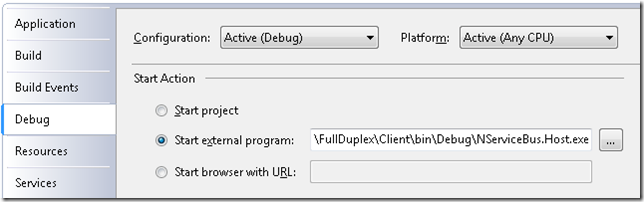

To avoid re-writing the same configuration code, or to host your endpoints in a Windows Service, use NServiceBus.Host.exe, which can also run as a console.

The NServiceBus host streamlines service development and deployment, allows you to change technologies without code, and is administrator-friendly whensetting permissions and accounts.

Overview
--------

To implement back-end message processing, you don't need to write your own host process. Just reference NServiceBus.Host.exe from your message handler assembly and write a single class that inherits from
<span style="font-family:courier new,courier,monospace;">IConfigureThisEndpoint</span>
, specifying whether you want server or client behavior (as described below).

Another option is to open the NuGet Package Manager Console and type:
<span style="font-family:courier new,courier,monospace;">Install-Package NServiceBus.Host</span> .

To run and debug your endpoint, change the Debug settings of the Visual Studio project by right-clicking it, selecting Properties, and then the Debug tab, as shown:



Make sure that 'Start external program' is selected under Start Action and choose the file 'NServiceBus.Host.exe' in the /bin/debug directory of your project. The settings are stored per user. To set them up for all your developers, follow the instructions in this video.

<div id="ytplayer">

<script>
  // Load the IFrame Player API code asynchronously.
  var tag = document.createElement('script');
  tag.src = "https://www.youtube.com/player_api";
  var firstScriptTag = document.getElementsByTagName('script')[0];
  firstScriptTag.parentNode.insertBefore(tag, firstScriptTag);
  // Replace the 'ytplayer' element with an <iframe> and
  // YouTube player after the API code downloads.
  var player;
  function onYouTubePlayerAPIReady() {
    player = new YT.Player('ytplayer', {
      height: '480',
      width: '640',
      videoId: '4qHdwni4AjQ'
    });
  }
</script> Let's see how it hooks into the configuration.

Configuration
-------------

How does the host know which configuration file to use? NServiceBus.Host.exe scans the runtime directory loading all DLLs into memory. It searches the types defined in those assemblies for a class that implements the
<span style="font-family:courier new,courier,monospace;">IConfigureThisEndpoint
</span> interface. The name of the assembly holding that type is used to create assembly.dll.config and that is the file used for configuration.

Shortcut the scanning process by telling the host which type to use by including a file called 'NServiceBus.Host.exe.config' in which you specify the type implementing
<span style="font-family:courier new,courier,monospace;">IConfigureThisEndpoint</span>
, like this:


```XML
<?xml version="1.0" encoding="utf-8" ?>
<configuration>
  <appSettings>
    <add key="EndpointConfigurationType" value="YourNamespace.YourTypeName, YourAssembly"/>
  </appSettings>
</configuration>
```

 File scanning
-------------

By default, NServiceBus scans files to find types implementing its interfaces so that it can configure them automatically. This is separate from the host's file scanning behavior and happens in the '
<span style="font-family:courier new,courier,monospace;">NServiceBus.Configure.With()</span>
' call.

To tell NServiceBus which assemblies to use, set the container by implementing
<span style="font-family:courier new,courier,monospace;">IWantCustomInitialization
</span> as described in the Container section below. In the Init method you can use the appropriate method overload:


```C#
Configure.With(string probeDirectory)
Configure.With(params Assembly[] assemblies)
Configure.With(IEnumerable<Type> typesToScan)  
```


**NOTE** : The NServiceBus assemblies are always included in scanning since NServiceBus needs them to function properly.

Logging
-------

To change the host's logging infrastructure, implement the
<span style="font-family:courier new,courier,monospace;">IWantCustomLogging
</span> interface. In the Init method, configure your custom setup. To make NServiceBus use your logger, use the
<span style="font-family:courier new,courier,monospace;">NServiceBus.SetLoggingLibrary.Log4Net()</span> API, described in the [logging documentation](logging-in-nservicebus.md) and shown below:


```C#
    class MyEndpointConfig : IConfigureThisEndpoint, IWantCustomLogging
    {
        public void Init()
        {
            // setup your logging infrastructure then call
            NServiceBus.SetLoggingLibrary.Log4Net(null, yourLogger);
        }
    }
```

 You may want to specify different logging levels (DEBUG, WARN, etc.) and possibly different targets (CONSOLE, FILE, etc.). The host provides a mechanism for changing these permutations with no code or config changes, via [profiles](profiles-for-nservicebus-host.md) .

Custom initialization and startup
---------------------------------

On top of the standard NServiceBus initialization you can initialize your own components. NServiceBus let you do it during its own initialization so that no messages are processed until all initialization is complete.

From files scanned above, the host looks for classes that implement
<span style="font-family:courier new,courier,monospace;">INeedInitialization
</span>and calls their
<span style="font-family:courier new,courier,monospace;">Init()</span> method. The best practice is to have one initialization class per independent component to initialize. You can have as many classes as you like, although you should avoid any assumptions about the order of their invocation.


To change core settings such as assembly scanning, container, and serialization format, implement
<span style="font-family:courier new,courier,monospace;">IWantCustomInitialization
</span>on the endpoint configuration class (the same class that implements
<span style="font-family:courier new,courier,monospace;">IConfigureThisEndpoint</span>). You must start the configuration expression 'With'


```C#
Configure.With()
```

 NOTE: Do not perform any startup behaviors in the Init method.

Defer all startup behavior until all initialization has been completed. At this point, NServiceBus invokes classes that implement the
<span style="font-family:courier new,courier,monospace;">IWantToRunWhenBusStartsAndStops
</span>(<span style="font-family:courier new,courier,monospace;">IWantToRunWhenTheBusStarts
</span>in v3.x) interface.
<span style="font-size: 14px; line-height: 24px;">An example of behavior suitable to implement with
<span style="font-family:courier new,courier,monospace;">IWantToRunWhenBusStartsAndStops
</span>(<span style="font-family:courier new,courier,monospace;">IWantToRunWhenTheBusStarts
</span>in v3.x) is the opening of the main form in a Windows Forms application. In the back-end Windows Services, classes implementing
<span style="font-family:courier new,courier,monospace;">IWantToRunWhenBusStartsAndStops
</span>(<span style="font-family:courier new,courier,monospace;">IWantToRunWhenTheBusStarts
</span>in v3.x) should kick off things such as web crawling, data mining, and batch processes.</span>
<a id="container" style="font-size: 14px; line-height: 24px;"> </a>


Containers and dependency injection
-----------------------------------

By default, the host makes use of Autofac internally as its container
(dependency injection framework). To use a different container, implement the
<span style="font-family:courier new,courier,monospace;">IWantCustomInitialization
</span>interface on the class that implements
<span style="font-family:courier new,courier,monospace;">IConfigureThisEndpoint
</span>and [provide NServiceBus with an adapter object for your container](containers.md) . Here is an example of setting Castle Windsor as the container of choice:


```C#
    // NSeviceBus v3.x
    class EndpointConfig : IConfigureThisEndpoint, AsA_Server, IWantCustomInitialization
    {
        public void Init()
        {
            NServiceBus.Configure.With()
            .CastleWindsorBuilder()
            .XmlSerializer(); // or BinarySerializer()
        }
    }
```


```C#
    // NSeviceBus v4.x 
 public class EndpointConfig : IConfigureThisEndpoint, AsA_Server, IWantCustomInitialization
    {        
	    public void Init()
	    {
	        Configure.Serialization.Xml();// or BinarySerializer()

	        Configure.With()
	            .CastleWindsorBuilder();
	    }
    }
```

 If you omit the serialization configuration, XML is used by default. The rest of the code specifying transport, subscription storage, and other technologies isn't here, because of the
<span style="font-family:courier new,courier,monospace;">AsAServer
</span>built-in configuration described next.

Built-in configurations
-----------------------

While NServiceBus allows you to pick and choose which technologies to use and how to configure each of them, the host packages these choices into three built-in options:
<span style="font-size: 14px; line-height: 24px;"><span style="font-family:courier new,courier,monospace;">AsAClient, AsAServer, </span>and
<span style="font-family:courier new,courier,monospace;">AsAPublisher</span>.
</span> <span style="font-size: 14px; line-height: 24px;">All these options make use of XmlSerializer, MsmqTransport, and UnicastBus. The difference is in the configuration:</span>


-   <span style="font-family:courier new,courier,monospace;">AsAClient
    </span>sets MsmqTransport as non-transactional and purges its queue
    of messages on startup. This means that it starts afresh every time,
    not remembering anything before a crash. Also, it processes messages
    using its own permissions, not those of the message sender.
-   <span style="font-family:courier new,courier,monospace;">AsAServer
    </span>sets MsmqTransport as transactional and does not purge
    messages from its queue on startup. This makes it fault-tolerant.
-   <span style="font-family:courier new,courier,monospace;">AsAPublisher
    </span>extends
    <span style="font-family:courier new,courier,monospace;">AsAServer
    </span>and indicates to the infrastructure to set up storage for
    subscription requests, described in the [profiles
    page](profiles-for-nservicebus-host.md) .
    <a id="installation"> </a>


Installation
------------

To install your process as a Windows Service, you need to pass /install on the command line to the host. By default, the name of the service is the name of your endpoint and the endpoint name is the namespace of your endpoint config class. To enable side-by-side operations, use the
/sideBySide switch to add the semver version to the service name. Passing /install also causes the host to invoke the
[installers](nservicebus-installers.md) .

To override this and specify additional details for installation:


```Batchfile
USAGE:
NServiceBus.Host.exe [/install [/serviceName]
[/displayName]
[/description]
[/endpointConfigurationType]
[/endpointName]
[/installInfrastructure]
[/scannedAssemblies]
[/dependsOn]
[/sideBySide]
[/startManually]
[/username]
[/password]]
[/uninstall [/serviceName]
[/sidebyside]
[/instance:Instance Name ] 
```

 You can get to this list by running the following at the command line:


```Batchfile
> NServiceBus.Host.exe /?
```

 To set the actual name of the Windows Services in the registry, specify/serviceName:YourServiceName. This is different from what you see in the Windows Service Manager.

To set the name of the Windows Service as you see it in the Windows Service Manager, specify /displayName:YourService.

If you do not specify /displayName, but do specify /serviceName, the display name does not become what was passed in the /serviceName, but rather the default described above.

To set the description shown in the Windows Service Manager, specify
/description:DescriptionOfYourService.

To install multiple instances of the same service by providing each a different instance name, use the 'instance' flag. For example:
<span style="font-family:courier new,courier,monospace;">/instance:Instance5</span>.

By default, Windows Services start automatically when the operating system starts. To change that, add
<span style="font-family:courier new,courier,monospace;">/startManually</span> to the
<span style="font-family:courier new,courier,monospace;">/install</span> command.

To specify under which account you want your service to run, pass in the username and password of that account.

Following is an example of the
<span style="font-family:courier new,courier,monospace;">/install</span> command line:


```Batchfile
NServiceBus.Host.exe /install /serviceName:"MyPublisher" 
/displayName:"My Publisher Service"
/description:"Service for publishing event messages"
/endpointConfigurationType:"YourNameSpace.YourEndpointConfigType, YourAssembly"
/username:"corp\serviceuser"
/password:"p@ssw0rd!" NServiceBus.Production
```


To uninstall, call


```Batchfile
NServiceBus.Host.exe /uninstall
```

 If you specify a service name or instance name when installing your service, you need to pass them in to the uninstall command as well:


```Batchfile
> NServiceBus.Host.exe [/uninstall  [/serviceName] [/instance]]

-- For example: 
> NServiceBus.Host.exe /uninstall /serviceName:YourServiceName /instance:YourInstanceName
```

 To invoke the infrastructure installers, run the host with the
/installInfrastructure switch. [Learn about installers.](nservicebus-installers.md)

