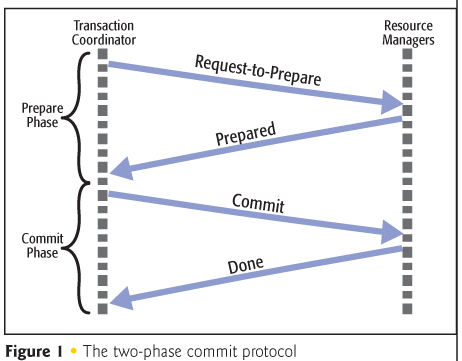

The Windows Azure Platform and NServiceBus make a perfect fit. On the one hand the azure platform offers us the scalable and flexible platform that we are looking for in our designs, and on the other hand it is NServiceBus that makes development on this highly distributed environment a breeze. However, there are a few things to keep in mind when developing for this platform, the most important being, the lack of (distributed) transactions. 

To better understand why this feature is lacking, let's first take a closer look at their implications.

Understanding Transactions
--------------------------

A transaction comprises a unit of work performed within a database management system (or similar system) against a database, and treated in a coherent and reliable way independent of other transactions. A database transaction must be atomic, consistent, isolated and durable. Transactions provide an "all-or-nothing" proposition, stating that each work-unit performed in a database must either complete in its entirety or have no effect whatsoever.

I assume most of you already knew what a transaction was. But what is often overlooked, is that in order to guarantee isolation, the database engine must lock certain records in use during the transaction, depending on isolation level, so that other transactions cannot work with them at the same time. 

Such locks are all fine and dandy when the database management system and client know and trust each other. But in a cloud or self-service environment, that trust level is simply not there. The windows azure platform must assume that you are a malicious user that is trying to perform a denial of service attack on the platform. This is the primary reason why many windows azure hosted services do not support transactions at all or are very aggressive when it comes to lock duration. For example
	* Windows azure storage services has no support for transactions
	* Windows azure database supports local transactions, but only grants locks on resources, when required by a system task for 20 seconds, and 24 hours otherwise. See [this msdn article](http://msdn.microsoft.com/en-us/library/windowsazure/dn338081.aspx#TransactionDurationLimit) for more details.

When both the database management system and client are under the same ownership, imagine you just deployed Sql Server to your own Virtual Machine, this is no longer an issue and you can control the lock duration. But even in this case, you need to be careful when it comes to distributed transactions. 

Understanding Distributed Transactions and the 2 phase commit protocol
----------------------------------------------------------------------

When multiple transaction aware resources are involved in a single transaction, than this transaction will automatically promote to a distributed transaction. That means that handling the unit of work is now performed outside the database system by a so called Global Transaction Manager, or Distributed Transaction Coordinator (DTC). This coordinator, the DTC service on the machine where the transaction started, will communicate with similar services on the machines involved by means of the 2 phase commit protocol, called resource managers.

As illustrated in the diagram below, the 2 phase commit protocol consists of 2 phases where the global transaction manager communicates with all other resource managers on order to coordinate the transaction. During the prepare phase it instructs all resource managers to get ready to commit and when all resource managers approve (or not) it will instruct all resource managers again to complete the commit (or rollback).

Note, that this protocol requires 2 communication steps for each resource manager added to the transaction and it also requires a response of each of them to be able to continue. Both of these conditions are problematic in a huge datacenter such as the windows azure ones.
	* 2 communication steps per added resource manager will result in an exponential explosion of communication. 2 resources = 4 network calls, 4 = 16, 100 = 10000, ...
	* As the windows azure datacenters are huge, check out [this video (5 mins in)](http://www.youtube.com/watch?v=JJ44hEr5DFE) to get an idea how huge, it's very likely that network partitioning will occur in your solution as virtual machines are physically remote from each other, network infrastructure will die, resulting in slow or in doubt transactions being more common than in a small network.

This is the reason why none of the windows azure services supports distributed transactions, and that you are encouraged not to use distributed transactions either even if you technically could.

Side note: The .net framework will promote to a distributed transaction rather quickly, for example 2 open connections to the same resource (exact same connectionstring), will still promote to a distributed transaction, and there is no option to disable promotion as far as I know of. 

How to use NServiceBus in this environment
-------------------------------------------------

By default, NServiceBus relies on the DTC to make distributed system development really easy. But in the windows azure environment, you should (or cannot) use the DTC. So we have to configure/use it a bit differently. 

There are quire a few options though, in the remainder of this article we'll discuss each option with it's pro's and it's cons. Depending on your scenario you may choose to configure NServiceBus differently.

The options are:
	* Share local transaction
	* Atomic operations with retries
	* Unit of work with batching and retries
	* Saga's and compensation logic
	* Routing slips and compensation logic

The need for idempotency
------------------------

Note that almost all of these configurations will result in at least once delivery semantics, or in other words, you can get the same message multiple times. You need to take this into account when designing your business logic and ensure that every operation is idempotent, or can be executed multiple times.

There are multiple ways to deal with idempotency though, some at the technical level, others built into the business logic. Depending on your business needs you can go for one of these:
* Message deduplication
* Natural idempotency
* Entities with version information
* Side effect checks
* Partner state machines
* Accept uncertainty

