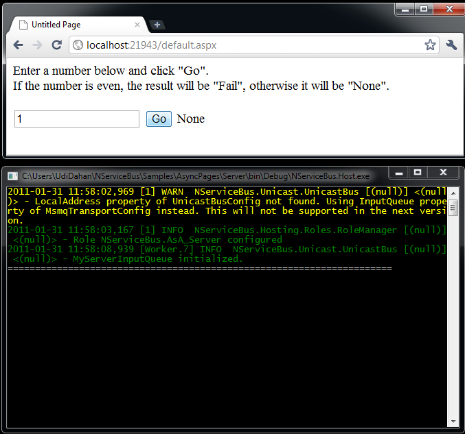
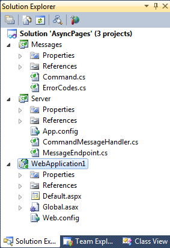

To see how to use NServiceBus in a WebForms application, open the AsyncPages sample and run the solution. A new browser window/tab opens, as well as a console application.

Enter the number "1" into the text box in the browser, and click "Go". You should see the result "None" appear, as shown:

Changing the number in the text box from even to odd numbers changes the result.

The web page renders synchronously; from the user's perspective, the interaction is synchronous and blocking, even though behind the scenes NServiceBus is doing asynchronous messaging.

This sample has three projects: Messages, Server, and WebApplication1. WebApplication1 is a web application that sends messages (found in the Messages project) to the Server project, which is hosted as a console application.

Initializing the bus
--------------------

In WebApplication1, open Global.asax.cs and look at the code in the ApplicationStart method:

    Bus = NServiceBus.Configure.With()
        .Log4Net()
        .DefaultBuilder()
        .XmlSerializer()
        .MsmqTransport()
            .IsTransactional(false)
            .PurgeOnStartup(false)
        .UnicastBus()
            .ImpersonateSender(false)
        .CreateBus()
        .Start();

The rest of the code is typical for hosting NServiceBus in your own process. Read more about [the other lines](hosting-nservicebus-in-your-own-process.md).

The code holds a reference to the bus, which is used later for sending messages. This isn't the only option available; if the classes for sending messages are managed by Dependency Injection, then they can get a reference to the bus by declaring a dependency on IBus. [See an example](how-do-i-get-a-reference-to-ibus-in-my-message-handler.md).

Sending a message
-----------------

Open Default.aspx.cs in WebApplication1 to see the Button1Click method:

    int number = int.Parse(TextBox1.Text);
    var command = new Command { Id = number };
    Global.Bus.Send(command).Register(
        code => Label1.Text = Enum.GetName(typeof (ErrorCodes), code)
        );

The first line of code simply parses the text passed in by the user. The second line creates a new NServiceBus message of the type "Command", and initializes its "Id" property with the value from the text box.

Open the class definition for the Command type in the Messages project:

    [Serializable]
    public class Command : IMessage
    {
        public int Id { get; set; }
    }

This class is very simple. The only special thing is the IMessage interface that it implements. This interface comes from NServiceBus and indicates that instances of this class can be sent and received by the bus. The IMessage interface itself is an empty marker interface. Read more about [defining messages](how-do-i-define-a-message.md).

Return to Default.aspx.cs and look at the code
"Global.Bus.Send(command)". Global.Bus references the Bus property of the Global class, which you saw in Global.asax.cs. Then the code calls the Send method, passing in the newly created command object.

The "bus" isn't anything special in code; it is just an object for calling methods.

Skip the rest of the code and see what happens to the message you just sent.

Routing configuration
---------------------

Open the web.config file in WebApplication1, and scroll down to the following code:

There are two configuration sections:
[MsmqTransportConfig](msmqtransportconfig.md) and UnicastBusConfig. The UnicastBusConfig section describes which messages are sent to which queue. In the configuration above, all messages belonging to the
"Messages" assembly are sent to an endpoint called 'server'.

One way to determine endpoint names is by the namespace that contains the call to NServiceBus.Configure.With(). Read about [endpoint naming](how-to-specify-your-input-queue-name.md).

Handling the message
--------------------

In the Server project, find this code in the CommandMessageHandler class:

    public class CommandMessageHandler : IHandleMessages
    {
        public IBus Bus { get; set; }

        public void Handle(Command message)
        {
            Console.WriteLine("=================================================");

            Thread.Sleep(TimeSpan.FromSeconds(1));

            if (message.Id % 2 == 0)
                Bus.Return(ErrorCodes.Fail);
            else 
                Bus.Return(ErrorCodes.None);
        }
    }

This class implements the NServiceBus interface "IHandleMessages<t>" where T is the specific message type being handled; in this case, the Command message. NServiceBus manages classes that implement this interface. When a message arrives in the input queue, it is deserialized and then, based on its type, NServiceBus instantiates the relevant classes and calls their "Handle" method, passing in the message object.

The IBus property of the class is how it gets a reference to the bus. In the method body you can see it calling the Return method on the bus, which results in a message being returned to WebApplication1, specifically putting a message in its input queue "MyWebClient".

Handling the response
---------------------

When the response arrives back at WebApplication1, the bus invokes the callback that was registered when the request was sent by this code:

    int number = int.Parse(TextBox1.Text);
    var command = new Command { Id = number };

    Global.Bus.Send(command).Register(
        code => Label1.Text = Enum.GetName(typeof (ErrorCodes), code)
        );

The "Register" method takes the callback code and tells the bus to invoke it when the response is received. There are several overloads to this method; the code above accepts a generic Enum parameter, effectively casting the return code from the server to the given enum.

Finally, the code updates the Text property of a label on the web page, setting it to the string that represents the enum value: sometimes
"None", sometimes "Fail".

