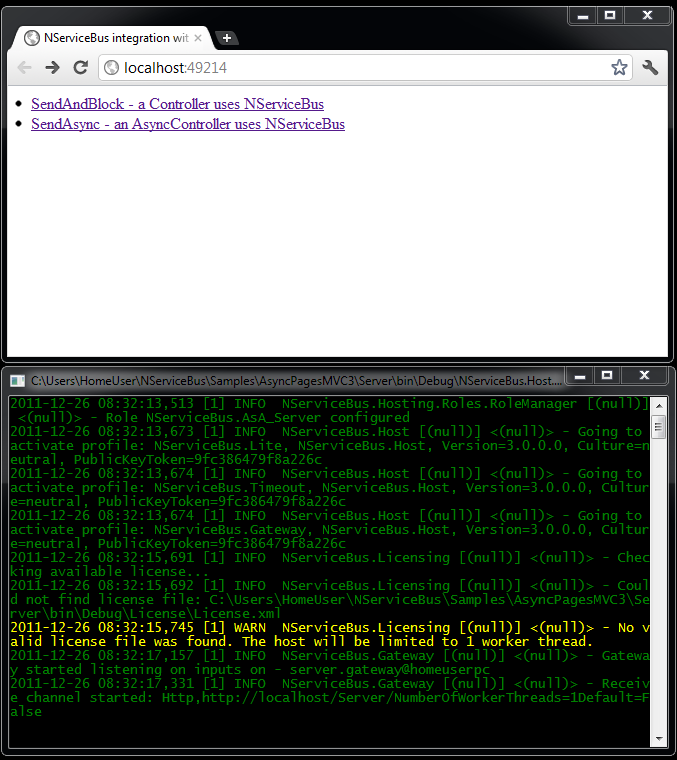

To see how to use NServiceBus in an ASP.NET MVC 3 application, open up the `AsyncPagesMvc3` sample.

Run the solution. A new browser window/tab opens, as well as a console application.

The web sample starts with two available methods of sending a command to the server and waiting for a response from it:

-   `SendAndBlock`: a controller uses NServiceBus
-   `SendAsync`: an `AsyncController` uses NServiceBus

The sample covers only the sending of the asynchronous message as the send and block are similar in NServiceBus.

 **NOTE**: In `SendAndBlock`, the web page renders synchronously. From the user's perspective, the interaction is synchronous and blocking, even though behind the scenes NServiceBus is messaging asynchronously.



Choosing SendAsync results in the following page: 


Changing the number in the text box from even to odd changes the result.


Now, look at the code. This sample has three projects:

-   `AsyncPlagesMvc3`: ASP.NET MVC 3 application that sends messages (found in `Messages` project)
-   `Messages`: Declaration of messages
-   `Server`: Destination of messages sent from the MVC 3 project. Hosted in a console application

Initializing the bus
--------------------

The sample controllers hold a reference of the bus, which is used later to send messages and receive a response.

In `AsyncPagesMvc3`, open `Global.asax.cs` and see the code for the `ApplicationStart` method:


    Configure.WithWeb()
        .DefaultBuilder()
        .ForMvc()
        .JsonSerializer()
        .Log4Net()
        .MsmqTransport()
        .IsTransactional(false)
        .PurgeOnStartup(true)
        .UnicastBus()
        .ImpersonateSender(false)
        .CreateBus()
        .Start(() => Configure.Instance.ForInstallationOn().Install());


By calling `With()`, the code indicates to NServiceBus to scan the directory where the web application is deployed (different from non-web applications).

The `.ForMvc` extension method injects `IBus` into the controllers by implementing the Mvc3 interfaces `IDependencyResolver` and `IControllerActivator`.

The NServiceBus builder registers and instantiates `IControllerActivator` so that when the controllers are requested, the NServiceBus builder has the opportunity to inject the `IBus` implementation into their `IBus` public property.

Read [how the IBus is injected into the controllers](injecting-the-bus-into-asp.net-mvc-controller.md), and also [David Boike's article: Injecting NServiceBus into ASP.NET MVC 3](http://www.make-awesome.com/2011/02/injecting-nservicebus-into-asp-net-mvc-3/).

The rest of the code is typical for hosting NServiceBus in your own process. You can read more about [the other lines](hosting-nservicebus-in-your-own-process.md).

Sending a message
-----------------

### Asynchronous message sending: SendAsync controller

Open the `SendAsyncController` class:

```
var command = new Command { Id = number };
Bus.Send(command).Register(status=>
{AsyncManager.Parameters["errorCode"] = Enum.GetName(typeof(ErrorCodes), status);});
```

Line 1 is a new NServiceBus message of the type `Command`, initializing its `Id` property with the value from the text box.

Line 2 sends the command using the Bus.Send syntax for registering a callback anonymous method.

The method in line 3 is executed when the reply from the server is received. The server executes this code:

    Bus.Return(ErrorCodes.Fail);

OR

    Bus.Return(ErrorCodes.None);

Depending on whether the Command ID is an even or odd number.

Open the class definition for the command type in the messages project:

    [Serializable]
    public class Command : IMessage
    {
        public int Id { get; set; }
    }

As you can see, this class is very simple; the only special thing is the `IMessage` interface that it implements. This interface comes from NServiceBus and indicates that instances of this class can be sent and received by the bus. The `IMessage` interface itself is an empty marker interface. Read about [defining messages](how-do-i-define-a-message.md). Beginning with NServiceBus V3, it is possible to send messages without implementing NServiceBus marker interfaces. See [Unobtrusive message](unobtrusive-mode-messages.md) and the [accompanying sample](unobtrusive-sample.md).

### Synchronous message sending: SendAndBlockController controller

Open the SendAndBlockController class:

    Bus.Send(command).Register(SimpleCommandCallback, this);

The controller is referencing its `IBus` (NServiceBus injected it when the controller was instantiated). The code calls the send method, passing in the newly created command object. The bus isn't anything special in the code; it's just an object for calling methods.

The call registers a callback method that will be called (with this parameter) as soon as a response is received by the server.

Routing Configuration
---------------------

Open the `web.config` file in `AsyncPagesMvc3` and scroll down to the following code:

```
<MsmqTransportConfig ErrorQueue="error" NumberOfWorkerThreads="1" MaxRetries="5"/>
<UnicastBusConfig>
    <MessageEndpointMappings>
        <add Messages="Messages" Endpoint="Server"/>
    </MessageEndpointMappings>
</UnicastBusConfig>
```

See the two configuration sections: [MsmqTransportConfig](msmqtransportconfig.md)and `UnicastBusConfig`.

The `UnicastBusConfig` section describes which messages are sent to which queue. In the configuration above, we see that all messages belonging to the Messages assembly are sent to a queue named Server.

In the `Server` project, the queue name equals the namespace of the `MessageEndpoint` class; that is, `Server`. This is how routing is configured in NServiceBus. In this case, the routing configures a request/response interaction rather than a publish/subscribe interaction, but later you'll see that the same configuration holds for all kinds of interactions.

Handling the message
--------------------

In the Server project, open the `CommandMessageHandler` class to see the following:

    public class CommandMessageHandler : IHandleMessages
    {
        public IBus Bus { get; set; }

        public void Handle(Command message)
        {
            Console.WriteLine("=================================================");

            Thread.Sleep(TimeSpan.FromSeconds(1));

            if (message.Id % 2 == 0)
                Bus.Return(ErrorCodes.Fail);
            else 
                Bus.Return(ErrorCodes.None);
        }
    }

This class implements the NServiceBus interface `IHandleMessages<T>` where `T` is the specific message type being handled; in this case, the Command message.

NServiceBus manages the classes that implement this interface. When a message arrives in the input queue, it is deserialized, and then, based on its type, NServiceBus instantiates the relevant classes and calls their Handle method, passing in the message object.

Notice the `IBus` property of the class. This is how it gets a reference to the bus. In the method body you can see it calling the `Return` method on the bus, which results in a message being returned to `WebApplication1`, specifically putting a message in the input queue whose name is determined by the namespace where the bus was configured; in this case, the `global.asax`: `AsyncPagesMVC3`.

Next steps
----------

If you are not familiar with Unobtrusive messaging mode, read the [documentation](unobtrusive-mode-messages.md)or see the [working sample](unobtrusive-sample.md).

