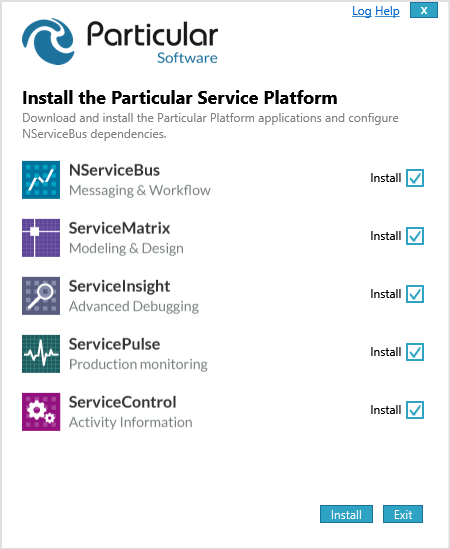

## Download

clickonce download link
`https://particulartest.blob.core.windows.net/platforminstaller/PlatformInstaller.application`

## Dependencies 

* [ClickOnce](https://msdn.microsoft.com/clickonce)
* [.net 4.5](http://www.microsoft.com/en-au/download/details.aspx?id=40779) (will be installed as part of the ClickOnce deployment)
* [Chocolatey](http://chocolatey.org/) (version 0.9.8.23 or higher) 

## License Acceptance

When you first use the Platform installer you will be prompted to accept the NServiceBus License Agreement 

## Confirm Chocolatey install

If you do not already have Chocolatey installed you will be prompted to confirm

## Select items to install

You will be prompted for which items to install.

### NServiceBus

This installs the NServiceBus prerequisites and configures the machine to be compatible for usage by NServiceBus. 

 * Configures DTC for usage by NServiceBus 
 * Setup the NServiceBus Performance Counters
 * Install and configure Msmq
 * Install RavenDB

The equivalent Chocolatey commands are 

    cinst NServicebus.Dtc.install
    cinst NServicebus.PerfCounters.install
    cinst NServicebus.Msmq.install
    cinst RavenDB -InstallArguments '/quiet /log {0} /msicl RAVEN_TARGET_ENVIRONMENT=DEVELOPMENT /msicl TARGETDIR=C:\ /msicl INSTALLFOLDER=C:\RavenDB /msicl RAVEN_INSTALLATION_TYPE=SERVICE /msicl REMOVE=IIS /msicl ADDLOCAL=Service'

### ServiceMatrix

Installs the [ServiceMatrix Chocolatey Package](http://chocolatey.org/packages/ServiceMatrix.install). The equivalent msi can be downloaded from the [ServiceMatrix Releases](https://github.com/Particular/ServiceMatrix/releases).

    cinst ServiceMatrix.install

### ServiceInsight

Installs the [ServiceInsight Chocolatey Package](http://chocolatey.org/packages/ServiceInsight.install). The equivalent msi can be downloaded from the [ServiceInsight Releases](https://github.com/Particular/ServiceInsight/releases).

    cinst ServiceInsight.install

### ServicePulse

Installs the [ServicePulse Chocolatey Package](http://chocolatey.org/packages/ServicePulse.install). The equivalent msi can be downloaded from the [ServicePulse Releases](https://github.com/Particular/ServicePulse/releases).
    
    cinst ServicePulse.install

### ServiceControl

Installs the [ServiceControl Chocolatey Package](http://chocolatey.org/packages/ServiceControl.install). The equivalent msi can be downloaded from the [ServiceControl Releases](https://github.com/Particular/ServiceControl/releases).

    cinst ServiceControl.install

## MSI Information

[MSI error messages](http://msdn.microsoft.com/en-us/library/aa376931.aspx)
[Chocolatey Wiki](https://github.com/chocolatey/chocolatey/wiki)

## Chocolatey Information 

[Chocolatey Google Group](https://groups.google.com/forum/#!forum/chocolatey)
[Chocolatey Wiki](https://github.com/chocolatey/chocolatey/wiki)

## ClickOnce Information

* [Troubleshooting ClickOnce Deployments](http://msdn.microsoft.com/en-us/library/fb94w1t5.aspx)
* [ClickOnce forum](http://social.msdn.microsoft.com/Forums/windows/en-US/home?forum=winformssetup)
