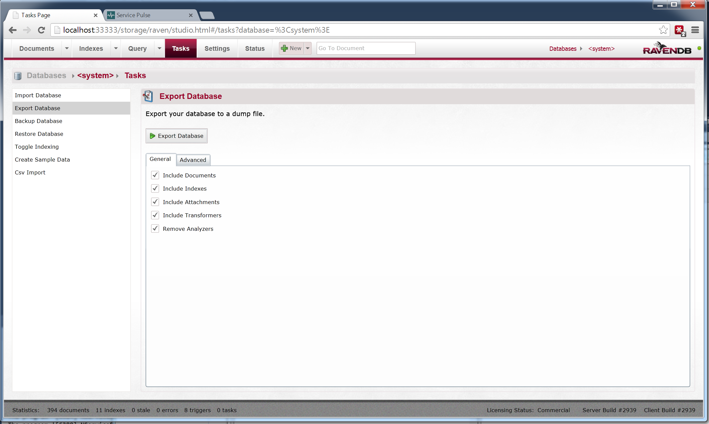
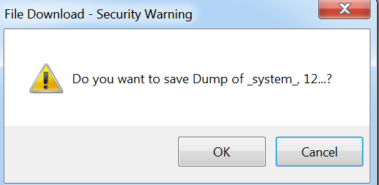
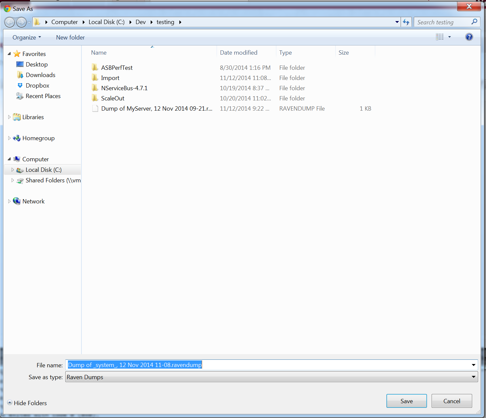
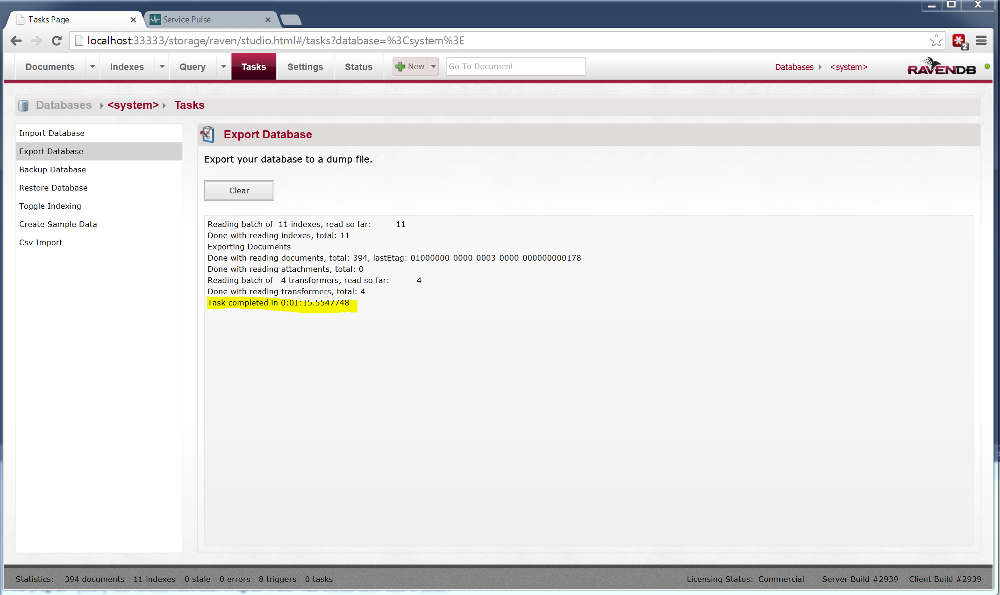
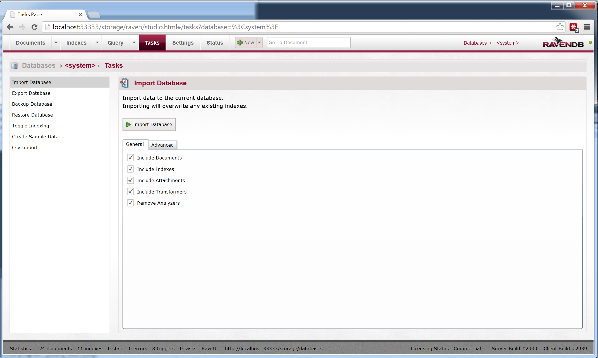
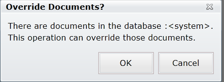
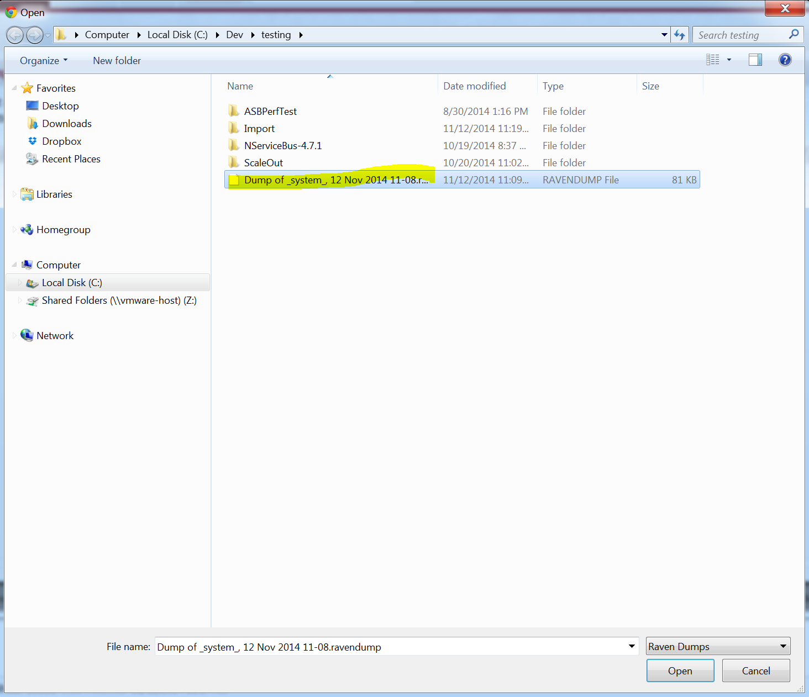
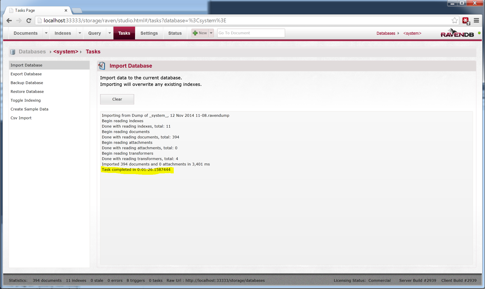

##Step 1: Start ServiceControl in the maintenance mode
- Stop the ServiceControl Windows Service
- Open command line and go to ServiceControl binary folder
- Type `ServiceControl -maint`
- ServiceControl will start in the maintenance mode with all the features disabled and with RavenDB studio exposed on `http://localhost:33333/storage`

##Step 2: Export the current database
- Open a browser and navigate to `http://localhost:33333/storage`
- Export the existing ServiceControl database. 

- Click Ok

- Select the directory where you want to store the exported data file.

- Wait for the export operation to complete.

##Step 3: Delete the existing database

- Once the export operation is complete, stop ServiceControl (press <enter> in the console).
- Delete the ServiceControl data file (localhost-33333) located at `C:\ProgramData\Particular\ServiceControl`
- Start ServiceControl, again in the maintenance mode.

##Step 4: Import the backed up data
- Go to the RavenDB studio `http://localhost:33333/storage` and perform Import steps.
- Select the `Tasks` tab and select all the checkboxes

- Click Ok to proceed.

- Select the file where the exported data was stored.

- Wait for the operation to complete.

- Stop ServiceControl (press <enter> in the console).

##Step 5: Restart ServiceControl

- Start the ServiceControl WindowsService.