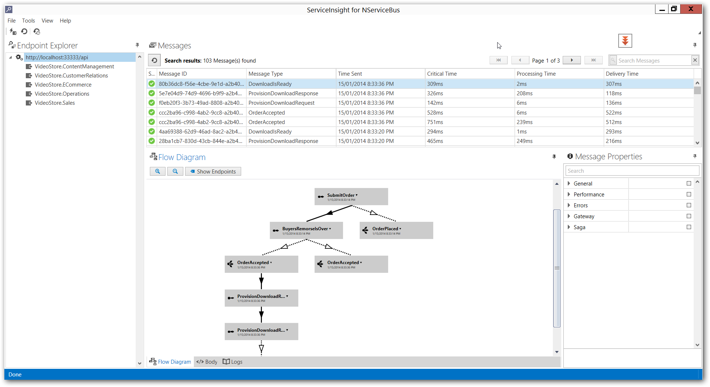

If you have ever had to go though the pain of debugging though a distributed application, you know that it is not exactly a trivial task, so we at ParticularSoftware created ServiceInsight to help you with that job. This application provides help on various aspects of debugging and visualizing your NServiceBus based solution. Let' see some of its benefits here.

Visualizing your distributed system
-----------------------------------
If you want to see your message payloads, you don't need to use other platform specific tools to see the messages in your queues, ServiceInsight provides formatted view of the messages for XML and JSON and binary messages. Another ServiceInsight feature is that it gives you a visual overview of the messages in your system. You can use various diagrams to see the message flow in your distributed system, see who originated a command or raised an event and what messages were created as a result of that and by which endpoints.

Error handling and retries
--------------------------
Error handling is another example of a type of work that is hard to do on a distributed system. Although NServiceBus is designed with this in mind, ServiceInsight builds on top of that and gives you more fine-grain information about the error, exception information, stack trace and also ability to retry the message that has ended up in the error queue when you see fit.

Message Properties
------------------
Even though you might have a queue specific tools that you use to view the message payload, some of the NServiceBus messages metadata used by the framework is stored in the message header. ServiceInsight provides easy access to all those properties where you can easily find the information you are looking for. You can filter and search for a specific property and it looks and behaves like your favorite IDE's property grid so you'll feel right at home.

Search
------
Initial version of ServiceInsight also has a search feature where you can perform basic search over all the messages across all the endpoints. This is a handy feature if you want to search for all the correlated messages where using conventional tools might not be possible. You can either search for a piece of information in the message contents or a value in the message header.

Supporting various transports
-----------------------------
Latest version of NServiceBus supports various transport protocols. Be it MSMQ, ActiveMQ, RabbitMQ or even non queue based transports like SQL Server, now you can use one tool to see your messages and get more insight about what's going on.  

Next steps
----------

-   [Download ServiceInsight](/downloads)
-   [Installation and Troubleshooting](getting-started--installation-and-troubleshooting.md)

