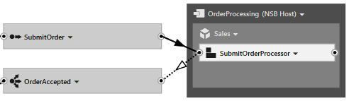
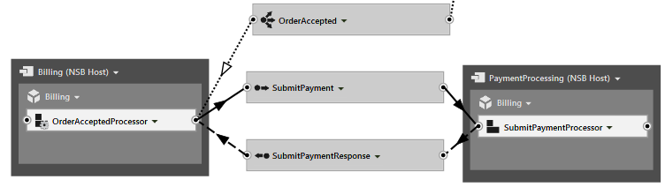

ServiceMatrix accelerates the creation of a distributed NServiceBus solution.  As the canvas and visual elements are used to design the system the Visual Studio solution is updated with generated code and content that is automatically generated.   

This article explores how to customize the ServiceMatrix solution and add your own code.

1. [Introduction](#introduction)
2. [Message Definitions](#message-definitions)
3. [NServiceBus Components](#customizing-components)
4. [Partial Classes and Methods](#the-dynamic-partial-class)
4. [Reviewing Generated Code](#reviewing-the-generated-code)
5. [Auto Publish](#the-auto-publish-property)
6. [Customizing Sagas](#customizing-sagas)
7. [Saga Data](#saga-data)
8. [Saga Message Handlers](#saga-message-handlers)
9. [Custom Saga Finding](#custom-saga-finding-logic)
10. [Summary](#summary)

#Introduction
ServiceMatrix is a visual design tool that accelerates the design and coding of an NServiceBus system.  It generates code and automates the creation of classes, projects and configurations that would take much longer if done manually.  The generated code is designed in a way that allows for user modification and extension. This article reviews this high level design and demonstrates the extension points.    

To view the code for any of the components, use the drop-down within that component and choose `View Code`.
#Message Definitions
NServiceBus messages are plain old CLR classes in C#. As you send commands or publish events in ServiceMatrix, you are prompted only for a name. When you build your solution, the messages are generated.  The generated message classes don't contain any properties but you can easily add them. To modify a message class, use the drop-down menu on the message, view the code and add whatever properties you wish.
```C#
namespace OnlineSales.InternalMessages.Commands.Sales
{
    public class SubmitOrder
    {
        public string CustomerName { get; set; }
        public string AccountNumber { get; set; }
        public string ShippingChoice { get; set; }
    }
}
``` 
If you build the solution again, the new message properties will be available in the components, handlers and sagas. 

#Customizing Components
Mixing dynamic code and user created code can be challenging.  This is especially true in an environment like ServiceMatrix where as you continue to design your system in the visual environment code is regenerated. This must be done without disturbing the users code that has been added along the way.   

##Partial Classes and Partial Methods
To solve this, the design of the generated code uses partial classes.  The dynamic files that are subject to regeneration by ServiceMatrix are created with a partial class definition in one file.  The same partial class is also defined in a separate file that is for user customization. Generated code in one file invokes virtual methods that are further defined in the user modified partial class. 

The dynamic partial class includes the message handlers, optional message publishing code, and partial methods.  This file should not be edited and warns you of this in the comments at the top of the file.  It will be regenerated every time the ServiceMatrix solution is built and will change as the visual design or settings are modified. 

```C#
//------------------------------------------------------------------------------
// <auto-generated>
// This code was generated by ServiceMatrix.
//
// Changes to this file may cause incorrect behavior and will be lost if
// the code is regenerated.
// </auto-generated>
//------------------------------------------------------------------------------
```
##Reviewing The Generated Code 
The design of the generated message handlers use partial methods to provide opportunities for the modification of messages and the integration of your own code and services.  Lets look at the code for a sample component. 

##NServiceBus Component Code 
The code below was generated by ServiceMatrix for component that handles a `SubmitOrder` message and publishes a `Orderaccepted` event that looks like this on the canvas. 



###The Dynamic Partial Class
The dynamic code generator has created a handler for the `SubmitOrder` method.  In the handler a  `HandleImplementation` partial method for the message is invoked. Similarly the `ConfigureOrderAccepted` partial method is invoked and passed the `SubmitOrder` message and a newly created `OrderAccepted` event just before the event is automatically published on the bus.   As partial methods, they are stubbed out in one class but implemented separately in the other partial class file.  

```C#
namespace OnlineSales.Sales
{
    public partial class SubmitOrderProcessor : ISubmitOrderProcessor, ServiceMatrix.Shared.INServiceBusComponent, IHandleMessages<SubmitOrder>
    {
		public void Handle(SubmitOrder message)
		{
			// Handle message on partial class
			this.HandleImplementation(message);

			// Auto-publish Event OrderAccepted
			var OrderAccepted = new OnlineSales.Contracts.Sales.OrderAccepted();
			ConfigureOrderAccepted(message, OrderAccepted);
			this.Bus.Publish(OrderAccepted);
		}
		partial void HandleImplementation(SubmitOrder message);

		partial void ConfigureOrderAccepted(SubmitOrder incomingMessage, OnlineSales.Contracts.Sales.OrderAccepted message);

        public IBus Bus { get; set; }
    }

```
###The Customizable Partial Class 
The customizable partial class is generated only once and is intended to be modified with partial methods and custom logic.  When generated, it will contain a partial method for the message types it handles.  

```C#
namespace OnlineSales.Sales
{
    public partial class SubmitOrderProcessor
    {
		
        partial void HandleImplementation(SubmitOrder message)
        {
            // TODO: SubmitOrderProcessor: Add code to handle the SubmitOrder message.
            Console.WriteLine("Sales received " + message.GetType().Name);
        }

    }
}
```
The code generator has implemented the first partial method for the `SubmitOrder` command message.  This can be used to access the properties of the message and change them with your own code.  

Notice that the other partial method, `ConfigureOrderAccepted`, has not been generated.  This method provides the opportunity to pass information from the handled message to the event.  In must be implemented manually.  Since it has been defined initially in the generated partial class, you will get Intellisense to assist you when typing it.  

```C#
partial void ConfigureOrderAccepted(SubmitOrder incomingMessage, Contracts.Sales.OrderAccepted message)
        {
            /*This method is given access to the handled message and the outbound message. You can transfer contents, implement logic,  or use your own code to integrate with other systems as your design dictates.
			*/ 
			message.OrderID = incomingMessage.OrderNumber;
		
			//The OrderAccepted is automatically publish by the caller to this method if 'Auto Publish Messages' is set to 'True' in ServiceMatrix
		}
```

## The Auto Publish Property
NServiceBus components both handle and send or publish messages. ServiceMatrix generates component code based on the designs and settings you implement.   The `Auto Publish Messages` setting of a component controls whether a generated message handler will include code to automatically create and publish events related to the component.  


Auto-Publish is set to 'True' by default.  In the sample above, upon receiving the `SubmitOrder` message, the generated code creates and publishes the `OrderAccepted` event using the Bus.Publish function.   It's worth noting that the `SubmitOrderProcessor` component is designed to publish an event.  If instead it was designed to reply to a sender in a full-duplex pattern, the Auto Publish code would use a **Bus.Reply**.   

If you set Auto Publish to false and rebuild the solution the dynamic partial class will be re-generated andt he message handler will no longer contain the auto publish code.  Also missing would be the partial method `ConfigureOrderAccepted` that allows user code to modify message.

The custom partial class user code must be modified to create and publish the event using your own code added to the existing partial method `HandleSubmitOrder`. 

```C#
public partial class SubmitOrderProcessor
    {
	 partial void HandleImplementation(SubmitOrder message)
        {
            // TODO: SubmitOrderProcessor: Add code to handle the SubmitOrder message.
            Console.WriteLine("Sales received " + message.GetType().Name);

            if (message.AccountNumber != null)
            {
                var orderaccepted = new Contracts.Sales.OrderAccepted();
                Bus.Publish(orderaccepted);
             }
		}
      }
```
The custom code allows for full control of the process.

#Customizing Sagas
ServiceMatrix supports the design of [NServiceBus sagas](images/sagas-in-nservicebus.md "Sagas in NserviceBus") and generates the necessary code to get you started.  The saga is a specialized stateful version of a ServiceMatrix component.  As we reviewed above, the dynamic code and user modified code are in separate partial class files.  For sagas, the design has been extended to to include defitions for saga data, custom finding logic, and some convenience methods to make saga completion easier.  

The code below is based on a ServiceMatrix designed saga used to correlate request and response with another endpoint as shown.  This saga handles the `OrderAccepted` event then publishes the `SubmitPayment` request to a payment processing service.  The saga handles and correlates the `SubmitPaymentResponse`.



##Designating the Startup Messages
Depending on the design of your saga, one or more messages can start a saga.  If the saga is handling multiple messages, you will be prompted in ServiceMatrix to indicate which messages will start the saga.  The partial class that contains the component definition will be generated to extent the NServiceBus.Saga base class and will use the marker interfaces to indicate the start-up message types and the message types that the saga will handle.  

The code below is generated for example saga class above.  Once again, this is dynamic code that will be regenerated so it is not safe to edit it.   

```C#
namespace OnlineSales.Billing
{
    public partial class OrderAcceptedProcessor : Saga<OrderAcceptedProcessorSagaData>, IOrderAcceptedProcessor, ServiceMatrix.Shared.INServiceBusComponent, IAmStartedByMessages<OrderAccepted>, IHandleMessages<SubmitPaymentResponse>
    {
		public void Handle(OrderAccepted message)
		{

```

##Saga Data
The Saga data is implemented as a partial class in the same dynamic file as the saga itself. The generated saga data design includes default properties for a unique ID and the storage of any message that is handled.  It also stores information about the `Originator` of the message that started the saga and the Id of that message. 
```C#

public partial class OrderAcceptedProcessorSagaData : IContainSagaData
     {
           public virtual Guid Id { get; set; }
           public virtual string Originator { get; set; }
           public virtual string OriginalMessageId { get; set; }
           public virtual OrderAccepted OrderAccepted { get; set; }
           public virtual SubmitPaymentResponse SubmitPaymentResponse { get; set; }
    }
```
As you've seen, this file is dymanic and cannot be edited.  A separate file contains a partial class for the saga data.  It provides a place to add your own properties.  Notice how the example uses the OrderID as the unique identifier for the saga data and marks is with the `[Unique]` attribute.

```C#
namespace OnlineSales.Billing
{
    public partial class OrderAcceptedProcessorSagaData
    {
        [Unique]
        public Guid OrderID { get; set; }
        public string PaymentAuthorizationCode { get; set; }
    }
}
```
##Saga Message Handlers
The message handling code of the Saga is implemented very much like the [component code above](#nservicebus-component-code).  The code will implement a handler in the saga for the messages handled in the ServiceMatrix design.  

The [Auto Publish Messages](#the-auto-publish-property) property to `True` for sagas.  Sagas are often used to maintain state and correlate multiple messages arriving at different times before sending or sending an outbound message.  In these scenarios Auto Publish should be set to `False`.
  
The following sample customizes the saga code.  It handles an `OrderAccepted` event, stores the `OrderID` then creates and sends the `SubmitPayment` command.  The saga then handles the `SubmitPaymentResponse` message and stores the `PaymentAuthorizationCode` in the saga data.

```C#
namespace OnlineSales.Billing
{
    public partial class OrderAcceptedProcessor
    {
        partial void HandleImplementation(OrderAccepted message)
        {
            Console.WriteLine("Billing received " + message.GetType().Name);
            //Customized to set the OrderID in saga data. 
            Data.OrderID = message.OrderID;
            //Since Auto Publish is off in my example, I'll send my own SubmitPayment
            var submitpayment = new InternalMessages.Commands.Billing.SubmitPayment() {ReferenceNumber=message.OrderID,Account=message.BillingAccount };
            Bus.Send(submitpayment);
         }

        partial void HandleImplementation(InternalMessages.Billing.SubmitPaymentResponse message)
        {
            //Handle the SubmitPaymentResponse
            Console.WriteLine("Billing received " + message.GetType().Name);
            //We can put response information in Saga date if needed. 
            Data.PaymentAuthorizationCode = message.AuthorizationCode;
        }

        partial void AllMessagesReceived()
        {
            Console.WriteLine("All messages received.  Completing the Saga.");
            MarkAsComplete();
        }
    }
}
``` 
The `AllMessagesReceived` is a convenient partial method.  As part of the dynamically generated handler code, every inbound message is stored in saga data. After each message is handled the saga data is checked to see if all the messages have been received.  If so, the virtual method `AllMessagesReceived` is called.  The example uses it to mark the saga as complete.

##Custom Saga Finding Logic
When a saga handles a message it must be able to correlate that message to a unique saga.  ServiceMatrix generates default code for this but if your design requires it, it can be modified.  In the [drop-down menu ](images/servicematrix-configuresaga.png)for the saga component is an option for `Configure Saga`. The provided partial class overrides the `ConfigureHowToFindSaga` method.  The comments indicate how it can be modified for any specific situation. 
```C#
amespace OnlineSales.Billing
{
    public partial class OrderAcceptedProcessor
    {
        public override void ConfigureHowToFindSaga()
        {
           // ConfigureMapping<SubmitPaymentResponse>(m => /* specify message property */).ToSaga(s =>  /* specify saga property */ );
           // If you add new messages to be handled by your saga, you will need to manually add a call to ConfigureMapping for them.
        }
    }
}

```
#Summary
The visual design environment of ServiceMatrix generates code designed to be extensible.  This article reviewed the partial classes and methods that can be customized.  

      