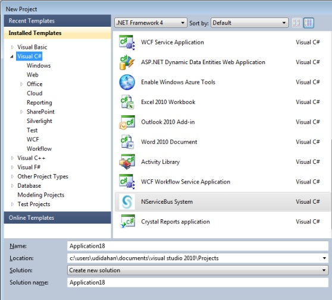
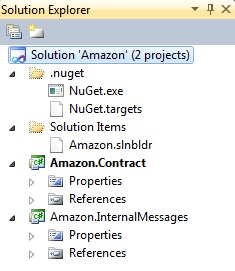
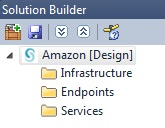
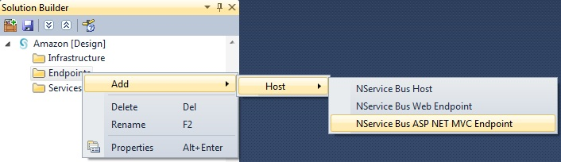
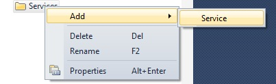
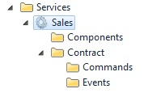
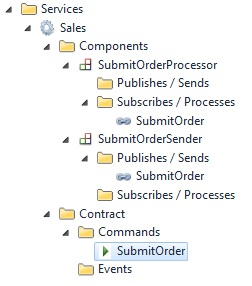
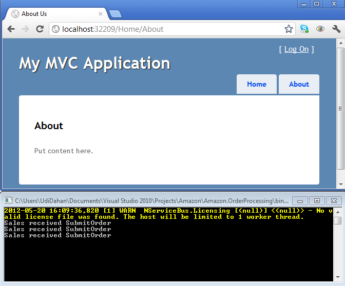

This article relates to ServiceMatrix v1.0 (formerly NServiceBus Studio), NServiceBus 3.x and Visual Studio 2010.  For the latest version see [this](getting-started-with-servicematrix-2.0.md "ServiceMatrix 2.0 Getting Started") article.

1. [Create a New Project](#create-a-new-project)
2. [Creating Endpoints](#creating-endpoints)
3. [Creating Services](#creating-services)
4. [Deploying Components](#deploying-components)
5. [Sending a Message](#sending-a-message)
6. [Next Steps](#next-steps)

##Create a New Project
To get started with NServiceBus, create a new project:


1.  Choose "NServiceBus System" for the type of project.
2.  Enter "Amazon" (or any other name) for the name of your solution.



As the project creation develops, you'll see that a number of projects are created in your solution, as shown on the right. You can ignore the .nuget folder and the .slnbldr file under Solution Items as they are part of the infrastructure. More important are the Contract and InternalMessages projects as they are the places where all message types are put; defined events to the Contract project and commands to the InternalMessages project.

Later you will see how messages from different services are partitioned within these projects.



Look at the design environment in Solution Builder. If you do not see a docked window in Visual Studio called Solution Builder, open it via the View menu (alt+V).



You should see three folders in Solution Builder called Infrastructure, Endpoints, and Services.

Services are logical constructs used to model the business domain. They are made of many components that can send, process, publish, and subscribe to messages. All components must ultimately be deployed to endpoints, which can be web applications (both WebForms and MVC) or NServiceBus Hosts (a special kind of Windows Service that allows you to debug it as a Console Application).

Infrastructure is where cross-cutting concerns like authentication and auditing are handled.

##Creating Endpoints
Right click Endpoints, select Host, and then NServiceBus ASP NET MVC Endpoint, as shown.
**Important:** If you haven't installed ASP MVC on your machine, choose a Web Endpoint instead.



Call it ECommerce (or any another name) and the Visual Studio project will be created for you.

You will examine the details of the generated code later so you understand how things work behind the scenes. However, notice the Components folder that has been created under the ECommerce endpoint; this is where the components will be deployed.

Create another endpoint called OrderProcessing as an NServiceBus Host.

Let's see some services.

##Creating Services

Right click the Services folder in the Solution Builder and select Add as shown:



Name the service "Sales" and you should see the image to the right.



There is currently much to see, but no code has been generated at this point. It is only when you have components allocated to endpoints that code is generated.

Now, right click Commands, select Add, and name it SubmitOrder. Several things happen:



- A command is created under the Commands folder, as expected.
- Two components are created in Sales: a Processor component and a Sender component named after the command you created.
- A link to the command is under the Subscribes / Process folder of the Processor component and another link is under the Publishes / Sends folder of the Sender component.

To open the class file, double click the SubmitOrder command:

```C#
namespace Amazon.InternalMessages.Sales
{
    public class SubmitOrder
    {
    }
}
```


You can add all sorts of properties to your message: strings, integers, arrays, dictionaries, etc. Just make sure to provide both get and set.

Double clicking the components won't open any code just yet as their code is only created when they are deployed to an endpoint. So, go ahead.

##Deploying Components

Right click the SubmitOrderSender component, choose "Deploy to...", and select the ECommerce endpoint.

If you try to build your solution at this point, you will get an error telling you that Sales.SubmitOrderProcessor should be allocated to an endpoint. This is because the code for the SubmitOrderProcessor component is not yet generated as you haven't indicated in which project it should be put. So, allocate the component to its endpoint:

1.  Starting at the endpoint, right click the Components folder of the OrderProcessing endpoint, choose "Add component...".
2.  Tick the box beside the Sales.SubmitOrderProcessor component, and click OK.
3.  Build the solution and see what happens.
4.  Double click the components (under the services folder, not the endpoints folder), to open their code. There is not much to see in the SubmitOrderSender but you'll notice that it is a partial class:


```C#
namespace Amazon.ECommerce.Components.Sales
{
    public partial class SubmitOrderSender
    {
    }
}
```

Navigate to the rest of the definition by selecting its name and clicking F12. You should see this:

```C#
namespace Amazon.ECommerce.Components.Sales
{
    public partial class SubmitOrderSender : ISubmitOrderSender, Amazon.ECommerce.Infrastructure.INServiceBusComponent
    {
        public void Send(SubmitOrder message)
        {
            Bus.Send(message);
        }
        public IBus Bus { get; set; }
    }
    public interface ISubmitOrderSender
    {
        void Send(SubmitOrder message);
    }
}
```

This component comes with an interface you can inject into your own MVC controllers, and implements the INServiceBusComponent interface so that NServiceBus knows to register it into the container for you automatically. The first empty partial class is for you to add any additional behavior; for example, logic that transforms your model objects into messages.

Now double click the SubmitOrderProcessor:

```C#
namespace Amazon.OrderProcessing.Sales
{
    public partial class SubmitOrderProcessor
    {
        partial void HandleImplementation(SubmitOrder message)
        {
            //    Implement your handler logic here.
            Console.WriteLine("Sales received " + message.GetType().Name);
        }
    }
}
```

Once again, there isn't much here, so add your logic. You can also click F12 on the class to see its counterpart, but there isn't much to see there either; just a class that implements `IHandleMessages<SubmitOrder>` and has a reference to IBus that you can use to send out other messages, publish events, or reply with.

##Sending a Message
The last thing to do is make the ECommerce website send a message.

### ASP MVC

**IMPORTANT**: If you created the ASP MVC application, take the following action; otherwise skip to the "Regular ASP.NET" section.

Find the HomeController in the Controllers folder in the Amazon.ECommerce project, add a property of the ISubmitOrderSender type, and invoke its Send method, like this:

```C#
namespace Amazon.ECommerce.Controllers
{
    public class HomeController : Controller
    {
        public ISubmitOrderSender SubmitOrderSender { get; set; }
        public ActionResult Index()
        {
            ViewBag.Message = "Welcome to ASP.NET MVC!";
            return View();
        }
        public ActionResult About()
        {
            SubmitOrderSender.Send(new SubmitOrder());
            return View();
        }
    }
}
```


Continue with "Run the code", below.

### Regular ASP.NET

For regular ASP.NET, open Default.aspx and drag a button from the toolbox onto the page (make sure the page is in "Design" view). Double click the button you just dragged, which opens the code-behind button-click handling method. In that method, type this:


```C#
Global.Bus.Send(new SubmitOrder());
```


### Run the code

Click F5. You should see something like the image below: a new tab in your browser and a console application. If you click "About" in the UI a couple of times, you can see the console application getting a message each time.

If you are in a regular ASP.NET web project, you see a different image, but just click the button on the form.



**Congratulations - you've just built your first NServiceBus application.** **Wasn't that easy?**

**NOTE**: You don't have to worry about the warnings; this is just NServiceBus telling you that it couldn't find the queues it needs, so it went ahead and created them for you.

##Next steps

The production-time benefits of NServiceBus (let's face it, interprocess communication isn't that exciting and has been done many times before): see how NServiceBus handles [Fault Tolerance](getting-started-fault-tolerance-servicematrix-1.0.md).
