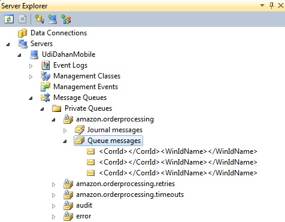
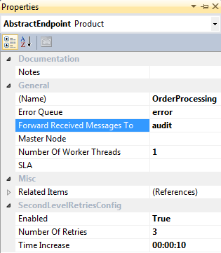
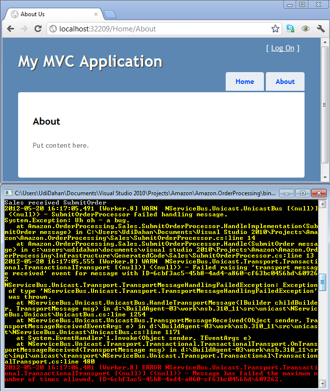
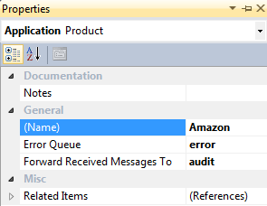

This article relates to ServiceMatrix v1.0 (formerly NServiceBus Studio), NServiceBus 3.x, and Visual Studio 2010.  For the latest version see [this](getting-started-with-nservicebus-using-servicematrix-2.0-fault-tolerance.md "ServiceMatrix 2.0 Fault Tolerance") article.

1. [Durable Messaging](#durable-messaging)
2. [Fault Tolerance](#fault-tolerance)
3. [Retries,Errors and Auditing](#retries-errors-and-auditing)
4. [Next Steps](#next-steps)

##Durable Messaging
In [the previous section](getting-started-creating-a-new-project-servicematrix-1.0.md) you saw how a web application can send messages to a console application. Now, see how messaging can get past all sorts of failure scenarios:

1.  Run the solution again to make sure the messages are being processed.
2.  Kill the `OrderProcessing` endpoint but leave the web application running.
3.  Click the "About" link a couple more times to check that the web application isn't blocked even when the other process it's trying to communicate with is down. This makes it easier to upgrade the backend even while the front end is still running, resulting in a more highly available system.
4.  Leaving the web application running, return to Visual Studio and open Server Explorer. You should see this:



All the messages sent to the `OrderProcessing` endpoint are queued, waiting for the process to come back online. You can click each message, press F4, and examine its properties; specifically BodyStream, where the data is.

Now bring the `OrderProcessing` endpoint back online.

Right click the project > Debug > Start new instance.
    
It processes all those messages, and if you go back to the queue shown above and right click `Refresh`, it is empty.

##Fault tolerance
Consider scenarios where the processing of a message fails. This could be due to something transient like a deadlock in the database, in which case some quick retries overcome this problem, making the message processing ultimately succeed. NServiceBus automatically retries immediately when an exception is thrown during message processing, up to five times by default (which is configurable).

If the problem is something more protracted, like a third-party web service going down or a database being unavailable, it makes sense to try again some time later. This is called the [second-level retries](../NServiceBus/second-level-retries.md) functionality of NServiceBus. Configure its behavior by selecting the OrderProcessing endpoint in Solution Builder and opening its properties (F4). 

 

You will get to the Error Queue and other General properties later. For now, focus on the SecondLevelRetriesConfig section.

-   The **Enabled** attribute defines whether this endpoint performs the second-level retry logic.
-   The **NumberOfRetries** attribute defines how many times a message has its processing attempted again. The TimeIncrease attribute defines how much time is added on each attempt.
-   The defaults are three retries and ten seconds, resulting in a wait of 10s, then 20s, and then 30s; after which the message moves to the defined **ErrorQueue**.

So, make the processing of messages in OrderProcessing fail. Throw an exception in the SubmitOrderProcessor code like this:

```C#
namespace Amazon.OrderProcessing.Sales
{
    public partial class SubmitOrderProcessor
    {
        partial void HandleImplementation(SubmitOrder message)
        {
            Console.WriteLine("Sales received " + message.GetType().Name);
            
            throw new Exception("Uh oh - a bug.");
        }
    }
}
```


Run your solution again, but this time use `Ctrl-F5` so that Visual Studio does not break each time the exception is thrown, sending a message from the ECommerce app by clicking About. You should see the endpoint scroll a bunch of warnings, ultimately putting out an error and stopping, like this:

 

While the endpoint can now continue processing other incoming messages (which will also fail in this case as the exception is thrown for all cases), the failed message has been diverted and is being held in one of the NServiceBus internal databases.

If you leave the endpoint running a while longer, you'll see that it tries processing the message again. After three retries, the retries stop and the message ends up in the error queue (in the default configuration this should be after roughly one minute).

NOTE: When a message cannot be deserialized, it bypasses all retry behaviors and moves directly to the error queue.

##Retries, Errors, and Auditing
If a message fails continuously (due to a bug in the system, for example), it ultimately moves to the error queue that is configured for the endpoint after all the various retries have been performed.

Since administrators must monitor these error queues, it is recommended that all endpoints use the same error queue. You can set the error queue for all endpoints via the properties of your top-level design element; in this case, Amazon. Press F4 to see the properties window. 



NOTE: If you specify an error queue for a specific endpoint, it won't change when you change the top-level error queue. Changing the top-level error queue only sets the value for endpoints for which you haven't modified the error queue.

The second value, `ForwardReceivedMessagesTo`, defines the queue to which all messages will be audited. Any message that is processed by an endpoint is forwarded to this queue. This too can be overridden per endpoint.

In production, set both of these queues to be on a central machine by setting a value like "error@machine" or "error@IP-Address". Read about [how to configure retries](../NServiceBus/second-level-retries.md).

Make sure you remove the code which throws an exception before continuing.

##Next Steps

See how to use NServiceBus for [Publish/Subscribe](getting-started-publish-subscribe-communication-servicematrix-1.0.md).
