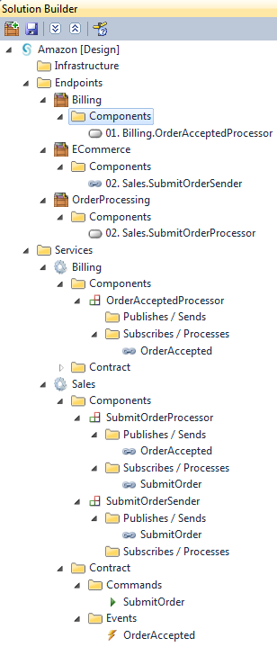
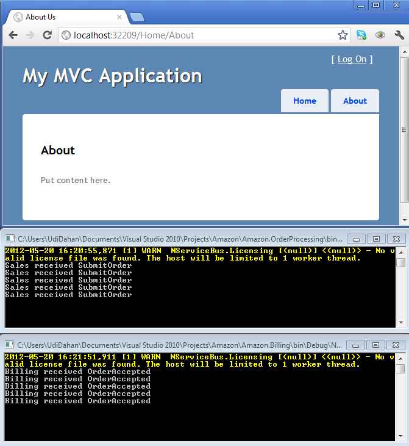
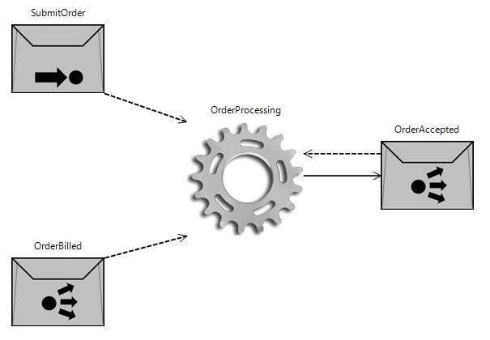

This article relates to ServiceMatrix v1.0 (formerly NServiceBus Studio), NServiceBus 3.x and Visual Studio 2010.  For the latest version see [this](getting-started-with-nservicebus-using-servicematrix-2.0-publish-subscribe.md "ServiceMatrix 2.0 Publish Subscribe") article.

1. [Review the Solution](#review-the-solution)
2. [Run the Solution](#run-the-solution)
3. [Known Issues](#known-issues)
4. [Next Steps](#next-steps)

##Review the Solution
In the [previous section](getting-started-fault-tolerance-servicematrix-1.0.md) we learned about fault tolerance.

Now that we've gone through the basics of NServiceBus communication and configuration, let's move on to publish/subscribe.



There are only a few steps needed to introduce pub/sub and make your solution look like the one appearing above.

1.  Right click your SubmitOrderProcessor component and select "Publish Event...". Type `OrderAccepted` for the name of the event and press Enter.
2.  Right click the OrderAccepted event you just created and select "Add Subscriber...". Type `Billing` for the name of the new service and press Enter.
3.  Create a new NServiceBus Host endpoint called "Billing" and deploy the OrderAcceptedProcessor component from the Billing service to that endpoint. See [a refresher](getting-started-creating-a-new-project-servicematrix-1.0.md) on how to do this. At this point, your solution structure should look the same as the picture on the right.
4.  Add code to the SubmitOrderProcessor in Sales to publish the event:

```C#
namespace Amazon.OrderProcessing.Sales
{
    public partial class SubmitOrderProcessor
    {
        partial void HandleImplementation(SubmitOrder message)
        {
            Console.WriteLine("Sales received " + message.GetType().Name);
            Bus.Publish<OrderAccepted>();
        }
    }
}
```

##Run the Solution
Your solution should compile, so run it using F5.
Lay out the various consoles and web-UI so that you can see them all, then click "About" a couple of times to watch how it runs:



And there you are: publish/subscribe messaging is working!

Try doing another one yourself: have Billing publish an `OrderBilled` event, and have yet another service (call it "Shipping") subscribe to it. Create another endpoint to host Shipping or deploy the component to OrderProcessing or Billing. Have Shipping subscribe to the OrderAccepted event and deploy the corresponding component to the same endpoint.

**Important:** Don't forget to add the call to `Bus.Publish` in Billing's `OrderAcceptedProcessor`.

Once you're done, run it, and see that everything works.

Return to Visual Studio, right click your endpoints, and select "Show Diagram". You should see visualizations of the message flows like this:



As you see, it's very easy to get started with NServiceBus. You're all set now and can build your own distributed systems with NServiceBus.

##Known issues
The Visual Studio tooling is still in its early phases and continuing to evolve. Currently it doesn't support renaming well, requiring quite a lot of manual work to get things back in sync. Also, if you make changes to the code structure, it isn't able to synchronize with those changes. For that reason, think of it as more of an accelerator, allowing you to get a new NServiceBus solution set up quickly, but then requiring you to continue with code-only development.

The tooling will improve over time, allowing it to become a more integral part of ongoing development, but in the meantime, it's a good idea to sign up to our discussion group. Any time you have a question, or are wondering why things work a certain way, there will always somebody who is happy to help you out.

##Next Steps
Learn more about the advantages of the bus architectural style and try the entire NServiceBus platform at [Particular.net](http://docs.particular.net "Particular Docs"). 
 
Get some training!
- Purchase the *Advanced Distributed Systems Design* [training video](http://particular.net/adsd "ADSD Training Video"). Presented by Udi Dahan and recorded in New York in 2013. 
- Attend the online course *Introduction to NServiceBus* by [Pluralsight.](http://pluralsight.com/training/Courses/TableOfContents/nservicebus "Pluralsight")
