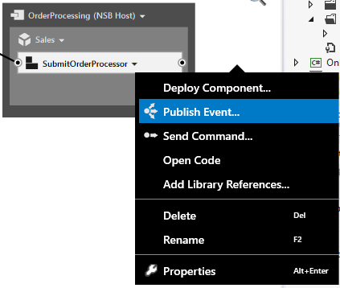
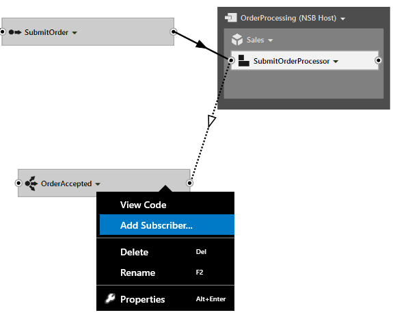
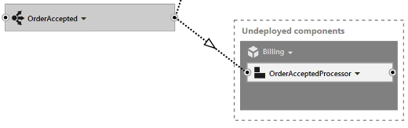
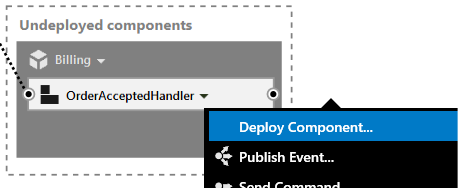
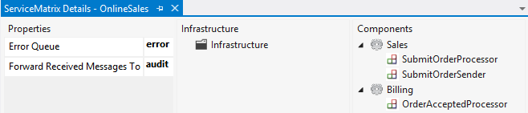

In our [previous article](getting-started-with-nservicebus-using-servicematrix-2.0-fault-tolerance.md "ServiceMatrix Fault Tolerance") introducing ServiceMatrix we explored some of the fault tolerance features of NServiceBus. 

In this article we will expand our Online Sales system and introduce the publish/subscribe pattern using ServiceMatrix.  We'll proceed through the following steps:

1. [Introduction to Publish/Subscribe](#introduction-to-publish-subscribe)
2. [Create the OrderAccepted Event](#create-the-orderaccepted-event)
3. [Add A Subscriber](#adding-the-subscriber)
4. [Deploy the Event Processor](#deploy-the-orderacceptedprocessor)
5. [Review the Code](#review-the-code)
6. [Build and Run the Solution](#build-and-run-the-solution)
7. [Additional Exercises](#additional-exercises)

# Introduction to Publish/Subscribe
Before we move on, please confirm that the `OnlineSales` solution we created previously is still working correctly.  Picking up where we left off, your `OnlineSales` solution ServiceMatrix Canvas should look like this:


## Expanding our OnlineSales Example
So far the [Online Sales](getting-started-with-servicematrix.md "Getting Started with ServiceMatrix") example implements the request response messaging pattern to facilitate communication between the website and our order processing system. We've all purchased items online and know that in reality many different things will need to happen when an order is accepted for processing. Arguably the most important business step should be billing the customer! In our example, let's consider how we add a billing capability to charge the customer for the order.
## Create the OrderAccepted Event
In our example the `SubmitOrderProcessor` component handles the `SubmitOrder` messages.  Using the drop-down menu of the `SubmitOrderProcessor` select 'Publish Event' as shown.



Name the new event `OrderAccepted`
## Adding the Subscriber
To create a subscriber for this new event, select the dropdown of the `OrderAccepted` event and choose 'Add Subscriber' as shown here:



In the 'Add Event Subscriber' window use the 'Add new Service' text box to add a [new service called Billing](images/servicematrix-addeventsubscriber.png "New Billing Service").  You should notice that a an `OrderAcceptedProcessor` has been created in a new Billing Service. The dashed container indicates that the component has yet to be deployed.  Also notice that the lines representing the `OrderAccepted` event messages are dashed.  This is because they are events.  The `SubmitOrder' messages are commands and are illustrated with a solid line. 

. 

## Deploy the OrderAcceptedProcessor
To deploy the `OrderAcceptedProcessor` use the drop down menu and choose 'Deploy Component' as shown here:



In the resulting '[Deploy To Endpoint](images/servicematrix-deploytonewendpoint.png "Deploy to Endpoint")' window chose the 'New Endpoint' option and [create an endpoint](images/servicematrix-newbillingendpoint.png "Add Billing Endpoint") called `Billing`.

At this point with a little re-arranging your ServiceMatrix canvas should look like this:


The `SubmitOrderProcessor` is raising the `OrderAccepted` event which is subscribed to by the `OrderAcceptedProcessor` of the `Billing` service.

As you would expect, the ServiceMatrix [Solution Builder](images/servicematrix-pubsubsolutionbuilder.png "SolutionBuilder") reflects the new endpoint, service, component and event we added using the ServiceMatrix canvas.  Of course the [`OnlineSales` solution](images/servicematrix-pubsubsolution.png "Visual Studio Solution") in Visual Studio has the new project for `Billing` as well as the new 'OrderAccepted' event. 
## Review the Code
ServiceMatrix takes care of the initial code generation for the publishing and processing of the event and both the publishing and subscribing end. 
### Event Publisher Code 
Our new event is published by the `SubmitOrderProcessor` component.   You can review the code by clicking the drop-down menu of the `SubmitOrderProcessor` and selecting 'Open Code' item.  You should see the following code: 
```C#
namespace OnlineSales.Sales
{
     public partial class SubmitOrderProcessor
    {
        partial void HandleImplementation(SubmitOrder message)
        {
       		Console.WriteLine("Sales received " + message.GetType().Name);
        }
     }
}

```
This should look familiar as it was created in our first article as part of handling the `SubmitOrder` message.  Recall that this partial `SubmitOrderProcessor` class and the partial `HandleImplementation` method give us a chance to customize the message handler.  

But what about our new `OrderAccepted` event?  In a similar way ServiceMatrix allows to implement a `ConfigureOrderAccepted` partial method  to customize our new `OrderAccepted` event. To take advantage of this capability you need to add the following partial method to the partial class. In my case, I have modified the `SubmitOrder` message and the `OrderAccepted` event to have a public property and mapped them to each other.   
```C#
partial void ConfigureOrderAccepted(SubmitOrder incomingMessage, OnlineSales.Contracts.Sales.OrderAccepted message)
        { 
        
            //This is our chance to mutate or change the OrderAccepted Message. Notice that we are given access to the SubmitOrder message as well so we can transfer content. 

            message.BillingName = incomingMessage.CustomerName;
        }

```
#### Review the Generated Code 
Let's briefly take a look at the generated code and how this customization works.  Press F12 on the `SubmitOrderProcessor` class name and navigate to the code generated portion of the partial class as shown below.  NOTE: Do not edit this generated portion as it is at risk of being re-generated by the ServiceMatrix platform.

```C#
namespace OnlineSales.Sales
{
    public partial class SubmitOrderProcessor : IHandleMessages<SubmitOrder>
    {
		public void Handle(SubmitOrder message)
		{
			this.HandleImplementation(message);

			var OrderAccepted = new OnlineSales.Contracts.Sales.OrderAccepted();

			ConfigureOrderAccepted(message, OrderAccepted);
			
			this.Bus.Publish(OrderAccepted);
		}

		partial void HandleImplementation(SubmitOrder message);

		partial void ConfigureOrderAccepted (SubmitOrder incomingMessage, OnlineSales.Contracts.Sales.OrderAccepted message);

		public IBus Bus { get; set; }
    }
}

```
Notice how this generated `Handle` method does the following: 

1. Invokes the `HandleImplementation` partial method passing in the received `SubmitOrder` message.
2. Creates a new `OrderAccepted` event. 
3. Invokes the `ConfigureOrderAccepted` partial method passing in both the `SubmitOrder` and `OrderAccepted`.
4. Finally publishes the `OrderAccepted` event using a reference to the bus.

### Subscriber Code
In the `OrderAcceptedProcessor` drop-down menu select `Open Code` and you should see the following. 

```C#
namespace OnlineSales.Billing
{
    public partial class OrderAcceptedProcessor
    {
		partial void HandleImplementation(OrderAccepted message)
        {
                Console.WriteLine("Billing received " + message.GetType().Name);
        }
    }
}

```
Nothing new here!  Notice that this generated `OrderAcceptedProcessor` code is the exactly the same as was generated for the  `SubmitOrderProcessor`.
#Build and Run the Solution
Go ahead and run the solution.  This time, in addition to the [sales web site](images/servicematrix-demowebsite.png "Demo Website") and [`OrderProcessing` endpoint console](images/servicematrix-reqresp-orderprocessor.png "Order Processing"), you should see another console window for `Billing`.

Send a few test messages from the website.  You should see them handled by the `OrderProcessing` console as we did before.  You should almost immediately see that the `Billing` endpoint has received our new `OrderAccepted` event as shown below:

  
 
##You Did It!##
Congratulations!  You have created a complete working solution for communicating via publish/subscribe messaging.  

As you see, it's very easy to get started with NServiceBus and ServiceMatrix.  


##Additional Exercises

###Add A Shipping Service
Try expanding the solution on your own.  Add a `Shipping` capability.  You can add another event to publish when billing is complete.  Call it `OrderBilled`.  Add a subscriber in a new `Shipping` service deployed to a `Shipping` endpoint also hosted in the NServiceBus host. 

### Explore the ServiceMatrix Solution Views
The Solution Builder of ServiceMatrix provides various views into the solution we've created.  Look at the [toolbar](images/servicematrix-solutionbuilder-final.png "Solution Builder Toolbar") and review some of the other buttons.  In addition to the Default View represented by the hammer, note the ServiceMatrix View icon. 

Select an endpoint in the SolutionBuilder then press the 'ServiceMatrix View' icon.  A new 'ServiceMatrix Details' window will be displayed as shown here:



This view provides a convenient look into the properties and components of the endpoint. 
#Next Steps
To understand the licensing model for ServiceMatrix, please continue on to [this article](licensing-servicematrix-v2.0.md "Licensing ServiceMatrix 2.0"). 

Learn more about the advantages of the bus architectural style and try the entire NServiceBus platform at [Particular.net](http://docs.particular.net "Particular Docs")  
 
Get some training!
- Purchase the *Advanced Distributed Systems Design* [training video](http://particular.net/adsd "ADSD Training Video"). Presented by Udi Dahan and recorded in New York in 2013. 
- Attend the online course *Introduction to NServiceBus* by [Pluralsight.](http://pluralsight.com/training/Courses/TableOfContents/nservicebus "Pluralsight")

