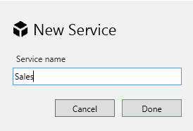
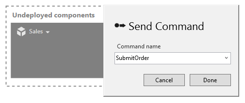
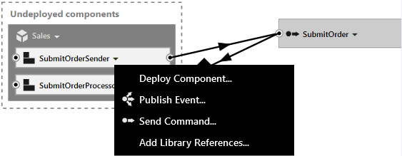

ServiceMatrix is a Visual Studio integrated development environment for developing NServiceBus distributed System.

This step-by-step guide will walk you through the creation of a send-and-receive NServiceBus distributed application using ServiceMatrix v2.0 for Visual Studio 2012, using the following steps:

1.  [Installing ServiceMatrix](#installing-servicematrix-for-visual-studio-2012)
2.  [Creating a new project](#creating-a-new-project)
3.  [Creating Endpoints](#Creating-Endpoints)
4.  [Creating Services](#Creating-Services)
5.  [Deploying Components](#Deploying-Components)
6.  [Sending a Message](#Sending-a-Message)
7.  [Running the Application](#Running-the-Application)
8.  [Next Steps](#next-steps)

The example demonstrates the integration of an online sales web store with a backend system using the request - response pattern and NServiceBus.

##Installing ServiceMatrix for Visual Studio 2012
For this example you will need to meet the following system requirements:
- Visual Studio 2012
- ASP.NET MVC 4 ([http://www.asp.net/downloads](http://www.asp.net/downloads))

To download and install ServiceMatrix follow the instruction [here](installing-servicematrix-2.0.md "Installing Service Matrix").  This document reviews the use of ServiceMatrix for Visual Studio 2012.
## Creating A New Project

To get started with ServiceMatrix, create a new project.
### Create NServiceBus Project
In Visual Studio select `File\New\Project` and Select 'NServiceBus System' under the Visual C\# project type. Target the .NET Framework 4.5 for this project. 


In the Solution name, type 'OnlineSales' (or any other name) for the name of your application.
### Review The Solution
You'll see that a solution folder has been created for your solution, as shown. 


A number of projects have been created for you, as shown in the Solution Explorer pane. The `Solution Items` folder is part of the ServiceMatrix infrastructure.

Two important folders are the `Contract` and `InternalMessages` projects as they are where all message types are placed:
-   All defined events will be put in the `Contract` project.
-   All commands will be put in the `InternalMessages` project. 

Later you will see how messages from different services are partitioned in these projects. 

Take a look at the design environment. The [Solution Builder](images/servicematrix-solutionbuilder.png "Solution Builder") on the left provides a hierarchy of the logical elements of the solution. If you  don't see a docked window in Visual Studio called Solution Builder,  open it via the View menu.

You should see folders in Solution Builder called 'Infrastructure', 'Libraries', 'Endpoints', and 'Services'.
-   Infrastructure is where cross-cutting concerns like authentication and auditing are handled.
-   Libraries are units of code that can be reused, including logging and data access.
-   Endpoints are where code is deployed as executable processes. They can be web applications (both Web Forms and MVC) or [NServiceBus Hosts](../NServiceBus/the-nservicebus-host.md).
=======

---

ServiceMatrix is a Visual Studio integrated development environment for developing NServiceBus distributed System.

This step-by-step guide will walk you through the creation of a send-and-receive NServiceBus distributed application using ServiceMatrix v2.0 for Visual Studio 2012, using the following steps:

1.  [Installing ServiceMatrix](#installing-servicematrix-for-visual-studio-2012)
2.  [Creating a new project](#creating-a-new-project)
3.  [Creating Endpoints](#Creating%20Endpoints)
4.  [Creating Services](#Creating%20Services)
5.  [Deploying Components](#Deploying%20Components)
6.  [Sending a Message](#Sending%20a%20Message)
7.  [Running the Application](#Running%20the%20Application)

The example demonstrates the integration of an online sales web store with a backend system using the request - response pattern and NServiceBus.

##Installing ServiceMatrix for Visual Studio 2012

System requirements:
-   Visual Studio 2012
-   ASP.NET MVC 4 ([http://www.asp.net/downloads](http://www.asp.net/downloads))

To install ServiceMatrix:
1. Download the latest version from [http://particular.net/downloads](http://particular.net/downloads)
2. Run the installer.

**NOTE** : If you have both Visual Studio 2010 and Visual Studio 2012 installed on your machine, you can install ServiceMatrix for one Visual Studio version. This document reviews the use of ServiceMatrix v2.0 for Visual Studio 2012.

## Creating A New Project

To get started with ServiceMatrix, create a new project.
### Create NServiceBus Project
In Visual Studio select `File\New\Project` and Select 'NServiceBus System' under the Visual C\# project type. Target the .NET Framework 4.5 for this project. 


In the Solution name, type 'OnlineSales' (or any other name) for the name of your application.
### Review The Solution
You'll see that a solution folder has been created for your solution, as shown. 


A number of projects have been created for you, as shown in the Solution Explorer pane. The `Solution Items` folder is part of the ServiceMatrix infrastructure.

Two important folders are the `Contract` and `InternalMessages` projects as they are where all message types are placed:
-   All defined events will be put in the `Contract` project.
-   All commands will be put in the `InternalMessages` project. 

Later you will see how messages from different services are partitioned in these projects. 

Take a look at the design environment. The [Solution Builder](images/servicematrix-solutionbuilder.png "Solution Builder") on the left provides a hierarchy of the logical elements of the solution. If you  don't see a docked window in Visual Studio called Solution Builder,  open it via the View menu.

You should see folders in Solution Builder called 'Infrastructure', 'Libraries', 'Endpoints', and 'Services'.
-   Infrastructure is where cross-cutting concerns like authentication and auditing are handled.
-   Libraries are units of code that can be reused, including logging and data access.
-   Endpoints are where code is deployed as executable processes. They can be web applications (both Web Forms and MVC) or [NServiceBus Hosts](../NServiceBus/the-nservicebus-host.md).
>>>>>>> upstream/master:Content/ServiceMatrix/getting-started-with-servicematrix.md
Services are logical containers for code that provide the structure for publish/subscribe events and command-processing.  Services are comprised of Components which will be shown later.

The [NServiceBus Canvas](images/servicematrix-canvas.png "NServiceBus Canvas") is in the center of the solution as shown above.   The endpoints, services, components and messages that comprise our solution will be created and illustrated here.

This dashed areas within the canvas and the buttons at the top are used to start building our solution.   **NOTE**: Alternatively, they can also be created using the Solution Builder tree view.  However since this is a visual tool, we will demonstrate using the canvas.  As items are added to the canvas they will appear in the Solution Builder as well as in the Solution Explorer project.

Building the Online Sales Solution
---
Our online sales example involves a website that collects online orders and a backend order processing system that processes them.  

To build the solution we will define and endpoint for the website and another endpoint for the order processing system.  A new 'Sales' service will define components for submitting and processing orders as well as a command message to represent the order submission.  

<a id="Creating the Endpoints" name="Creating Endpoints"></a> Creating Endpoints
----
First we will create the endpoints for selling and processing.
### New Endpoint
To create and endpoint on the canvas either select the dashed 'New Endpoint' area on the canvas or the button at the top of the canvas.


Name the endpoint `ECommerce` and choose ASP.NET MVC as the endpoint host.  **NOTE: ** MVC Endpoints require that ASP.NET MVC be installed on the local machine. If you haven't installed ASP MVC on your machine, choose a Web Forms host for the endpoint instead.  Both work equally well. 
### Review The Endpoint
We will examine the generated code in detail later to understand    how things work behind the scenes.  For now, notice how Service Matrix has created the ECommerce Endpoint on the canvas, in the Solution Builder and in the Visual Studio Project.  In the solution builder notice that this endpoint has a folder to contain components.  Components contain the code for specific services.  They can only send commands to other components in the same service.  However, they can subscribe to events that are published by components in *any* service. Soon our Sales components will be deployed to our endpoints.
### Create OrderProcessing Endpoint
Create another endpoint called `OrderProcessing`.  This time select 'NServiceBus Host' as the host.  

At this point your Solution should have both endpoint on the NServiceBus canvas.

 

Notice how you can control the zoom with your mouse scroll wheel and drag the boxes around.   You will have to rearrange the canvas as more things are added to it.  
<a id="Creating Services" name="Creating Services"></a> Creating Services 
----
Next we will create a `Sales` Service that will facilitate the communication between our website and order processing.
### New Service Creation
At the top of the canvas select the 'New Service' button and name your new service `Sales` as shown.



The canvas will illustrate the new Sales service.  It's shown in a 'Undeployed Components' box.  This is because we have yet to define and deploy any of them for this service.  Similarly, no code has yet been generated in the Visual Studio project.  As we add our command this will change!
Notice the drop down next to the title in the undeployed `Sales` service.  Click on [the dropdown](images/servicematrix-sales-newcommand.png "Sales Send Command Menu") and select 'Send Command'.  Name your new command `SubmitOrder`. 

   

Notice that several things have happened. The `Sales` service has had two new components added to it as shown below.


The service now has a `Sender` component named after our command that will enable an endpoint to send `SubmitOrder` messages.  Similarly there is a `Processor` component that will enable an endpoint to process these messages.  In addition to illustrating these in the canvas the [Solution Builder](images/servicematrix-solutionbuilder-salesservice.png "Solution Builder With Sales") now shows the `SubmitOrder` command in the commands folder.  It also illustrates the components and the fact they send and process the `SubmitOrder` command accordingly. You will notice there is now code that has been generated in the Visual Studio project as well. 
The `SubmitOrder` command is meant to communicate the order between our endpoints.   To view the generated class file, click on the drop down menu of the `SubmitOrder` command and select View Code [as shown](images/servicematrix-submitorderviewcode.png "View SubmitOrder Code"). You can add all sorts of properties to your message to represent the order data: strings,  integers, arrays, dictionaries, etc. Just make sure to provide both a get accessor and a set mutator to each property. 
```C#
namespace OnlineSales.InternalMessages.Sales
{
    public class SubmitOrder
    {
		//Put your properties in the class.
		//public string CustomerName { get; set; }
    }
}
```
The code for the Sales components is not created until they are deployed to an endpoint. So, next we will go ahead and deploy them.

<a id="Deploying Components" name="Deploying Components"></a> Deploying Components
----
Remember that in our example we want to send orders from the front end ECommerce website to the back end for processing via our bus.  To make this happen we need to deploy the `Sender` component to the `ECommerce` endpoint and the `Processor` to `OrderProcessing` endpoint.  

By deploying these components to each endpoint, the `Sales` service will have afforded our systems the capability to easily communicate reliably and durably using a command message containing the submitted order.  

Let's deploy!
### Deploying Sales Components
To deploy our sender use the drop down menu of the `SubmitOrderSender` component as shown below.   Select 'Deploy Component' and choose to deploy it to the `ECommerce` endpoint using the list provided. 



**NOTE:** You cannot build the solution with components that aren't deployed.  If you try to build at this point you will get an error indicating that the `Sales.SubmitOrderProcessor` must be allocated to an endpoint. 
Deploy the `SubmitOrderProcessor` to the `OrderProcessing` endpoint by choosing the drop down menu.  At this point, with a little re-organizing, the canvas should nicely illustrate the `ECommerce` and `OrderProcessing` endpoints using the `Sales` service components to send and process the `SubmitOrder` command.


Now build the solution and see how everything turns out.
Look at the `SubmitOrderProcessor` code by selecting its drop down and choosing 'Open Code'.  As you can see below, there isn't much here.  A partial class has been created where you would need to add your order processing logic.  You can view the partial class counterpart by clicking F12 while highlighting the class name.  There isn't much to see there either; just a class that implements `IHandleMessages<submitorder>` and has a reference to `IBus` that you can use from within your partial class to send out other messages, publish events, or to reply to commands.
    
```C#
namespace OnlineSales.Sales
{
    public partial class SubmitOrderProcessor
    {
		
        // TODO: SubmitOrderProcessor: Configure published events' properties implementing the partial Configure[EventName] method.

        partial void HandleImplementation(SubmitOrder message)
        {
            // TODO: SubmitOrderProcessor: Add code to handle the SubmitOrder message.
            Console.WriteLine("Sales received " + message.GetType().Name);
        }
    }
}

```

<a id="Sending a Message" name="Sending a Message"></a> Sending a Message 
---
The last thing to do is to review how the 'ECommerce' website sends a message.  When ServiceMatrix generated the MVC endpoint it also created a demonstration site already capable of sending the commands created using the tool. 
### Review MVC Code
If you chose web forms to host the ECommerce endpoint instead of MVC, see the section for [Web Forms Users](#webformsreview "Web Forms Review") below.

Find the `TestMessagesController.generated.cs` file in the Controllers folder in the OnlineSales.ECommerce project.  This file is generated as part of the MVC application by ServiceMatrix. Notice the `MvcApplication.Bus.Send` method that sends the command message `SubmitOrder`.

```C#
namespace OnlineSales.ECommerce.Controllers
{
    public partial class TestMessagesController : Controller
    {
       public ActionResult Index()
        {
            return View();
        }

        
	    [HttpPost]
        public ActionResult SendMessageSubmitOrder(SubmitOrder SubmitOrder)
        {
            ConfigureSubmitOrder(SubmitOrder);
            MvcApplication.Bus.Send(SubmitOrder);

            ViewBag.MessageSent = "SubmitOrder";

            return View("Index");
        }

        partial void ConfigureSubmitOrder(SubmitOrder message);
      
    }
} 
```  
Any modifications to this file would be overwritten by subsequent regeneration of the demonstration site.  To accomodate any changes you wish to make, just before the Bus.Send is called the code invokes a partial method called `ConfigureSubmitOrder` that accepts our `SubmitOrder` message as a parameter.  This can be implemented by you inside the `TestMessagesController.cs` file in the same directory.  The following code snippet illustrates how that can be done.  

```C#
namespace OnlineSales.ECommerce.Controllers
{
    public partial class TestMessagesController
    {
        // TODO: OnlineSales.ECommerce: Configure sent/published messages' properties implementing the partial Configure[MessageName] method.");
        partial void ConfigureSubmitOrder(SubmitOrder message)
        {
            //This is where we can get access the message and mutate it etc.  as we see fit before it is sent.
            //You need to add a CustomerName property to the SubmitOrder class for this to work. 
			message.CustomerName = "Customer Name";
        }
    }
}
```

<a id="webformsreview" name="webformsreview">Review Web Forms Code</a>
---
In the OnlineSales.Ecommerce web project locate the file TestMessages.aspx.generated.cs. This file is generated by ServiceMatrix.  Notice the `Global.Bus.Send(SubmitOrder)` method that sends the command message `SubmitOrder`.

```C#
namespace OnlineSales.ECommerceWebForms
{
    public partial class TestMessages
	{ 
		public void SendMessageSubmitOrder_Click(object sender, EventArgs e)
        {
            var SubmitOrder = new SubmitOrder();
            ConfigureSubmitOrder(SubmitOrder);
            Global.Bus.Send(SubmitOrder);

            this.MessageSentSubmitOrder.Visible = true;
        }
		partial void ConfigureSubmitOrder(SubmitOrder message);
    }
}
```
Any modifications to this file would be overwritten by subsequent regeneration of the demonstration site.  To accomodate any changes you wish to make, just before the Bus.Send is called the code invokes a partial method called `ConfigureSubmitOrder` that accepts our `SubmitOrder` message as a parameter.  This can be implemented by you inside the `TestMessages.aspx.cs` file in the same directory.  The following code snippet illustrates how that can be done. 

```C#
namespace OnlineSales.ECommerceWebForms
{
    public partial class TestMessages : System.Web.UI.Page
    {
        // TODO: OnlineSales.ECommerceWebForms: Configure sent/published messages' properties implementing the partial Configure[MessageName] method.");


        partial void ConfigureSubmitOrder(SubmitOrder message)
        {
            //This is where we can get access the message and mutate it etc.  as we see fit before it is sent.
            //You need to add a CustomerName property to the SubmitOrder class for this to work. 
            //message.CustomerName = "Customer Name";
        }

    }
}
```


<a id="Running the Application" name="Running the Application"></a> Running the Application
----
Now press F5 or press the 'Play' button in Visual Studio to debug the application. You should see both the eCommerce website launched in your default browser and a console window for the NServiceBus host that is running our OrderProcessing endpoint.  

### eCommerce Website
The ECommerce website generated by ServiceMatrix should look like the image below.


Notice the 'Try NServiceBus' box and the 'Test Messages' button on the right half.  When you click on the button another page opens and provides a button to publish the `SubmitOrder` to the bus as shown.


To send the `SubmitOrder` message just click the word 'Send!'.   If you're using web forms, the page is [slightly different](images/servicematrix-demowebsite-sendasp.png "Send Message Asp") but you still just push the button to send the message.

Go ahead and click to send a few times.

### Order Processing

Since we selected the NServiceBus host for our OrderProcessing endpoint it is launched as a console application for convenient development.  Your console window should look like this.


As you click the Send button in the website, you will see the console indicate that the `OrderProcessing` endpoint has received the messages.

### Congratulations!

You've just built your first NServiceBus application. Wasn't that easy?

## Next steps

So far we have seen how ServiceMatrix can be used to connect a front end website and a backend processing system using NServiceBus.

What's so exciting about that?  After all inter-process communication has been done many times before. 

One answer is ***fault tolerance***.  Next we'll explore the fault tolerance and durability features NServiceBus offers.
.

