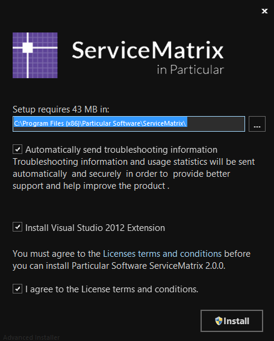
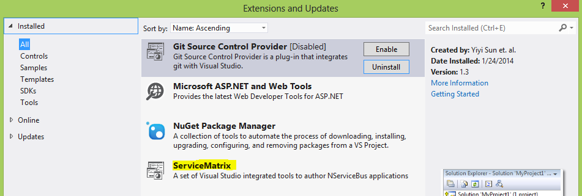

ServiceMatrix enables developers to efficiently generate a fully functional distributed NServiceBus solution using an intuitive visual interface.  Using the drawing canvas you can create a solution composed of Endpoints, Services, Components and Messages.   The resulting Visual Studio solution will contain generated code that adheres to best practices and includes developer friendly extension points for integration with your custom code.   

If you're ready to learn more, this article will review how to download and install Service Matrix for use in Visual Studio.

1.  [Prerequisites](#prerequisites)
2.  [Installing ServiceMatrix](#installing-servicematrix)
3.  [The Visual Studio Extension](#visual-studio-extension)
3.  [TroubleShooting](#troubleshooting)
4.  [Next Steps](#next-steps)

#Prerequisites
##Visual Studio
ServiceMatrix version 2.X is a Visual Studio 2012 extension.  It requires that you have Visual Studio 2012 on your system prior to installation.  It is currently not compatible with Visual Studio 2013. 
  
If you are using Visual Studio 2010 you will Service Matrix 1.0 will be detected and installed. Version 1.0 builds solutions through the a tree-view in the solution builder interface.  New features like the drawing canvas are only available in the 2.0 and beyond and will not be added to older versions. 

If you have multiple versions of Visual Studio installed, you will have to choose which you would like to have the installation of ServiceMatrix target.  Only one instance of Visual Studio may have ServiceMatrix installed on a particular system. 
#Installing ServiceMatrix
##Downloading the Installer
Download the latest version of ServiceMatrix from [Particular.net](http://particular.net/downloads).   Save the .exe file in your favorite location.

##Using the Installer
Locate and run the ServiceMatrix installer executable file you downloaded.  Since ServiceMatrix is an extension to Visual Studio, it's a good idea to close Visual Studio. If you don't you will be prompted to later. 
###Uninstall the Previous Version
If you already have ServiceMatrix installed and are upgrading, you will get a [warning](images/servicematrix-installer-existingversion.png "Previous Version Warning") that you must uninstall the previous version.

Uninstall using the normal procedure through `Control Panel\Programs\Programs and Features` in Windows.
##Installation Options
When installing ServiceMatrix you'll be prompted for installation options:

- You'll have the option of changing the default installation location and must agree to the terms and conditions to proceed. 

- Please consider agreeing to have troubleshooting information shared with our team at Particular.net.  Were always working hard to improve ServiceMatrix and getting this automated feedback on any issues is quite valuable. 

###Proceed with the installation by pressing `Install`.

If you didn't close Visual Studio, at this point you will be [prompted](images/servicematrix-installer-closevstudio.png "Close Visual Studio") to do so.   

The installer will show you the [progress window](images/servicematrix-installer-progress.png "Installer progress") and finally prompt you to [finish the installation](images/servicematrix-installer-finish.png "Finish Installation").  When you open Visual Studio the extension will have been installed. 
#The Visual Studio Extension
When you start Visual Studio, you can review the ServiceMatrix extension.  To do so, select 'Tools' [from the menu](images/servicematrix-vstudio-toolsmenu.png "Extensions Menu") and select 'Extensions and Updates'.  Notice the extension listed as shown below.  

#Troubleshooting
If you have issues installing or uninstalling ServiceMatrix please see the [troubleshooting](troubleshooting-servicematrix-2.0.md "Troubleshooting ServiceMatrix") article. 
#Next Steps
###Getting Started Examples
At the completion of the installer your default browser will open to the first of a series of ServiceMatrix [Getting Started](getting-started-with-servicematrix.md "Getting Started With ServiceMatrix") documents.  
###Licensing
ServiceMatrix installs with a trial license. Read more about how the product is licensed [here](licensing-servicematrix-v2.0.md "Licensing NServiceBus").