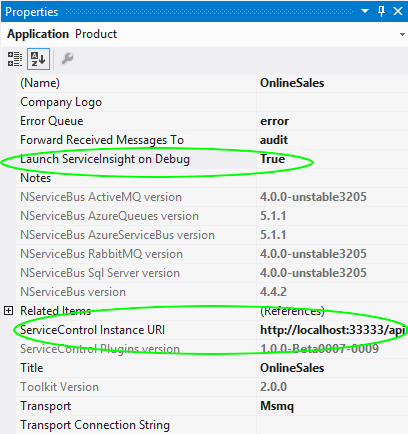
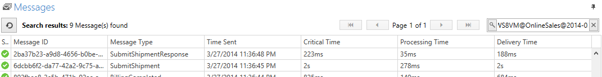
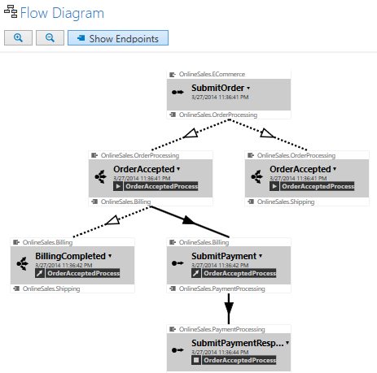

ServiceMatrix helps you accelerate the creation NServiceBus systems in a visual environment.  ServiceInsight provides the ability to visualize a system and the messages interaction.

The capabilities of these two NServiceBus platform applications compliment each other and together provide value at design time. When used together ServiceInsight can give you a real time view of your ServiceMatrix solution as you debug it.   Let's look at how it works.

1. [Setting Up ServiceInsight Integration](#setting-up-serviceinsight-debugging "Service Insight Debugging Setup")
2. [How Debugging Works](#how-debugging-works "How Debugging Works")
2. [Launching ServiceInsight](#launching-serviceinsight "Launching ServiceInsight")
3. [Next Steps](#next-steps "Next Steps")

#Setting Up ServiceInsight Integration
ServiceMatrix is configured to integrate with ServiceInsight through the Application Properties of the  Solution.  To review them, open the Solution Builder window and right-mouse click on the root application in the tree and select properties.

Two key properties are highlighted below:

To set things up for debugging, ServiceMatrix not only needs to launch ServiceInsight, it also must be able to locate and integrate with [ServiceControl](../ServiceControl/index.md "ServiceControl").   ServiceControl aggregates log and error information from the Errors and Audit queues of your system. It also provides the data and query ability necessary for ServiceInsight to access the message data. 

Turn on the automatic launch of ServiceInsight using the property shown.  By default, ServiceMatrix will use the Windows registry to determine the location of the ServiceControl but you can change this property for your specific situation as you need. 

#How Debugging Works
###Debugging Meta Data
When debugging in a ServiceMatrix solution, an assembly is added to your project.  If you look at your project references in the Solution Explorer, you will notice that your projects have a reference to the `ServiceControl.Plugin.DebugSession` assembly.  This debug assembly will be loaded by NServiceBus and will add a specific debug session id to the headers of each messages.  When ServiceInsight is launched, it will use this id to filter the results to only the messages for your debug session. 

#Launching ServiceInsight
When you launch your ServiceMatrix solution in the Visual Studio debugger, ServiceInsight will be launched and passed the debug session id needed for searching.  To understand more about invoking ServiceInsight, please see the article on [ServiceInsight Application Invocation](../ServiceInsight/application-invocation.md "Invoking ServiceInsight").  The image below shows the search window of ServiceInsight populated with the filter that uses the debug session id.

###Auto-Refresh
When launched, the ServiceInsight system will efficiently poll ServiceControl for message data.  The polling period is configurable but by default it is only 2 seconds.  This auto-refresh will allow ServiceInsight to populate with your debug information and provide near real-time insight to your system. 

##Visualizing your Solution
As you run ServiceInsight during your debug session, you will see the messages start to arrive in the message window.  As this happens ServiceInsight will also dynamically illustrate the relationship between the messages in the Flow Diagram as shown here.

ServiceInsight will provide a variety of information, including message data, a detailed saga view, and a complete endpoint list.

#Next Steps
The debug integration of ServiceInsight and ServiceMatrix delivers the power of ServiceInsight to your design process. To learn more about ServiceInsight see the articles [here](../ServiceInsight/index.md "ServiceInsight Documentation").