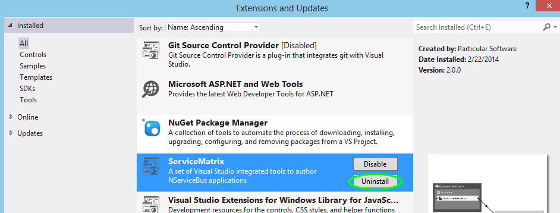

This article provides information on how to troubleshoot ServiceMatrix.

1.  [Issues Uninstalling](#issues-uninstalling-servicematrix)
2.  [Accessing the Log File](#access-the-servicematrix-log-file)
3.  [Microsoft FixIt Tool](#using-the-microsoft-fixit-tool)

#Issues Uninstalling ServiceMatrix
Older versions of ServiceMatrix must be uninstalled prior to the installation of a new version.  The following are issues that can occur when uninstalling:
###Unable To Uninstall using `Control Panel\Programs\Programs and Features`
If you are unable to uninstall the old version using the traditional method through control panel you can uninstall it from inside Visual Studio.  Locate the Extension in Visual Studio through the `Tools\Extensions and Updates` [Menu](images/servicematrix-vstudio-toolsmenu.png "Extensions Menu") options.  You'll see the extension listed as shown here:

###After Uninstalling, the ServiceMatrix still shows as installed
If you completed the uninstall and your system still shows ServiceMatrix as installed, try the following actions.  If one does not work, proceed to the next.
- Try uninstalling again through the `Programs and Features' list.  The last attempt may not have completed successfully.  
- Restart your machine.  This can clear residual issues.
- Try using the Microsoft [FixIt](#using-the-microsoft-fixit-tool) tool described below. 

###Manually Remove The Registry Keys
**Warning**:Only advanced users should edit the registry keys.  If none of the options above work you can try locating and removing the keys from the registry manually. Launch the registry editor by opening the run prompt (press the window button and 'R') and typing [regedit](images/servicematrix-runregedit.png "Running Regedit").  Inside the registry editor, navigate the tree on the left to locate the keys indicated below for your operating system and remove them.
```C#
// 64bit:
HKEY_LOCAL_MACHINE\SOFTWARE\Wow6432Node\Microsoft\Windows\CurrentVersion\Uninstall\Particular Software ServiceMatrix 2.0.0

// 32bit:
HKEY_LOCAL_MACHINE\SOFTWARE\Microsoft\Windows\CurrentVersion\Uninstall\Particular Software ServiceMatrix 2.0.0
```
#Access the ServiceMatrix Log File
In case of any errors or exception the ServiceMatrix log file may contain information about the cause.  The log file is located in the ServiceMatrix extension installation location.  By default the location is:
```
%localappdata%/Microsoft/VisualStudio/11.0/Extensions/{extensions-unique-id}/[MachineName]-[UserName].logging
```

#Using the Microsoft FixIt tool
The Microsoft FixIt tool can help troubleshoot general installation issues including registry problems.  You may download it [here](servicematrix-vstudio-extensions-uninstall.png "Microsoft FixIt tool"). 


