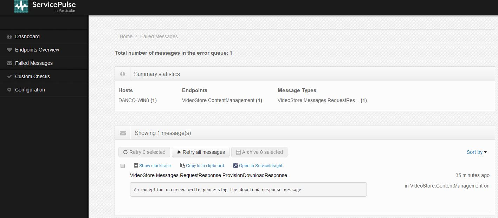
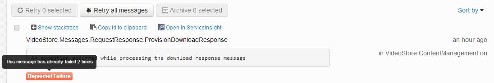
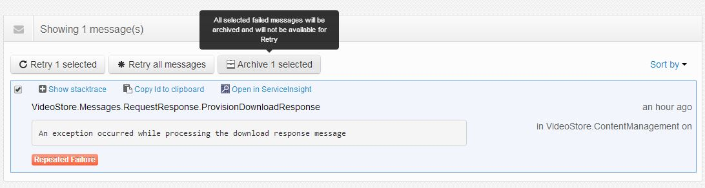

When an NServiuceBus endpoint fails to process a message, it performs a set of configurable attempts to recover from this failure. These attempts are referred to as First-Level-Retries (FLR) and Second-Level-Retries (SLR) and in many cases will allow the endpoint to overcome intermittent communication failures (for more details see [Fault Tolerance](/ServiceMatrix/getting-started-with-nservicebus-using-servicematrix-2.0-fault-tolerance#fault-tolerance) and [Second-Level-Retries](/NServiceBus/second-level-retries)).

If the FLR and SLR processing attempts also fail, the endpoint forwards the failed message to the central error queue defined for all endpoints in the system (see [Auditing with NServiceBus](/NServiceBus/auditing-with-nservicebus)). 

ServicePulse (via ServiceControl) monitors the central error queue and displays current status and details of failed messages as an indicator in the ServicePulse dashboard.

    

### Failed Messages page

Clicking on the Failed Messages indicator (or the "Failes Messages" link in the navigation bar) provides a detailed display of the failed messages.

* **Summary statistics:** a breakdown of the current number of failed messages per machine, endpoint and message type
* **Messages List:** displays an entry per Failed Messages
* **Message Details:** for each failed message, displays the message type, exception description, endpoint name and location and failure timestamp    
* **StackTrace:** displays the full .NET exception stacktrace when clicking on the "Show stacktrace" link
* **Copy Message Id:** Click on the "Copy Id to clipboard" to topy the failed message unique identifier to the clipboard, for future reference
* **Open in ServiceInsight:** Launches ServiceInsight focusing on the failed message, for further in-depth analysis of the failure causes (for more details, see [ServiceInsight Overview](/ServiceInsight/getting-started-overview); this only works if ServiceInsight is installed on the local machine)   

### Failed Message Retry

After addressing the root cause of the message's processing failure, you can re-send the failes message for re-processing by the endpoint/s. This is referred to as a "retry" (or a manual retry, in contrast to the automated and configurable FLRs and SLRs).

To retry a failed message, select the failed message(s) in the failed messages list and click on the "Retry Selected" button (or simply click on "Retry All Messages").

A message that is sent for retry is marked as such, and will not be displayed in the failed message list, unless it re-processing fails again.

If a messages fails repeated retry attempts, an indication is added, including the number of times it has failed. 
   
   

**NOTE:** Tracking the number of repeated retry attempts may be of significance to your specific solution implementation, since each retry may invoke custom and/or 3rd party logic that may not be participate in the NServiceBus endpoint transactional  processing (and will therefore not be rolled-back on processing failure). 

**Related articles:**

* [Failed Messages display and Retry in ServiceInsight](/ServiceInsight/getting-started-overview#errors-and-retries)

### Archiving Failed Messages

Failed messages that cannot be processed successfully (or should not be retried due to various application-specific reasons) can be archived.

Archiving in ServicePulse means that the failed messages will be marked as "Archived", its data will still be available, but it will no longer be displayed in the Failed Messages list in ServicePulse and will not be counted by the Failes Messages indicator in the ServicePulse dashboard.

**NOTE:** An archived failed message is available for analysis and search in ServiceInsight.

  