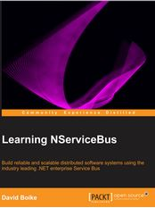

  

# WORK IN PROGRESS

  

<table>
<tbody>
<tr>
<td style="text-align:left" width="20%"></td>
<td style="text-align:left"><strong>The most popular Service Bus for .NET</strong></td>
</tr>
<tr>
<td style="text-align:left" width="20%"></td>
<td style="text-align:left"><strong>Modeling &amp; Design</strong></td>
</tr>
<tr>
<td style="text-align:left" width="20%"></td>
<td style="text-align:left"><strong>Advanced Debugging</strong></td>
</tr>
<tr>
<td style="text-align:left" width="20%"></td>
<td style="text-align:left"><strong>Production Monitoring</strong></td>
</tr>
<tr>
<td style="text-align:left" width="20%"></td>
<td style="text-align:left"><strong>REST API Integration</strong></td>
</tr>
</tbody>
</table>

<!--
|| **The most popular Service Bus for .NET** |
|:--|:--|
|| **Modeling & Design** |
|| **Advanced Debugging** |
|| **Production Monitoring** |
|| **REST API Integration** |
-->

 

  

- **[Getting Started with NServiceBus](/nservicebus/#getting-started)**
- **[NServiceBus Hands-On-Labs](http://particular.net/HandsOnLabs)**
- **[Download NServiceBus](http://particular.net/downloads)**
- **[NServiceBus Documentation](/nservicebus)**
- **[Release Notes](https://github.com/Particular/NServiceBus/releases)**

  
#### Additional Resources
 

|| Get the first 3 chapters of David Boike's ["Learning NServiceBus" book](http://www.packtpub.com/build-distributed-software-systems-using-dot-net-enterprise-service-bus/book) for free when you [download NServiceBus](http://particular.net/downloads)  |
|:--:|:--|
|| **[Advanced Distributed Systems Design course recording](http://particular.net/adsd)**: Five full days of training with Udi Dahan (recorded in New York, 2013)|
|| **[Pluralsight Introduction to NServiceBus](http://pluralsight.com/training/Courses/TableOfContents/nservicebus)**: Six hours with Andreas Ohlund, Engineering Director of Particular Software and lead developer of NServiceBus|

  

 **(Beta)**

- **[Getting Started with ServiceMatrix for Visual Studio 2012](/servicematrix/getting-started)**
- **[Video Introduction](http://particular.net/ServiceMatrix)**
- **[Download ServiceMatrix](http://particular.net/downloads)**
- **[ServiceMatrix Documentation](/servicematrix)**
- **[Release Notes](https://github.com/Particular/ServiceMatrix/releases)**

  

 **(Beta)**

- **[Getting started with ServiceInsight](/serviceinsight/getting-started--overview)**
- **[Video Introduction](http://particular.net/ServiceInsight)**
- **[Download ServiceInsight](http://particular.net/downloads)**
- **[ServiceInsight Documentation](/serviceinsight)** 
- **[Release Notes](https://github.com/Particular/ServiceInsight/releases)**

  

 **(Beta)**

- **[Getting Started with ServicePulse](/servicepulse)** 
- **[Video Introduction](http://particular.net/ServicePulse)**
- **[Download ServicePulse](http://particular.net/downloads)**
- **[ServicePulse Documentation](/servicepulse)** 
- **[Release Notes](https://github.com/Particular/ServicePulse/releases)**

  

 **(Beta)**

- **[Download ServiceControl](http://particular.net/downloads)**
- **[ServiceControl Documentation](/servicecontrol)** 
- **[Release Notes](https://github.com/Particular/ServiceControl/releases)**

