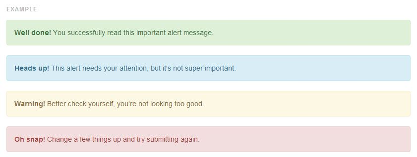

# How to Contribute

Before you start ensure you have

 *  Created a [GitHub account](https://github.com/signup/free)
 *  Signed the Particular [Contributor License Agreement](http://www.particular.net/contributors-license-agreement-consent).

There are two approaches to contributing.

## Via the GitHub Web UI  

For simple changes the GitHub web UI should suffice.

 1. Find the page you want to edit on http://docs.particular.net/.
 1. Click the `Improve this doc`. This will automatically fork the project so you can edit the file.
 1. Make the changes you require. Ensure you verify your changes in the `Preview` tab.
 1. Add a description of your changes.
 1. Click `Propose File Changes`.

## By Forking and Submitting a Pull Request

For more complex changes you should fork and then submit a pull request. This is useful if you are proposing multiple file changes

 1. [Fork](http://help.github.com/forking/) on GitHub.
 1. Clone your fork locally.
 1. Work on your feature.
 1. Push the up to GitHub.
 1. Send a Pull Request on GitHub.

For more information see [Collaborating on GitHub](https://help.github.com/categories/63/articles) especially [using GitHub pull requests](https://help.github.com/articles/using-pull-requests). 

# Conventions

## Headers

Each document has a header. It is enclosed by `---` and is defined in a [YAML](http://en.wikipedia.org/wiki/YAML) document.

The GitHub  UI will [correctly render YAML](https://github.com/blog/1647-viewing-yaml-metadata-in-your-documents).

For example:

```
---
title: Auditing With NServiceBus
summary: 'Provides built-in message auditing for every endpoint.'
tags:
- Auditing
- Forwarding Messages
---
```

### Title

Required. Used for the web page title tag `<head><title>`, displayed in the page content, and displayed in search results.

### Summary

Required. Used for the meta description tag (`<meta name="description"`) and displaying on the search results.

### Tags

Optional. Used to flag the article as being part of a group of articles.

Tags are rendered in the articles content with the full list of tags being rendered at [http://docs.particular.net/tags](http://docs.particular.net/tags). Untagged articles will be rendered here [http://docs.particular.net/tags/untagged](http://docs.particular.net/tags/untagged)

Tags are interpreted in two ways. 

* For inclusion of URLs:
   * Tag are lower case
   * Spaces are replaced with dashes (`-`) 
* For display purposes: 
   * Tags are lower case
   * Dashes (`-`) are replaced with dashes spaces 

### Redirects

URL redirects are not currently implemented but will be included as part of the header.

## Menu

The menu is a YAML text document stored at [Content/menu.yaml](Content/menu.yaml).

## URLs

The directory structure where a `.md` exists is used to derive the URL for that document. 

So a file existing at `Content\NServiceBus\Logging\NLog.md` will have a resultant URL of `http://docs.particular.net/NServiceBus/Logging/Nlog`.

### Index Pages

One exception to this rule is when a page is named `Index.md`. In this case the `Index.md` is omitted in the resultant URL and only the directory structure is used.

So a file existing at `Content\NServiceBus\Logging\Index.md` will have a resultant URL of `http://docs.particular.net/NServiceBus/Logging`.

### Linking

Links to other documentation pages should be relative and contain the `.md` extension. 

The `.md` allows links to work inside the GitHub web UI. The `.md` will be trimmed when they are finally rendered.

Given the case of editing a page located at `\Content\NServiceBus\Page1.md`:

To link to the file `\Content\NServiceBus\Page2.md`, use `[Page 2 Text](Page2.md)`.

To link to the file `\Content\ServiceControl\Page3.md`, use `[Page 3 Text](../ServiceControl/Page3.md)`.

## Markdown

The site is rendered using [GitHub Flavored Markdown](https://help.github.com/articles/github-flavored-markdown)

### [MarkdownPad](http://markdownpad.com/)

For editing markdown on your desktop (after cloning locally with Git) try [MarkdownPad](http://markdownpad.com/).

#### Markdown flavor

Ensure you enable `GitHub Flavoured Markdown (Offline)` by going to 

    Tools > Options > Markdown > Markdown Processor > GitHub Flavored Markdown (Offline)

Or click in the bottom left no the `M` icon to "hot-switch"

#### Yaml

Don't render YAML Front-Matter by going to  

    Tools > Options > Markdown > Markdown Settings 

And checking `Ignore YAML Front-matter`

## Code Snippets

There is a some code located here https://github.com/Particular/docs.particular.net/tree/master/Snippets. Any code in that directory wrapped in `// start code KEY` and `// end code KEY` can be injected into the documentation markdown using the syntax **&lt;!-- import KEY -->**.

So for example you could have a `.cs` file in that solution containing 

```
// start code ConfigureWith
var configure = Configure.With();
// end code ConfigureWith
```

And a documentation `.md` file containing

<pre>
<code >To configure the bus call
&lt;!-- import ConfigureWith --></code>
</pre>

And the resulting markdown will be will be 

    To configure the bus call
    ```
    var configure = Configure.With();
    ``` 


## Anchors

One addition to standard markdown is the auto creation of anchors for headings.

So if you have a heading like this: 

    ## My Heading

it will be converted to this:

    <h2>
      <a name="my-heading"/>
      My Heading
    </h2>

Which means elsewhere in the page you can link to it with this: 

    [Goto My Heading](#My-Heading)

<!--
## Alerts

Sometimes is necessary to draw attention to items you want to call out in a document.
Unfortunately markdown does not have a way to add class attributes so you will have to write the HTML by hand and embed it.

```html
<div class="alert alert-success">...</div>
<div class="alert alert-info">...</div>
<div class="alert alert-warning">...</div>
<div class="alert alert-danger">...</div>
```

This will produce:

-->

## Some Useful Characters

 * Ticks are done with `&#10004;` &#10004;
 * Crosses are done with `&#10006;` &#10006;
  
## Suggested Practices for Consistent Writing

* Spell out numbers smaller than ten (not 2,3, etc.).
* Do not use "please".
* Use these:
 * "click" (not "click on" or "press")
 * "open" (not "open up")
 * V3, V3.1	(not version 3, v.3, v3)
 * NOTE:	(Not "Note that")
 * Present tense (not future tense)
 * you, NServiceBus	(not "we") 
 * to (not "in order to")
 * Next steps (not	"Where to go from here?" or "Where to now?")
 * cannot, you would, is not	 (not contractions such as can't, you'd, isn't)
 * double click, right click	(not double-click, right-click)
 * you (not developers or users)
 * backend (not	back end)
* Use these proper nouns:
 * Particular Software	not Particular 
 * Visual Studio	 not visual studio
 * NuGet	not Nuget
 * RavenDB not Raven DB
 * Fluent not fluent
 * PowerShell not powershell 
 * MVC 3 not Mvc3
 * ASP.NET not Asp.Net
 * Log4Net not log4net 
 * Intellisense	not intellisense
 * ServiceInsight not serviceInsight
 * Windows Azure Service Bus not windows azure servicebus
 * First Level Retries not First-Level-Retries

## More Info
 
 * [Markdown Cheatsheet](https://github.com/adam-p/markdown-here/wiki/Markdown-Cheatsheet)

# Additional Resources

* [General GitHub documentation](http://help.github.com/)
* [GitHub pull request documentation](http://help.github.com/send-pull-requests/)
* [Forking a Repo](https://help.github.com/articles/fork-a-repo)
* [Using Pull Requests](https://help.github.com/articles/using-pull-requests)
