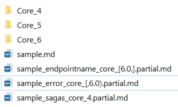
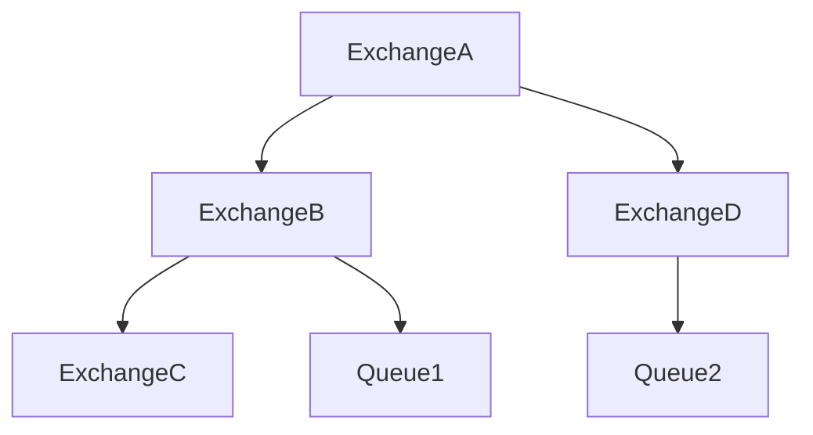
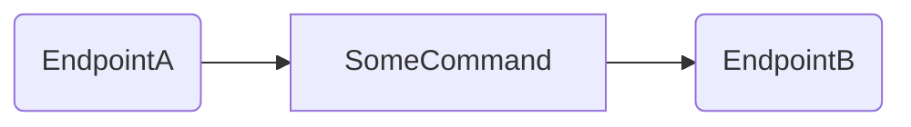
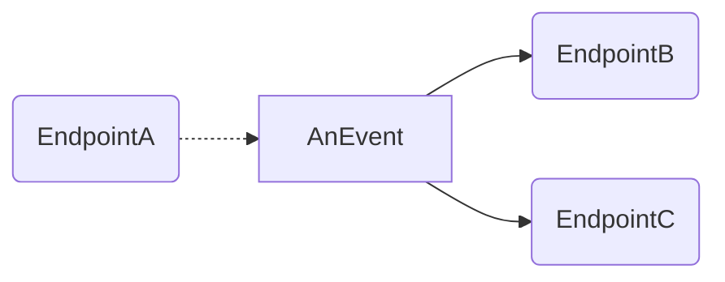
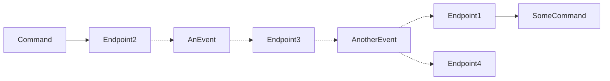

 

# How to Contribute

Before you start, ensure you have created a [GitHub account](https://github.com/join).

There are two approaches to contributing.


## Via the GitHub Web UI

For simple changes, the GitHub web UI should suffice.

 1. Find the page you want to edit on https://docs.particular.net/.
 1. Click the `Edit Online` button. This will automatically fork the project so you can edit the file.
 1. Make the changes you require. Ensure you verify the changes in the `Preview` tab.
 1. Add a description of the changes.
 1. Click `Propose File Changes`.


## By Forking and Submitting a Pull Request

For more complex changes you should fork and then submit a pull request. This is useful if you are proposing multiple file changes

 1. [Fork](https://help.github.com/forking/) on GitHub.
 1. Clone the fork locally.
 1. Work on the feature.
 1. Push the code to GitHub.
 1. Send a Pull Request on GitHub.

For more information, see [Collaborating on GitHub](https://help.github.com/categories/63/articles) especially [using GitHub pull requests](https://help.github.com/articles/using-pull-requests).


## Reviewing a page

If, as part of editing a page, a full review of the content is done, the [reviewed header](#reviewed) should be updated. This date is used to render https://docs.particular.net/review.

As part of a full review the following should be done:

 * Spelling (US)
 * Grammar
 * Version specific language and content is correct
 * Language is concise
 * All links are relevant. No 3rd party links have redirects or 404s.
 * Are there any more links that can be added to improve the content
 * Content is correct up to and including the current released version
 * Summary and title is adequate
 * Update reviewed date in header, even if no changes were made.


# Conventions


## Lower case  and `-` delimited

All content files (`.md`, `.png`, `.jpg` etc) and directories must be lower case.

All links pointing to them must be lower case.

Use a dash (`-`) to delimit filenames (e.g. `specify-endpoint-name.md`).


## Headers

Each document has a header. It is enclosed by `---` and is defined in a [YAML](https://en.wikipedia.org/wiki/YAML) document format.

The GitHub UI will [correctly render YAML](https://github.com/blog/1647-viewing-yaml-metadata-in-your-documents).

For example:

```
---
title: Auditing Messages
summary: Provides built-in message auditing for every endpoint.
versions: '[4,)'
related:
- samples/custom-checks/monitoring3rdparty
redirects:
- nservicebus/overview
---
```


### Title

```
title: Auditing With NServiceBus
```

**Must be 70 characters or less**, and 50-60 characters is recommended. https://moz.com/learn/seo/title-tag

Required. Used for the web page title tag `<head><title>`, displayed in the page content, and displayed in search results.

**Note: When considering what is a good title keep in mind that the parent context of a given page is fairly well known by other means. ie people can see where it exists in the menu and can see where in the hierarchy it is through the breadcrumbs. So it is often not necessary to include the parent title in the current pages title. For example when documenting "Publishers name configuration", for "Azure Service Bus Transport", then "Publishers name configuration" would be a sufficient title where "Publishers name configuration in Azure Service Bus Transport" is overly verbose and partially redundant.**


### Component

```
component: Core
```

Required when using partials views, recommended also when using snippets in multiple versions. Allows the rendering engine determine what versions of the given page should be generated. Specified by providing the [component key](#component-key).


### Versions

```
versions: '[1,2)'
```

In case of components that consist of multiple packages it's also possible to explicitly specify ranges of versions for each package separately:
```
versions: 'PackageA:[1,2); PackageB : [3,4); PackageC :*'
```

Optional. Used for specifying what versions the given page covers, especially relevant for features that are not available in all supported versions. The old format 'nuget_version_range' or 'package_name: nuget_version_range; package_name_2: nuget:version_range2'.


### Reviewed

```
reviewed: 2016-03-01
```

Optional. Used to capture the last date that a page was fully reviewed. Format is `yyyy-MM-dd`.


### Summary

```
summary: Provides built-in message auditing for every endpoint.
```

Optional. Used for the meta description tag (`<meta name="description" />`) and displaying the search results.


### Hidden

```
hidden: true
```

Causes two things:

 * Stops search engines from finding the page using a `<meta name="robots" content="noindex" />`.
 * Prevents the page from being found in the docs search.
 
 
### Preview Image

```
previewImage: preview-image.png
```

Populates a feature image for the [Open Graph](http://ogp.me/) and [Twitter Card](https://developer.twitter.com/en/docs/tweets/optimize-with-cards/guides/getting-started.html) meta tags for social sharing.

The URL should be a relative URL, usually just the filename in the same directory as the article, but `../` to go up a directory is also supported. If it works in a Markdown image tag `` then it should work for the metadata.


### Related

```
related:
- samples/custom-checks/monitoring3rdparty
```

A list of related pages for this page. These links will be rendered at the bottom of the page. Can include both samples and articles and they will be grouped as such when rendered in html.


### Suppress Related

```
suppressRelated: true
```

No related content will be displayed at the bottom of the article, including specifically included articles in the metadata, as well as any documents discovered by traversing the directory structure. This is intended for pages where tight control over the presentation of related material is desired.


### Redirects

```
redirects:
- nservicebus/overview
```

When renaming an existing article to a new name, add the `redirects:` section in the article header and specify the previous name for the article. If the old URL is linked anywhere, the new renamed article will automatically be served when the user clicks on it.

 * Values specified in the `redirects` section must be lower case.
 * Multiple values can be specified for the redirects, same as `tags`.
 * Values are fully qualified


### URL format for Redirects and Related

Should be the URL relative to the root with no beginning or trailing slash padding and no .md.


### UpgradeGuides

To Mark something as an upgrade guide use `isUpgradeGuide: true`

The `upgradeGuideCoreVersions` setting can optionally be used to filter which NSB core version tab the page show up in the search results

```
isUpgradeGuide: true
upgradeGuideCoreVersions:
 - 5
 - 6
```


### Learning Path

To mark a page as belonging to the [Particular Software Learning Path](https://particular.net/learn) use `isLearningPath: true`.


## An example header for an article

- In the following example, whenever the URLs `/servicecontrol/sc-si` or `/servicecontrol/debugging-servicecontrol` are being requested, the given article will be rendered.

```
---
title: ServiceInsight Interaction
summary: 'Using ServiceInsight Together'
redirects:
- servicecontrol/sc-si
- servicecontrol/debugging-servicecontrol
related:
- samples/azure/shared-host
---
```


## Components

Two things are generally referred to as "components", which can be confusing:

* [Components](#componentsyaml), as defined in [components.yaml](components/components.yaml), is the true definition of components, and defines the topic for a page, as well as the collection of snippets that it will pull in. In the case of a component like MSMQ, the functionality started in Core but was moved out to the MSMQ transport, but all of these together use the component `MsmqTransport`.
* [NuGet Aliases](#nugetaliastxt) are frequently misidentified as components because they look the same. NuGet aliases are used to translate the name of a versioned directory like `MsmqTransport_1` into the NuGet package `NServiceBus.Transport.Msmq`. Multiple NuGet aliases can exist within a component, i.e. MSMQ will have versioned snippet directories `Core_6` and `MsmqTransport_1`, which are different NuGet Aliases, but both belong to the same copmonent.

**When you are adding a new package,** you therefore need to add new entries to both components.yaml and nugetAlias.txt, which can be a source of confusion.

### components.yaml

"Components" is a general term used to describe a deployable set of functionality. Components exist in [components/components.yaml](components/components.yaml). Note that over time a component may have moved between nugets or split into new nugets. For example, the ASB Data Bus or the Callbacks.

Sample Component:

```
- Key: Callbacks
  Url: nservicebus/messaging/callbacks
  NugetOrder:
    - NServiceBus.Callbacks
    - NServiceBus
```

When adding a new component


#### Component Key

The component key allows for shorthand when referring to components in page headers.


#### Component URL

The component URL is the definitive source of documentation for a given component. This will eventually be used to link back to said documentation from both NuGet usages, samples and articles.


#### Component NugetOrder

Since components can be split over multiple different nugets, it is not possible to infer the order from the NuGet version alone. So we need to have a lookup index and the NugetOrder allows us to sensibly sort component versions. For example, NServiceBus.Callbacks.1.0.0 should sort higher than the version of Callbacks that exists in NServiceBus.5.0.0.


### nugetAlias.txt

All NServiceBus-related NuGet packages (used in documentation) are listed in [components/nugetAlias.txt](components/nugetAlias.txt). The alias part of the NuGet is the key that is used to infer the version and component for all snippets. For example, [Snippets/Callbacks](Snippets/Callbacks) has, over its lifetime, existed in both the Core NuGet and the Callbacks NuGet. So the directories under Callbacks are indicative of the NuGet (alias) they exist in and then split over the multiple versions of a given NuGet.

Example aliases:

```
ASP: NServiceBus.Persistence.AzureStorage
Autofac: NServiceBus.Autofac
Azure: NServiceBus.Azure
Callbacks: NServiceBus.Callbacks
```


## Target Frameworks

Samples can be targeted to multiple [target frameworks](https://docs.microsoft.com/en-us/dotnet/standard/frameworks). Samples can be edited and tested for multiple frameworks within this repository when using Visual Studio 2019. When the site is rendered, separate downloads for each target framework are generated by splitting the framework list and transforming the project files before zipping.

The currently recommended set of frameworks is:

```
<TargetFrameworks>net5.0;netcoreapp3.1;netcoreapp2.1;net48</TargetFrameworks>
```

Shared/messages projects should not be multi-targeted but use a standard framework that works with all targets:

```
<TargetFramework>netstandard2.0</TargetFramework>
```

Some things to keep in mind:

* The same list of target frameworks must be used for each project, **in the same order**.
* Target framework monikers (i.e. `netcoreapp3.1`) are translated to framework display names (i.e. `.NET Core 3.1`) in [/components/tfm-mappings.txt](https://github.com/Particular/docs.particular.net/blob/master/components/tfm-mappings.txt).
  * Download dropdown items are ordered by position in this file descending, so that options for newer frameworks are presented first.


## Menu

The menu is a YAML text document stored at [menu/menu.yaml](menu/menu.yaml).

Any sub-items that are prefixed with the title of the parent item will have that prefix removed

Example content:

```
- Name: NServiceBus
  Topics:
  - Url: platform
    Title: Getting Started
    Articles:
    - Url: platform
      Title: Particular Service Platform Overview
    - Title: NServiceBus Overview
      Articles:
      - Url: nservicebus/architecture/principles
        Title: Architectural Principles
      - Url: nservicebus/architecture
        Title: Bus versus broker architecture
```

Conventions:

 * Top level items the `Name` is used for the URL.
 * `Title` is required for all nodes other than top level.
 * Maximum of 4 levels deep.
 * URL is optional. if it does not exist it will render as an expandable node.


## URLs

The directory structure where a `.md` exists is used to derive the URL for that document.

So a file existing at `nservicebus\logging\nlog.md` will have a URL of `https://docs.particular.net/nservicebus/logging/nlog`.


### Index Pages

One exception to the URL rule is when a page is named `index.md`. In this case the `index.md` is omitted in the URL and only the directory structure is used.

So a file existing at `nservicebus\logging\index.md` will have a URL of `https://docs.particular.net/nservicebus/logging/`.


#### Related Pages on Index Pages

Like any page an index page can include [related pages](#related). However index pages will, by default, have all sibling and child pages included in the list of related pages. This is effectively a recursive walk of the file system for the directory the given index.md exists in.


### Linking

Links to other documentation pages should be relative and contain the `.md` extension.

The `.md` allows links to work inside the GitHub web UI. The `.md` will be trimmed when they are finally rendered.

Given the case of editing a page located at `\nservicebus\page1.md`:

- To link to the file `nservicebus\page2.md`, use `[Page 2 Text](Page2.md)`.
- To link to the file `\servicecontrol\page3.md`, use `[Page 3 Text](/servicecontrol/page3.md)`.

Don't link to `index.md` pages, instead link to the directory. So link to `/nservicebus/logging` and NOT `/nservicebus/logging/index.md`


## Markdown

The site is rendered using [GitHub Flavored Markdown](https://help.github.com/articles/github-flavored-markdown)


### [MarkdownPad](https://markdownpad.com/)

For editing markdown on the desktop (after cloning locally with Git) try [MarkdownPad](https://markdownpad.com/).


#### Markdown flavor

Ensure you enable `GitHub Flavored Markdown (Offline)` by going to

    Tools > Options > Markdown > Markdown Processor > GitHub Flavored Markdown (Offline)

Or click in the bottom left on the `M` icon to "hot-switch"


#### YAML

Don't render YAML front-matter by going to

    Tools > Options > Markdown > Markdown Settings

And checking `Ignore YAML Front-matter`


## EIP references 

[Enterprise Integration Patterns (EIP)](https://www.enterpriseintegrationpatterns.com/) is a bible of messaging. We sometimes use the same or similar patterns, but name them differently. When describing such a pattern, it's useful to reference the related EIP pattern, to make it easier to understand.


### Terms we use and are aligned with EIP

 * Message
 * Message Endpoint
 * [Messaging Bridge](https://www.enterpriseintegrationpatterns.com/patterns/messaging/MessagingBridge.html) - Unfortunately we don't have any implementation other than MSMQ-SQL sample
 * [Command Message](https://www.enterpriseintegrationpatterns.com/patterns/messaging/CommandMessage.html)
 * [Event Message](https://www.enterpriseintegrationpatterns.com/patterns/messaging/EventMessage.html)
 * [Request-Reply](https://www.enterpriseintegrationpatterns.com/patterns/messaging/RequestReply.html) - not sure if we are 100% aligned here. We use the term *Full Duplex* to describe a non-synchronous request reply and only use *Request-Reply* or *Callback* for the synchronous variant
 * [Correlation ID](https://www.enterpriseintegrationpatterns.com/patterns/messaging/CorrelationIdentifier.html)
 * [Transactional Client](https://www.enterpriseintegrationpatterns.com/patterns/messaging/TransactionalClient.html)
 * [Competing Consumers](https://www.enterpriseintegrationpatterns.com/patterns/messaging/CompetingConsumers.html)
 * [Message Store](https://www.enterpriseintegrationpatterns.com/patterns/messaging/MessageStore.html) - we have it in ServiceControl


### EIP terms and ideas we don't use but can

 * [Message Bus](https://www.enterpriseintegrationpatterns.com/patterns/messaging/MessageBus.html) - we dropped using the *bus* word when referring to an *endpoint* (which is correct) but I think we can take advantage of this definition of the bus because it is aligned with our concepts.
 * [Dead Letter Channel](https://www.enterpriseintegrationpatterns.com/patterns/messaging/DeadLetterChannel.html) - only MSMQ implements it, we don't have it on NServiceBus level
 * [Datatype Channel](https://www.enterpriseintegrationpatterns.com/patterns/messaging/DatatypeChannel.html) - is a channel reserved for a single data/message type. This is something we should be selling users as a good practice
 * [Channel Adapter](https://www.enterpriseintegrationpatterns.com/patterns/messaging/ChannelAdapter.html) - this seems to be similar to the ADSD idea for integration components that pull data from various services in order to combine them into a message
 * [Messaging Gateway](https://www.enterpriseintegrationpatterns.com/patterns/messaging/MessagingGateway.html) and [Messaging Mapper](https://www.enterpriseintegrationpatterns.com/patterns/messaging/MessagingMapper.html) - we could prepare guidance based on them on how to use NSB in the application
 * [Control Bus](https://www.enterpriseintegrationpatterns.com/patterns/messaging/ControlBus.html) - I believe we should get this implemented in (close) future
 * [Test Message](https://www.enterpriseintegrationpatterns.com/patterns/messaging/TestMessage.html)


### Terms we use but have a different meaning or name

 * Message Channel - we call it a queue but EIP name seeps to be more appropriate since e.g. SQL transport does not use queues
 * [Point-to-Point](https://www.enterpriseintegrationpatterns.com/patterns/messaging/PointToPointChannel.html) - we use *Unicast* instead
 * [Publish-Subscribe](https://www.enterpriseintegrationpatterns.com/patterns/messaging/PublishSubscribeChannel.html) - we use *Multicast* instead. I think these two discrepancies are something we need to live with because we reserve *Publish/Subscribe* name to a logical pattern.
 * [Invalid Message Channel](https://www.enterpriseintegrationpatterns.com/patterns/messaging/InvalidMessageChannel.html) - we call it *error queue*
 * [Guaranteed Delivery](https://www.enterpriseintegrationpatterns.com/patterns/messaging/GuaranteedMessaging.html) - we call it *store and forward*
 * [Return Address](https://www.enterpriseintegrationpatterns.com/patterns/messaging/ReturnAddress.html) - we use *reply address* but I think we are close enough.
 * [Process Manager](https://www.enterpriseintegrationpatterns.com/patterns/messaging/ProcessManager.html) - we call it *Saga*
 * [Message Broker](https://www.enterpriseintegrationpatterns.com/patterns/messaging/MessageBroker.html) - we use the term broker to describe a centralized transport mechanism where all message channels are on remote machine/cluster. EIP sees broker as a thing that also does routing based on message types (and/or content)
 * [Claim Check](https://www.enterpriseintegrationpatterns.com/patterns/messaging/StoreInLibrary.html) - we call it *Data bus*
 * [Event-Driven Consumer](https://www.enterpriseintegrationpatterns.com/patterns/messaging/EventDrivenConsumer.html) - we call it *message pump* or *IPushMessages*
 * [Message Dispatcher](https://www.enterpriseintegrationpatterns.com/patterns/messaging/MessageDispatcher.html) - we call it *Distributor*
 * [Selective Consumer](https://www.enterpriseintegrationpatterns.com/patterns/messaging/MessageSelector.html) - I believe our closest equivalent is a message handler
 * [Wire Tap](https://www.enterpriseintegrationpatterns.com/patterns/messaging/ControlBus.html) - we call it audit queue which confuses the purpose with the implementation. The thing is called *wire tap* and it is usually used to *audit* message flows.


## Samples


### When to write a sample

Any of the following, or combination thereof, could indicate that something should be a sample

 * When there are multiple non-trivial moving pieces that would be mitigated by being able to download a runnable VS solution.
 * When illustrating how Particular products/tools interact with 3rd-party products/tools.
 * It is a sample of a significant feature of the Particular platform. e.g. Databus, encryption, pipeline etc.

Do not write a sample when:

 * The only difference to an existing sample is a minor API usage.


### Recommendations

 * Samples should illustrate a feature or scenario with as few moving pieces as possible. For example, if the sample is "illustrating IOC with MVC" then "adding SignalR" to that sample will only cause confusion. In general, the fewer NuGet packages required to get the point across the better.
 * Do not "document things inside a sample". A sample is to show how something is used, not to document it. Instead update the appropriate documentation page and link to it. As a general rule, if you add any content to a sample, where that guidance could possibly be applicable to other samples, then that guidance should probably exist in a documentation page.
 * Start a sample with paragraph(s) that summarize why the sample would be useful or interesting. Think about more than what the sample _does_, but also what additional scenarios it can enable. After this summary, put the `downloadbutton` directive in a paragraph by itself, which will be rendered as a large **Download the sample now** button.


### Conventions

 * Samples are located here: https://github.com/Particular/docs.particular.net/tree/master/samples.
 * They are linked to from the home page and are rendered here: https://docs.particular.net/samples/.
 * Any directory in that structure with a sample.md will be considered a "root for a sample" or Sample Root.
 * A Sample Root may not contain a sample.md in subdirectories.
 * Each directory under the Sample Root will be rendered on the site as a downloadable zip with the directory name being the filename.
 * A sample.md can use snippets from within its Sample Root but not snippets defined outside that root.
 * A sample must obey rules that are verified by [Integrity Tests](#integrity-tests).
 * Samples targeting .NET Core should be able to run across Windows, macOS, and Linux. To ensure that's the case, you can run the sample using WSL (Windows Subsystem for Linux) in VS Code. VS Code can be [configured to use WSL as the default development environment](https://code.visualstudio.com/docs/remote/wsl). If a sample cannot be designed to support one or more platforms add a note to the `sample.md`-file with the platforms that are unsupported and the reasoning.

### References

Since users often use our samples to kick start their own projects, we want them to always use the latest versions of their dependencies. This is also important since we internally use our samples for smoke testing.

See the [NuGet package reference guidelines](#nuget-package-references) for more details on how to achieve this.

### Startup projects

When a sample is zipped the [VS startup projects](https://msdn.microsoft.com/en-us/library/a1awth7y.aspx) are also configured. This is done by using https://github.com/SimonCropp/SetStartupProjects. By default startable projects are [detected though interrogating the project settings](https://github.com/SimonCropp/SetStartupProjects/blob/master/src/SetStartupProjects/StartProjectFinder.cs). To override this convention and hard-code the list of startup projects add a file named `{SolutionName}.StartupProjects.txt` in the same directory as the solution file. It should contain the relative paths to the project files you would like to use for startup projects. 

For example if the solution "TheSolution.sln" contains two endpoints and you only want to start `Endpoint1` the content of `TheSolution.StartupProjects.txt` would be:

```
Endpoint1\Endpoint1.csproj
```

To apply this convention on your local clone of the docs repo use the [set startup projects linkpad script](#setstartuplinq).


### Bootstrapping a sample

At the moment the best way to get started on a sample is to copy an existing one. Ideally one that is similar to what you are trying to achieve.

A good sample to start with is the [Default Logging Sample](https://github.com/Particular/docs.particular.net/tree/master/samples/logging/default), since all it does is enable logging. You can then add the various moving pieces to the copy.


### Screenshots

Avoid using screenshots in samples unless it adds significant value over what can be expressed in text. They have the following problems:

 * More time consuming to update than text
 * Not search-able
 * Prone to an inconsistent feel as different people take screenshots at different sizes, different zoom levels and with different color schemes for the app in question
 * Add significantly to the page load time.

The most common misuse of screenshots is when capturing console output. **DO NOT DO THIS**. Put the text inside a formatted code section instead.


## Tutorials

Tutorials are similar to samples but optimized for new users to follow in a step-by-step fashion. Tutorials differ from samples in the following ways:

* Markdown file must be named `tutorial.md`
* No component specified in the header
* Focus on only the most recent version
* Rendered without button toolbar and component information at the top
* By default, solution download button is rendered at the end
  * An inline download button can be created instead using a `downloadbutton` directive on its own line within the tutorial markdown.
* Utilizes two collections of snippets, from the solution and also from an optional Snippets solution, allowing more granular or multi-phase snippets
* Allows use of personal voice (you/your/we/etc.) within `/tutorials` directory to foster collaborative tone with user


### Directory structure

An example directory structure for a tutorial might look like this:

```
{tutorial-name}/
  Snippets/ (optional)
    Snippets.sln
    Core_6
  Solution/
    {SolutionName}.sln
  tutorial.md
```

Tutorials can be grouped together in a parent directory with a normal article serving as a table of contents.


### Multi-lesson tutorials

For tutorials chained together to form multiple lessons, navigation can be created to combine a button linking to the next lesson with the Download Solution link.

```
- !!tutorial
  nextText: "Next Lesson: Sending a command"
  nextUrl: tutorials/nservicebus-step-by-step/2-sending-a-command
```

The `nextText` parameter is optional, and will default to the title of the linked page if omitted.


## Markdown partials

Partials are version-specific files that contain markdown.

They are only rendered in the target page when the version filter matches the convention for a give file.

Partial Convention: `filePrefix_key_nugetAlias_version.partial.md`

Make sure to use component alias (as defined in components.yaml file) in the partial name. For most components component alias will be identical to NuGet alias, however it's not always the case, e.g. the Callbacks feature has been moved out of core package to the dedicated NServiceBus.Callbacks package, so the there are two NuGet aliases that are related to this feature, but it's still the same component and has a single component alias. 

The NuGet alias in samples should match the prefix as defined by the samples solution directories.

Partials are rendered in the target page by using the following syntax

```
partial: PARTIAL_KEY
```

So an example directory structure might be as follows



And to include the `endpointname` partial can be pulled into `sample.md` by including.

```
partial: endpointname
```


## Markdown includes

Markdown includes are pulled into the document prior to passing the content through the markdown conversion.


### Defining an include

Add a file anywhere in the docs repository that is suffixed with `.include.md`. For example, the file might be named `theKey.include.md`.


### Using an include

Add the following to the markdown:
```
include: theKey
```

## Code Snippets


### Defining Snippets

There is a some code located here: https://github.com/Particular/docs.particular.net/tree/master/Snippets. Any directory containing an `_excludesnippets` file will have its snippets ignored.

File extensions scanned for snippets include:

 * `.config`
 * `.cs`
 * `.cscfg`
 * `.csdef`
 * `csproj`
 * `.html`
 * `.sql`
 * `.txt`
 * `.xml`
 * `.xsd`
 * `ps1`
 * `.ps`
 * `.json`
 * `.proto`
 * `.config`
 * `.yml`
 * `Dockerfile`

### Snippets are highlighted using highlightjs

 * [Documentation](https://highlightjs.readthedocs.io/)
 * [Language List](https://highlightjs.readthedocs.io/en/latest/css-classes-reference.html#language-names-and-aliases)


### Inline Code

 * https://highlightjs.org/static/demo/
 * https://github.com/isagalaev/highlight.js/tree/master/src/languages

| language     | key            |
|--------------|----------------|
| c#           | `cs`           |
| xml          | `xml`          |
| command line | `dos`          |
| powershell   | `ps`           |
| json         | `json`         |
| sql          | `sql`          |


**Always use fenced code blocks with a language.** If no language is defined then highlightjs will guess the language and it regularly gets it wrong.


#### Using comments

Any code wrapped in a convention-based comment will be picked up. The comment needs to start with `startcode` which is followed by the key.

```
// startcode ConfigureWith
var configure = Configure.With();
// endcode
```

For non-code snippets apply a similar approach as in code, using comments appropriate for a given file type. For plain-text files an extra empty line is required before `endcode` tag.

|Tag        |XML-based                    |PowerShell            |SQL script             |Plain text          |Dockerfile / Compose         |
|-----------|-----------------------------|----------------------|-----------------------|--------------------|--------------------|
|**Open**   |`<!-- startcode name -->`|`# startcode name`|`-- startcode name`|`startcode name`|`# startcode name`
|Content    |                             |                      |                       |                    |
|**Close**  |`<!-- endcode -->`       |`# endcode`       |`-- endcode`       |`endcode`       |`# endcode`


#### Using regions

Any code wrapped in a named C# region will be picked up. The name of the region is used as the key.

```
#region ConfigureWith
var configure = Configure.With();
#endregion
```


### Snippet versioning

Snippets are versioned. These versions are used to render snippets in a tabbed manner.


Versions follow the [NuGet versioning convention](https://docs.nuget.org/create/versioning#specifying-version-ranges-in-.nuspec-files). If either `Minor` or `Patch` is not defined they will be rendered as an `x`. For example, version `3.3` would be rendered as `3.3.x` and version `3` would be rendered as `3.x`.

Snippet versions are derived in two ways


#### Version suffix on snippets

Appending a version to the end of a snippet definition as follows:

```
#region ConfigureWith 4.5
var configure = Configure.With();
#endregion
```

Or version range:

```
#region MySnippetName [1.0,2.0]
My Snippet Code
#endregion
```


#### Convention based on the directory

If a snippet has no version defined then the version will be derived by walking up the directory tree until if finds a directory that is suffixed with `_Version` or `_VersionRange`. For example:

 * Snippets extracted from `docs.particular.net\Snippets\Snippets_4\TheClass.cs` would have a default version of `(≥ 4.0.0 && < 5.0.0)`.
 * Snippets extracted from `docs.particular.net\Snippets\Snippets_4\Special_4.3\TheClass.cs` would have a default version of `(≥ 4.3.0 && < 5.0.0)`.
 * Snippets extracted from `docs.particular.net\Snippets\Special_(1.0,2.0)\TheClass.cs` would have a default version of `(> 1.0.0 && < 2.0.0)`.


#### Pre-release marker file

If a file named `prerelease.txt` exists in a versioned directory then a `-pre` will be added to the version.

For example, if there is a directory `docs.particular.net\Snippets\{Component}\Snippets_6\` and it contains a `prerelease.txt` file then the version will be `(≥ 6.0.0-pre)`


### Using Snippets

The keyed snippets can then be used in any documentation `.md` file by adding the text

**snippet: KEY**

Then snippets with the key (all versions) will be rendered in a tabbed manner. If there is only a single version then it will be rendered as a simple code block with no tabs.

For example:

<pre>
<code >To configure the bus call
snippet: ConfigureWith</code>
</pre>

The resulting markdown will be:

    To configure the bus call
    ```
    var configure = Configure.With();
    ```


### Code indentation

The code snippets will do smart trimming of snippet indentation.

For example, given this snippet:

<pre>
&#8226;&#8226;#region DataBus
&#8226;&#8226;var configure = Configure.With()
&#8226;&#8226;&#8226;&#8226;.FileShareDataBus(databusPath);
&#8226;&#8226;#endregion
</pre>

The two leading spaces (&#8226;&#8226;) will be trimmed and the result will be

```
var configure = Configure.With()
••.FileShareDataBus(databusPath)
```

The same behavior will apply to leading tabs.


#### Do not mix tabs and spaces

If tabs and spaces are mixed there is no way for the snippets to work out what to trim.

So given this snippet:

<pre>
&#8226;&#8226;#region DataBus
&#8226;&#8226;var configure = Configure.With()
&#10137;&#10137;.FileShareDataBus(databusPath);
&#8226;&#8226;#endregion
</pre>

where &#10137; is a tab, the resulting markdown will be

<pre>
var configure = Configure.With()
&#10137;&#10137;.FileShareDataBus(databusPath)
</pre>

Note that none of the tabs have been trimmed.


### Explicit variable typing versus 'var'

Use `var` everywhere.


### Snippets are compiled

The code used by snippets and samples is compiled on the build server. The compilation is done against the versions of the packages referenced in the samples and snippets projects. When a snippet doesn't compile, the build will break so make sure snippets are compiling properly. Samples and snippets should not reference unreleased NuGet packages.


## NuGet package references


### Use current minor

NuGet package references should use the the most greedy wildcard that is safe for that reference. In most cases that is "current minor":

```
<PackageReference Include="NServiceBus.Serilog" Version="4.*" />
```

This applies to snippets and samples.


### Sometimes current patch

In some cases, usually where a package has significant new API in a minor, it may be necessary to version snippets down to the "current patch".

```
<PackageReference Include="NServiceBus.Persistence.Sql" Version="2.0.*" />
```

```
<PackageReference Include="NServiceBus.Persistence.Sql" Version="2.1.*" />
```

Note that this should be a temporary state and in the next major default back to "current minor".

```
<PackageReference Include="NServiceBus.Persistence.Sql" Version="3.*" />
```

Also this generally only applies to snippets. It is usually not necessary to go to that level of version granularity for samples.


### Samples always pull in one extra level

All samples pull in one extra level of package dependency. So, for example, in the Rabbit samples it would be sufficient to have:

```
<PackageReference Include="NServiceBus.RabbitMQ" Version="4.*" />
```

The reference to `NServiceBus` and `RabbitMQ.Client` would then be inferred. However, since the dependencies in `NServiceBus.RabbitMQ` are:

```
NServiceBus (>= 6.0.0 && < 7.0.0)
RabbitMQ.Client (>= 5.0.1 && < 5.1.0)
```

NuGet will then resolve the lowest within those ranges. This make it more difficult to smoke test new versions of those dependencies using samples. As such, for all dependencies that are important to use the latest, the extra dependencies are explicitly included with wildcards.

```
<PackageReference Include="NServiceBus.RabbitMQ" Version="4.*" />

<ItemGroup Label="Required to force the latest version of transitive dependencies">
  <PackageReference Include="NServiceBus" Version="6.*" />
  <PackageReference Include="RabbitMQ.Client" Version="5.0.*" />
</ItemGroup>
```


### Unreleased NuGet packages

There are some scenarios where documentation may require unreleased or beta NuGet packages. For example, when creating a PR against documentation for a feature that is not yet released. In this case, it is ok for a PR to reference an unreleased NuGet and have that PR fail to build on the build server. Once the NuGet packages have been released that PR can be merged.

In some cases it may be necessary to have merged documentation for unreleased features. In this case the NuGet packages should be pushed to the [Particular feed on MyGet](https://www.myget.org/feed/Packages/particular). The feed is included by default in the [Snippets nuget.config](https://github.com/Particular/docs.particular.net/blob/master/Snippets/nuget.config#L14).


### Temporary unstables

When documenting an unstable feature, those unstable packages must be explicitly included using the exact prerelease package version using `-`. 

```
<PackageReference Include="NServiceBus.RabbitMQ" Version="4.3.1-alpha.XYZ" />
```

Wildcard patterns, like `Version="4.3.1-*` are not allowed for pre-releases since they tend to break the snippet and sample builds.
```

In snippets this can be safely done at any point in time. Note that when for applied to samples this can have side effects on a user who downloads a sample during that period. As such it is generally only done for samples that are marked with a `prerelease.txt` marker.

This is a temporary state and once a stable is released it is changed back to the "current minor"

```
<PackageReference Include="NServiceBus.RabbitMQ" Version="4.*" />
```


## Integrity tests

A [number of integrity tests](tests/IntegrityTests) validate that samples and snippets conform to conventions that make the documentation easier to maintain. Pull requests that fail these tests can not be merged.

The integrity tests include:

* [Samples should not be multi-targeted](tests/IntegrityTests/ProjectFrameworks.cs) using the `<TargetFrameworks>` (plural) element. This is because a visitor who downloads the solution without .NET Core installed will not be able to run a multi-targeted project even on the .NET Framework. Instead a sample should have separate solutions and projects to support .NET Framework and .NET Core, all using the same underlying code, i.e.:
    * `SampleName.sln` references `ProjectName.csproj` targeting `net462`
    * `SampleName.Core.sln` references `ProjectName.Core.csproj` targeting `netcoreapp2.0`
* [Package references cannot use a wildcard-only version](tests/IntegrityTests/ReferenceVersions.cs) using `Version="*"` as this can cause a package restore operation to sometimes fail and yield old, incorrect, or mismatched versions.
* [Versioned sample/snippet directories (i.e. `Core_7`) must contain a `prerelease.txt` file](tests/IntegrityTests/ValidatePrereleaseTxt.cs) **only** when the contained projects use a prerelease version of that component's NuGet package. This is verified in two ways:
    1. Tests find all `prerelease.txt` files, parse the component name out of the parent directory name, find the related NuGet packages from component metadata, and then scan all child project files for prerelease package references of those NuGet packages, flagging `prerelease.txt` files with no associated prerelease package reference.
    2. Tests examine all project files, finding a parent versioned directory, parse out the component name, look up the NuGet packages from component metadata, scan the project path for any prerelease package references of those NuGet packages, and then flag any missing a `prerelease.txt` file.

## Alerts

Sometimes it is necessary to draw attention to items you want to call out in a document.

This is achieved through bootstrap alerts https://getbootstrap.com/components/#alerts

There are several keys each of which map to a different colored alert

| Key                 | Color  |
|---------------------|--------|
| `SUCCESS`           | green  |
| `NOTE` or `INFO`    | blue   |
| `WARNING` or `WARN` | yellow |
| `DANGER`            | red    |

Keys can be used in two manners


### Single-line

This can be done with the following syntax

    KEY: the note text.

For example, this

    NOTE: Some sample note text.

will be rendered as

    <p class="alert alert-info">
       Some sample note text.
    </p>


### Multi-line

Sometimes it is necessary to group markdown elements inside a note. This can be done with the following syntax

    {{KEY:
    Inner markdown elements
    }}

For example, this

    {{NOTE:
    * Point one
    * Point Two
    }}

will be rendered as

    <p class="alert alert-info">
    * Point One
    * Point Two
    </p>


## Headings

The first (and all top level) headers in a `.md` page should be a `h2` (i.e. `##`) with sub-headings under it being `h3`, `h4`, etc.


## Spaces

* Add an empty line before a heading and any other text
* Add an empty line after a heading
* Add an empty line between paragraphs


## Anchors

One addition to standard markdown is the auto creation of anchors for headings.

So if you have a heading like this:

    ## My Heading

it will be converted to this:

    <h2>
      <a name="my-heading"/>
      My Heading
    </h2>

Which means elsewhere in the page you can link to it with this:

    [Goto My Heading](#My-Heading)


## Images

Images can be added using the following markdown syntax

    

With the minimal syntax being

    


### Image sizing

Image size can be controlled by adding the text `width=x` to the end of the title

For example

    

With the minimal syntax being

    

This will result in the image being re-sized with the following parameters

    width="x" height="auto"

It will also wrap the image in a clickable lightbox so the full image can be accessed.


### Maintaining images

When creating images, strive to keep sources in order to update and re-create images later. Whenever possible use mermaid. When using LucidChart make sure to keep the sources.


### mermaid

The support for [mermaid](https://knsv.github.io/mermaid/) is provided as an extension to [Markdig](https://github.com/lunet-io/markdig). Markdig converts the diagram definition from .md to HTML, and then mermaid JavaScript library converts the definition to SVG format on the fly.

Diagram images are generated using the  using a pseudocode syntax like this:
<pre><code>
```mermaid
_mermaid_diagram_definition_
```
</code></pre>

For example:
<pre><code>

</code></pre>

The diagrams can be created and verified using the [online editor](http://knsv.github.io/mermaid/live_editor/).


#### Messaging Graph Style

Diagrams that represent messages and events being passed between endpoint should follow some basic style rules.

Endpoints should be represented as nodes with rounded corners. Messages should be represented as nodes. To show an endpoint sending a message to another endpoint use two edges. The first edge goes from the sender to the message being sent. The second edge goes from the message to the receiver. Like this:
<pre><code>

</code></pre>

Showing an endpoint publishing an event is similar but should use a dotted edge. Events can be delivered to multiple recipients. Use a separate edge for each one. Like this:
<pre><code>

</code></pre>

There are two css classes (`event` and `message`) that should be applied to message nodes in these diagrams. To apply these, use the `class` keyword in mermaid:

<pre><code>

</code></pre>


### LucidChart

Another option is using [LucidChart](https://www.lucidchart.com). LucidChart allows to export and import Visio (VDX) formatted documents. Visio formatted documents can be used to generate images and should be committed along with the images. To generate images from LucidChart (or a Visio document), export the image as PNG, using the "Crop to content" option.


## Some Useful Characters

 * Ticks are done with `&#10004;` &#10004;
 * Crosses are done with `&#10006;` &#10006;


## More Information

 * [Markdown Cheatsheet](https://github.com/adam-p/markdown-here/wiki/Markdown-Cheatsheet)


# Writing style


## Language Preferences

For consistency, prefer American English.

No personal voice. I.e. no "we", "you", "your", "our" etc.


## Version language

Avoid ambiguity.

* Range: **version X and above** and **version Y and below** and **version X to version Y**.
* Singular: **version X** and NOT **VX**.

Don't capitalize "version" unnecessarily.

* **NServiceBus version 6** and NOT **NServiceBus Version 6**
* **NServiceBus version 5 and below** and NOT **NServiceBus Version 5 and below**

Don't assume the latest version of a product is the only one being used

* Instead of "Prior to NServiceBus version 6.5, sagas could not...", say "In NServiceBus 6.4.x and below, sagas can not..."

## Embedding videos

There is a CSS class that will properly style videos: `video-container`

Use it as follows:

```
<div class="video-container">
<iframe src="https://www.youtube.com/embed/QolL1Oum72Q" frameborder="0" allowfullscreen></iframe>
</div>
```


## Terminology


### Bus

The word `Bus` should be avoided in documentation. Some replacements include:
 * When referring to the topology, use `federated` (for which the opposite term is `centralized`)
 * When referring to the NServiceBus instance, the general thing that sends or publishes messages, use `endpoint instance` or `endpoint` (when it is clear from the context that you are talking about an instance rather than a logical concept)
 * When referring specifically to the `IBus` interface use `message session` or `message context` (depending if you are talking about just sending a messages from external component or from inside a handler)

The word `Bus` is allowed when a particular piece of documentation refers specifically to version 5 or below and discusses low level implementation details.


# Links to 3rd parties


## RavenDB

Avoid deep link into the RavenDB documentation since it is a maintenance pain. For example don't link to `https://ravendb.net/docs/article-page/3.0/Csharp/client-api//session/transaction-support/dtc-transactions#transaction-storage-recovery`. When RavenDB 4 was released, `article-page/3.0/Csharp` became invalid and required an update. Also the RavenDB documentation does not maintain structure between versions. e.g. `https://ravendb.net/docs/article-page/2.0/Csharp/client-api//session/transaction-support/dtc-transactions#transaction-storage-recovery` is a 404. So we can't trust that "just change the version" will work. Instead link to the RavenDB docs search: `https://ravendb.net/docs/search/latest/csharp?searchTerm=THE-SEARCH-TERM`. So for the above example it would be `https://ravendb.net/docs/search/latest/csharp?searchTerm=Transaction-storage-recovery`.


# Utilities

Under https://github.com/Particular/docs.particular.net/tree/master/tools there are several utilities to help with the management of this repository. All are in the form of [LINQPad](https://www.linqpad.net/) scripts.


## projectStandards.linq

Remove redundant content from sln and csproj files.

Enforces the [Resharper](https://www.jetbrains.com/resharper/) settings to be correct for every solution. The standard is a placeholder .settings file that pull in the [Shared.DotSettings](https://github.com/Particular/docs.particular.net/blob/master/tools/Shared.DotSettings) file as a layer.


## setStartup.linq

Sets the correct startup projects for every solution. This is persisted in an `.suo` file for each solution. Since `.suo` files are not committed to source control, if a re-clone is done this script will need to be re-run.


# Git management/behavior

In general the quality of the git history is not important in this repository. The reason for this is that the standard usages of a clean history (blame, supporting old versions, support branches etc) do not apply to a documentation repository. As such there are several recommendations based on that:

 * If pushed to GitHub **do not** re-write history. Even locally it is probably not worth the effort.
 * **Do not** force push.
 * Optionally merge commits immediately prior to merging a PR.

So if following the [Git pretty flow chart](http://justinhileman.info/article/git-pretty/) you should usually end in the "It's safest to let it stay ugly" end point.


# Additional Resources

 * [GitHub Flow in the Browser](https://help.github.com/articles/github-flow-in-the-browser/)
 * [General GitHub documentation](https://help.github.com/)
 * [GitHub pull request documentation](https://help.github.com/send-pull-requests/)
 * [Forking a Repo](https://help.github.com/articles/fork-a-repo)
 * [Using Pull Requests](https://help.github.com/articles/using-pull-requests)
 * [Markdown Table generator](https://www.tablesgenerator.com/markdown_tables)
