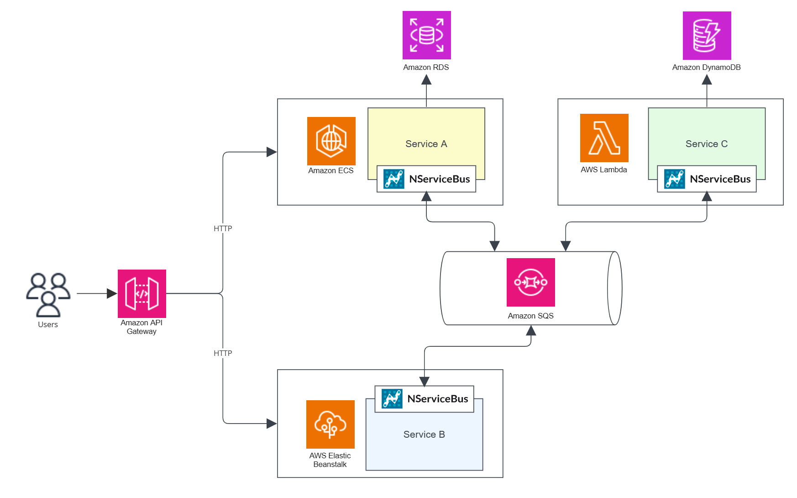

According to the [AWS guidance](https://aws.amazon.com/microservices/), microservices are an architectural approach where software is composed of small, independent services communicating over well-defined APIs.

The Particular Service Platform makes it easy to use microservices by defining [NServiceBus endpoints](/nservicebus/endpoints/) that act as one of these independent services. These endpoints use [messaging patterns](/nservicebus/messaging/) to ensure the services remain autonomous.

## Components

- **[NServiceBus endpoint](/nservicebus/endpoints/) (service)**

    Each service is an autonomously deployable and scalable unit with a private [data store](./data-stores.md).

- **Message bus**

    The message bus provides an asynchronous, reliable, and fault-tolerant communication channel which decouples the services.

- **Gateway**

    A gateway is a facade which allows decoupling between different service layers and/or UI applications. Gateways may provide further operational features but do not contain business logic. In AWS, APIs can be managed with [AWS API Gateway](https://aws.amazon.com/api-gateway/).

## Challenges

### Service boundaries

Finding good service boundaries is one of the biggest challenges within the microservice architectural style. Suboptimal boundaries often lead to a lack of data isolation and excessive inter-service communication. This often leads to high coupling between services that implement business processes,  leading to what is known as a ["distributed monolith"](https://particular.net/videos/microservices-and-distributed-monoliths). To define autonomous services, it is crucial to focus on business boundaries rather than technical boundaries.

<iframe allowfullscreen frameborder="0" height="300" mozallowfullscreen src="https://player.vimeo.com/video/113515335" webkitallowfullscreen width="400"></iframe>

In this presentation, Udi Dahan demonstrates the process of finding good service boundaries. He explains the challenges of traditional layered architectures and covers an approach that cuts across all application layers, outlining the natural lines of loose and tight coupling. Finally, Udi shows how these vertical slices collaborate using events, enabling flexible and high performance business processes.

[**Blog post: Goodbye microservices, hello right-sized services →**](https://particular.net/blog/goodbye-microservices-hello-right-sized-services)

### RPC vs. messaging

Communication between services is much slower and error-prone due to network limitations compared to communication between modules inside a single process. This can lead to higher latency and increased impact of network outages. Asynchronous communication between services helps to mitigate these risks.

[**Read more about this topic: RPC vs. Messaging – which is faster? →**](https://particular.net/blog/rpc-vs-messaging-which-is-faster)

### User interfaces

Users often need to see and interact with data aggregated from multiple services. Several technologies and patterns help to do this while keeping the services decoupled, such as [ViewModel Composition](https://www.viewmodelcomposition.com), [microfrontends](https://en.wikipedia.org/wiki/Microfrontend), and [GraphQL](https://graphql.org/).

## Microservice technologies

Since each service within a microservice architecture style is hosted independently and can use its own data store, one of the major benefits of this architecture is the ability for a team to choose the most appropriate technologies for a given service without impacting other services or the teams working on them. Endpoints built with the Particular Service Platform are generally hosted separately, and each may use a different data store technology. The Particular Service Platform also supports [cross-platform integration with systems or components which do not use NServiceBus](https://particular.net/blog/cross-platform-integration-with-nservicebus-native-message-processing).

Some common technology options for building microservices in AWS include:

- Fully managed services like [AWS Lambda](https://aws.amazon.com/pm/lambda/) and [AWS Elastic Beanstalk](https://aws.amazon.com/elasticbeanstalk/) are popular choices for systems requiring scalable hosting environments with minimal management. These services also offer convenient solutions when building web-facing applications.
- [Containerized applications](/architecture/aws/compute.md#platform-as-a-service-containers) can be hosted in managed container orchestration platforms like [Amazon Elastic Container Service (ECS)](https://aws.amazon.com/ecs/), [Amazon Elastic Kubernetes Service (EKS)](https://aws.amazon.com/eks/)
- Data storage technologies for building microservices include [Amazon DynamoDB](https://aws.amazon.com/dynamodb/), [Amazon Aurora](https://aws.amazon.com/rds/aurora/), [Amazon Relational Database Service (RDS)](https://aws.amazon.com/rds/)
- Messaging options, like [Amazon Simple Queue Service (SQS)](https://aws.amazon.com/sqs/) and [Amazon Simple Notification Service (SNS)](https://aws.amazon.com/sns/) are key for microservices to ensure services remain decoupled.
