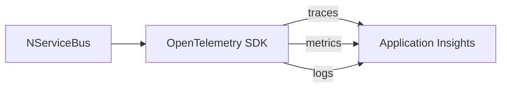

[Azure Application Insights](https://learn.microsoft.com/en-us/azure/azure-monitor/app/app-insights-overview) is part of [Azure Monitor](https://azure.microsoft.com/en-us/products/monitor) and collects the [three main observability signals](https://opentelemetry.io/docs/concepts/signals/) - traces, metrics, and logs - into a single managed service. NServiceBus supports all three signals via [OpenTelemetry](/nservicebus/operations/opentelemetry.md) and exports them to Application Insights using the [`Azure.Monitor.OpenTelemetry.Exporter`](https://www.nuget.org/packages/Azure.Monitor.OpenTelemetry.Exporter) package.

## Prerequisites

1. Create an [Application Insights resource](https://learn.microsoft.com/en-us/azure/azure-monitor/app/create-workspace-resource) in the Azure portal.
2. Copy the connection string from the resource overview panel.
3. Add the `Azure.Monitor.OpenTelemetry.Exporter` NuGet package to the endpoint project.

## Enabling OpenTelemetry

NServiceBus version 10 and above enables OpenTelemetry instrumentation by default. In earlier versions, enable it explicitly:

```csharp
endpointConfiguration.EnableOpenTelemetry();
```

With instrumentation enabled, NServiceBus emits traces, metrics, and logs that can be captured by OpenTelemetry and exported to Application Insights.

## Tracing

NServiceBus generates a trace span for each incoming message, covering the full processing pipeline including all handler invocations. Configure a tracer provider with the `NServiceBus.Core` activity source and the Azure Monitor exporter:

```csharp
var traceProvider = Sdk.CreateTracerProviderBuilder()
    .AddSource("NServiceBus.Core*")
    .AddAzureMonitorTraceExporter(o => o.ConnectionString = appInsightsConnectionString)
    .Build();
```

Traces appear in Application Insights under _Investigate_ → _Performance_. Each span includes NServiceBus-specific attributes such as message type, message ID, and handler name, making it straightforward to filter and correlate message processing activity across endpoints.

> [!NOTE]
> Dispose the `traceProvider` when the endpoint stops to ensure all buffered traces are flushed.

## Metrics

NServiceBus exposes meters for message throughput, timing, and recoverability. Configure a meter provider with the `NServiceBus.Core` meter and the Azure Monitor exporter:

```csharp
var meterProvider = Sdk.CreateMeterProviderBuilder()
    .AddMeter("NServiceBus.Core*")
    .AddAzureMonitorMetricExporter(o => o.ConnectionString = appInsightsConnectionString)
    .Build();
```

Metrics appear in Application Insights under _Monitoring_ → _Metrics_. The available meters include:

| Meter | Description |
|---|---|
| `nservicebus.messaging.fetches` | Messages fetched from the queue |
| `nservicebus.messaging.successes` | Messages processed successfully |
| `nservicebus.messaging.failures` | Messages that failed processing |
| `nservicebus.messaging.handler_time` | Time spent in message handlers |
| `nservicebus.messaging.processing_time` | Total message processing time |
| `nservicebus.messaging.critical_time` | Time from message send to handler completion |
| `nservicebus.recoverability.immediate` | Immediate retry attempts |
| `nservicebus.recoverability.delayed` | Delayed retry attempts |
| `nservicebus.recoverability.error` | Messages moved to the error queue |

See [metrics definitions](/monitoring/metrics/definitions.md) for full descriptions of each metric.

> [!NOTE]
> It may take a few minutes for metric data to appear in Application Insights. Meters only appear in the dashboard after reporting at least one value.

## Logging

NServiceBus logs are exported to Application Insights when [Microsoft.Extensions.Logging](https://learn.microsoft.com/en-us/dotnet/core/extensions/logging/) is configured with the OpenTelemetry logging exporter. Logs are correlated to the active trace, so each log entry includes the `TraceId` and `SpanId` of the span in which it was emitted.

### Generic Host

When hosting with the [.NET Generic Host](/nservicebus/hosting/extensions-hosting.md), configure the logging pipeline on the host builder. NServiceBus connects to `Microsoft.Extensions.Logging` automatically when using `UseNServiceBus()`:

```csharp
builder.Logging.AddOpenTelemetry(options =>
{
    options.IncludeFormattedMessage = true;
    options.IncludeScopes = true;
    options.AddAzureMonitorLogExporter(o => o.ConnectionString = appInsightsConnectionString);
});
```

### Self-hosted endpoints

In a self-hosted endpoint that does not use the Generic Host, create a logger factory and connect it to NServiceBus using the [`NServiceBus.Extensions.Logging`](https://www.nuget.org/packages/NServiceBus.Extensions.Logging) package:

```csharp
var loggerFactory = LoggerFactory.Create(builder =>
{
    builder.AddOpenTelemetry(options =>
    {
        options.IncludeFormattedMessage = true;
        options.IncludeScopes = true;
        options.AddAzureMonitorLogExporter(o => o.ConnectionString = appInsightsConnectionString);
    });
});

NServiceBus.Logging.LogManager.UseFactory(new ExtensionsLoggerFactory(loggerFactory));
```

Logs appear in Application Insights under _Monitoring_ → _Logs_ and can be queried using [KQL](https://learn.microsoft.com/en-us/azure/data-explorer/kusto/query/).

## Correlating signals

When all three signals are configured, Application Insights links traces, metrics, and logs by their shared `TraceId`. This makes it possible to navigate from a slow or failed trace directly to the associated log entries, or to pin a metric spike to the specific message that caused it - all within a single tool.



## Samples

- [Application Insights sample](/samples/open-telemetry/application-insights) - a complete example exporting traces and metrics to Application Insights
- [Connecting OpenTelemetry traces and logs](/samples/open-telemetry/logging) - shows how to correlate logs to traces using Microsoft.Extensions.Logging
