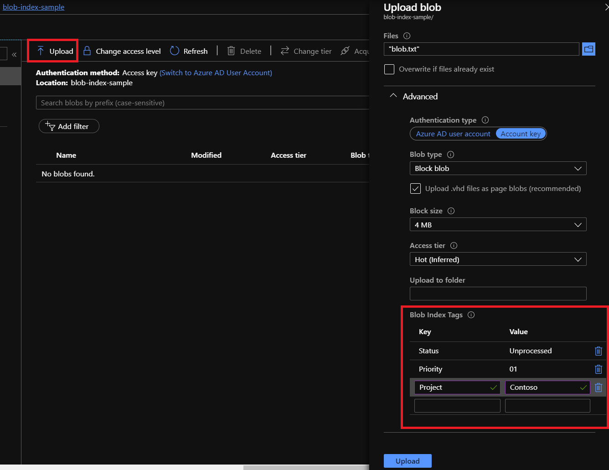

Attribute-Based Access Control ([ABAC](https://learn.microsoft.com/en-gb/azure/role-based-access-control/conditions-overview)) is an authorization system that defines access based on attributes associated with identities, resources, and environment. These attributes can be changed during application runtime, dynamically altering access to resources.

Traditional Role-Based Access Control ([RBAC](https://learn.microsoft.com/en-gb/azure/role-based-access-control/overview)) has a severe limitation for distributed, message-driven architectures in that authorization decisions are based on pre-assigned roles rather than dynamic attributes evaluated at the time of access. This presents unique authorization challenges for distributed systems due to their asynchronous nature, service autonomy, and  [temporal decoupling](/architecture/messaging.md#message-systems). For example,

- **Temporal permission drift**: Permissions can change between the time a message is sent and when it's ultimately executed in a message handler
- **Over-provisioned access**: Over allocating permissions to resources to cater for the decoupling of services
- **Role explosion**: An unmanageable proliferation of fine-grained access roles due to complexity
- **Content-based routing limitations**: Inability to dynamically route messages based on payload attributes without creating static roles for each route
- **Queue subscription filtering**: All-or-nothing access to queues, preventing selective message consumption based on attributes like region or customer tier
- **Saga state authorization**: Cannot enforce different permissions based on long-running saga or workflow states
- **Message replay control**: No distinction between processing live messages versus replayed ones during error recovery or testing
- **TTL-based permissions**: Unable to enforce time-sensitive rules like requiring additional approval for aged messages

## ABAC Components using Azure and NServiceBus

Understanding the four core components of ABAC is essential for implementing effective authorization in distributed systems. Each component plays a specific role in the authorization workflow, and in a message-driven architecture, these components are distributed across your application code and Azure services. By mapping these ABAC functions to native Azure and NServiceBus features, you can build a dynamic authorization system that adapts to changing business requirements without the complexity of traditional RBAC.

**PEP (Policy Enforcement Point)** - The PEP is the gatekeeper that intercepts an action and enforces the authorization decision.  

- **Azure Storage Service**: When using native ABAC for Azure, the Azure Storage platform itself acts as the PEP, blocking or allowing requests to blobs or queues based on conditions.  

- **NServiceBus Message Handler**: The handler code intercepts the command before executing business logic. For example:

snippet: abac-pep-as-nservicebus-handleer

- **NServiceBus Custom Pipeline Behavior**: A centralized PEP that can intercept all incoming messages to enforce cross-cutting rules. For example:

snippet: abac-pep-as-nservicebus-behavior

**PDP (Policy Decision Point)** - The PDP is the "brain" that evaluates attributes against policies to make a "Permit" or "Deny" decision.  

- **Azure Storage Service**: For native ABAC in Azure, the storage service acts as the PDP, evaluating the condition on a role assignment.

- **A Custom C# Service**: A dedicated class (e.g., `AuthorizationService`) in your application that contains the business rule logic.  
- **An Azure Function**: A serverless function that hosts the decision logic, which can be called from your NServiceBus handler.  

**PIP (Policy Information Point)** - The PIP is any source that provides the attributes needed for the decision.  

- **Azure Entra ID**: The primary PIP for user and application identity attributes (e.g., group membership, custom security attributes), queried via the **Microsoft Graph API**.  
- **NServiceBus Message**: The message body and headers are a crucial PIP, providing context about the action and its parameters. For example:

snippet: abac-pip-as-nservicebus-behavior

- **Azure Blob Storage Index Tags**: A PIP that provides attributes about the resource itself.

**PAP (Policy Administration Point)** - The PAP is the interface or system where policies and attributes are managed.  

- **The Azure Portal**: The primary PAP for managing Azure's native ABAC. This is where you assign roles with conditions and define custom security attributes.

> [!NOTE]
> NServiceBus is an unopinionated messaging framework. Authorization is considered a **business-specific, cross-cutting concern** and would be highly opinionated. It’s recommended to extend its functionality to allow building of specific ABAC systems to fit business needs.

## Applications

Below are example scenarios where Azure ABAC could be used to solve the challenges with RBAC in distributed systems, using NServiceBus, native ABAC support for Azure Storage Queues and Azure Blob Storage, and Azure Entra ID with security attributes.

- Enforcing Data Residency with Region-Specific Queues  
- Attribute-Scoped Log Processing  
- Just-in-Time Check for Purchase Approval Authority

### Scenario: Enforcing Data Residency with Region-Specific Queues

This scenario ensures that data subject to residency laws is only processed by systems located in the correct geographical region.

**Solves**:

- ⚠️ An unmanageable proliferation of fine-grained access roles

**By using:**

- ✅ Azure Entra ID
- ✅ Azure Storage Queues
- ✅ Azure ABAC with Custom Security Attributes
- ✅ NServiceBus Endpoints and Messages

**The Problem ⚠️**: A global company uses a single system to process customer orders. An order from France must be processed by a service running in a European data center. A new queue is created for each region processor. The company will end up managing **N** individual permissions for **N** processors. This could potentially scale up in other scenarios to hundreds, leading to an *unmanageable proliferation of fine-grained access roles to accommodate complex distributed systems.

**The Solution** ✅: The solution is to route messages to region-specific Azure Storage Queues and use native Azure ABAC to strictly enforce that only regional processor endpoints can access their corresponding queue. This is achieved by giving all processors permissions to all queues and conditionally allowing these processes access to queues based on their region attribute. This allows for a single permission to be applied for N processors and queues. e.g.

1. **Attribute-Based Routing**: A central "Router" endpoint receives all orders. It inspects a `region` attribute in the message (`region = 'eu'`) and forwards the message to a dedicated Azure Storage Queue, such as **`orders-eu`**.  
2. **Application Attributes (PAP)**: Each regional processor endpoint runs with its own **Azure Service Principal or Managed Identity**. In Azure Entra ID, these identities are assigned a custom security attribute defining their location, such as `region = 'eu'`.  
3. A security group `Regional Processors` is created that contains all Regional Processor Identities.  
4. **The ABAC Condition (PEP/PDP)**: The Azure Storage Account itself enforces the security. An administrator assigns the `Storage Queue Data Message Processor` role to the security group, but with a critical ABAC condition that ties the identity to a specific queue.  e.g. `"Allow access to the queue only if the processor's 'region' attribute matches a part of the queue name."`

**Outcome**:

- The `EU-Processor` endpoint (with `region = 'eu'`) is granted access to the **`orders-eu`** queue.  
- If this same processor were misconfigured and tried to connect to the **`orders-us`** queue, the ABAC condition on its role assignment would fail. Azure Storage would return a **`403 Forbidden`** error, preventing a compliance breach.  
- Managing permissions after scaling out the number of processors for different regions would only mean assigning the correct `region` attribute to that processor's identity, and adding it to the security group. No additional permissions and roles would need to be assigned to any resource

### Scenario: Just-in-Time Check for Purchase Approval Authority

This scenario involves a manager whose spending authority is reduced after they have already submitted a purchase request.

**Solves**:

- ⚠️Permissions can change between the time a message is sent and when it's ultimately executed in a message handler.

**By using:**

- ✅ Azure Entra ID
- ✅ Azure Storage Queues
- ✅ Azure ABAC with Custom Security Attributes
- ✅ NServiceBus Endpoints and Messages

**The Problem ⚠️**: A manager is in the `Manager-Tier-2` role, which allows approvals up to $5,000. At 2:00 PM, they approve a purchase of $4,500, and a command is sent to a queue. At 9:00 AM the next day, due to budget cuts, the manager is moved to the `Manager-Tier-1` role (approvals up to $1,000). When the message is processed later that morning, a system that only validated the user's role at the time of submission would incorrectly approve the $4,500 purchase, violating the new business rule.

**The Solution** ✅: The solution is to decouple the request from the approval by checking the user's *current* attributes at the exact moment of processing. e.g.

1. **The Attributes**: The user in Azure Entra ID has a custom security attribute, `SpendingLimit`. The `ProcessPurchase` command sent via NServiceBus contains the `Amount` and the `ApproverUserId`.  
2. **The Timeline**:  
   - **Tuesday, 2:00 PM**: A manager with a `SpendingLimit` of **$5,000** approves a purchase for **$4,500**. The command is sent to the NServiceBus queue. At this moment, the request is valid.  
   - **Wednesday, 9:00 AM**: An administrator updates the manager's `SpendingLimit` attribute in Azure Entra ID to **$1,000**.  
   - **Wednesday, 10:00 AM**: The NServiceBus message handler (the **PEP**) finally picks up the message from the previous day.  
3. **The Just-in-Time Check**: The handler does not trust the original state. It performs a real-time check:  
   - It extracts the `Amount` ($4,500) and `ApproverUserId` from the message.  
   - It makes a live API call to the Microsoft Graph API to fetch the manager's **current** `SpendingLimit`.  
   - The API returns the new value: **$1,000**.

**Outcome**:

- The handler's logic (the **PDP**) compares the purchase amount to the current limit (`$4,500 > $1,000`).  
- The authorization fails. The purchase is **denied**, and the system can log the event and notify the user that their request could not be processed due to a change in their spending authority.

### Scenario: Attribute-Scoped Log Processing with NServiceBus

This scenario describes a central log processing service that is triggered by NServiceBus messages. It uses Azure's native ABAC to ensure the service can only access and process log files for the specific project it is assigned to.

**Solves**:

- ⚠️Over allocating permissions to resources

**By using**:

- ✅ Azure Entra ID
- ✅ Azure Storage BLOB
- ✅ Azure Storage Queues
- ✅ Azure ABAC with Custom Security Attributes
- ✅ NServiceBus Endpoints and Messages

**The Problem ⚠️**: A company has a single NServiceBus endpoint responsible for processing and archiving logs from multiple projects (`Project-Alpha`, `Project-Beta`). Logs are uploaded to a central "ingestion" blob container, and a message is sent to a queue to trigger the processor. With standard RBAC, the log processing service would be granted the `Storage Blob Data Reader` role on the entire container. This *over-allocates permissions*, creating a significant risk. A bug or a misrouted message could cause the service to access and process logs from a project it shouldn't touch, leading to data corruption or a compliance breach.

**The Solution** ✅: The solution is to allow NServiceBus to handle the workflow, while Azure's infrastructure handles the security enforcement in real-time. e.g.

1. **The Workflow**: An application uploads its log file to a central "ingestion" container. After the upload, it sends an NServiceBus command, `ProcessLogCommand { BlobName = 'log-01.txt' }`, to a queue.  
2. **Resource Attributes**: The uploaded log file is tagged with a **blob index tag** indicating its origin, for example, `Project = 'Alpha'`.  
3. **Application Attributes (PAP)**: The `LogProcessor` NServiceBus endpoint runs with an **Azure Managed Identity**. In Azure Entra ID, this identity is assigned a **custom security attribute** defining its scope, such as `ProjectAssignment = 'Alpha'`.  
4. **The ABAC Condition (PEP/PDP)**: The **Azure Storage service itself enforces the security**. The `LogProcessor`'s identity is assigned the `Storage Blob Data Reader` role, but this role is constrained by an ABAC condition: `"Allow Read if the blob's 'Project' tag EQUALS the processor's 'ProjectAssignment' attribute"`  

**Outcome**: The `LogProcessor` endpoint, which is configured for `Project-Alpha`, receives the `ProcessLogCommand` message.

- Inside the NServiceBus message handler, it attempts to read `log-01.txt` from the ingestion container.  
- Azure Storage intercepts the request. It compares the blob's `Project = 'Alpha'` tag with the processor's `ProjectAssignment = 'Alpha'` attribute.  
- The attributes match, so access is **granted**. The handler successfully processes the log.  
- If a message for a `Project-Beta` log was accidentally sent to the queue, the handler would try to read it. Azure would see the attribute mismatch and return a **`403 Forbidden`** error. The NServiceBus handler would fail, and the message would move to the error queue, preventing incorrect data processing.

## Additional resources

- [Attribute-based access control](https://en.wikipedia.org/wiki/Attribute-based_access_control)
