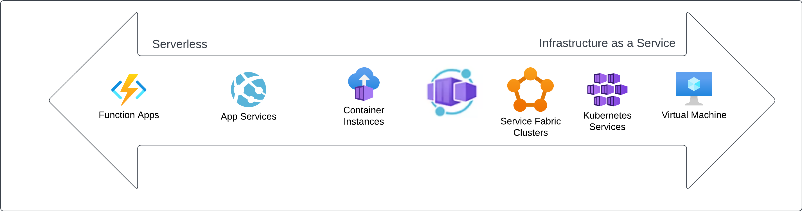

Azure offers wide range of different hosting options that will host and run application code. The available option range from full control of the machine, including the operating system, to fully managed serverless services.

The most popular Azure hosting options supported by NServiceBus are:

* [Azure Functions](/nservicebus/hosting/azure-functions-service-bus/)
* [ASP.NET Core on App Services](/nservicebus/hosting/asp-net.md)
* [Background tasks using WebJobs](https://learn.microsoft.com/en-us/azure/app-service/webjobs-create)
* Azure Container Instances using [docker container host](/nservicebus/hosting/docker-host/)
* Azure Container Apps using [docker container host](/nservicebus/hosting/docker-host/)
* Azure Kubernetes Services using [docker container host](/nservicebus/hosting/docker-host/)
* Virtual Machines using the [Microsoft Generic Host](/nservicebus/hosting/extensions-hosting.md) or [Windows Services](/nservicebus/hosting/windows-service.md)

[Explore all available NServiceBus hosting options](/nservicebus/hosting/selecting.md).

The right hosting option may depend on desired characteristics like:

* Scalability: Different hosting options offer different approaches to scaling. Managed solutions are typically easier to scale on demand and can scale in more granular levels. In addition to the scalability itself, elasticity (the time required to scale up or down) might also be a decision criteria.
* Pricing: Managed services typically offer more dynamic pricing models that adjust to the actual consumption of the application compared to more fixed pricing models for infrastructure services. However, managed services typically charge more for their pricing units, making infrastructure highly competitive for consistent demand.
* Portability: Serverless models are primarily built on proprietery programming models heavily tied to the cloud service vendor. hosting models built on open standards make it easier to run applications in other hosting environments. Additionally, consider whether the software should also be able to run in on-premises hardware or on local machines.
* Flexibility: Lower-level infrastructure provides more control over the configuration and management of applications. Serverless offerings offer less flexibility due to higher levels of abstractions exposed to the developers.

For further information about Azure hosting options, refer to [Microsoft's compute service overview](https://learn.microsoft.com/en-us/azure/architecture/guide/technology-choices/compute-decision-tree).