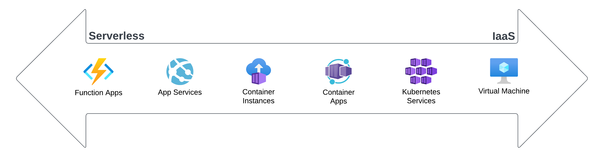

Azure offers a [wide variety of options](https://learn.microsoft.com/en-us/azure/architecture/guide/technology-choices/compute-decision-tree) for hosting and running system components, ranging from full control of a virtual machine, including the operating system, to fully managed services.

The Particular Service Platform may be hosted using several Azure hosting models:

## Serverless

In serverless (also referred to as "Functions as a service (FaaS)") models, code is deployed directly to the service which runs it.

[Azure Functions](https://azure.microsoft.com/en-us/products/functions) is Azure's serverless hosting model. NServiceBus supports integration with Azure Functions that allows deployment of new or existing NServiceBus applications into serverless environments with minimal effort. NServiceBus applications on Azure Functions can directly consume messages from Azure Service Bus. [Other Azure Functions triggers](https://learn.microsoft.com/en-us/azure/azure-functions/functions-triggers-bindings?tabs=csharp) can also [use NServiceBus to send messages to Azure Service Bus](/nservicebus/hosting/azure-functions-service-bus/#usage-dispatching-outside-a-message-handler.md).

[**Host NServiceBus applications on Azure Functions →**](/nservicebus/hosting/azure-functions-service-bus/)

## Platform as a Service

[Platform as a Service (PaaS)](https://en.wikipedia.org/wiki/Platform_as_a_service) models provide managed hosting environments where applications can be deployed without having to manage the underlying infrastructure, operating system, or runtime environments.

### Azure App Services

[Azure App Services](https://azure.microsoft.com/en-us/products/app-service/) has native support for deployment of .NET applications. NServiceBus endpoints can be integrated into [ASP.NET Core web applications](/nservicebus/hosting/asp-net.md) or run as background tasks using [WebJobs](https://learn.microsoft.com/en-us/azure/app-service/webjobs-create).

### Containers

[Containers](https://en.wikipedia.org/wiki/Containerization_(computing)) are a popular mechanism to deploy and host applications in PaaS services. NServiceBus can be used by containerized applications and deployed to services like:

* [Azure App Services](https://azure.microsoft.com/en-us/products/app-service/) (using containers)
* [Azure Container Instances](https://azure.microsoft.com/en-us/products/container-instances/)
* [Azure Container Apps](https://azure.microsoft.com/en-us/products/container-apps/)
* [Azure Kubernetes Services](https://azure.microsoft.com/en-us/products/kubernetes-service/)

[**Host NServiceBus applications in Docker containers →**](/nservicebus/hosting/docker-host/)

## Infrastructure as a Service

Infrastructure as a Service (IaaS) provides virtualized computing resources like virtual machines, storage, and networking that can be used to build and manage the required infrastructure.

NServiceBus applications can easily be hosted on virtual machines. Popular techniques include:

* [Integrating NServiceBus with the Microsoft Generic Host](/nservicebus/hosting/extensions-hosting.md)
* [Custom hosted web applications](/nservicebus/hosting/web-application.md)
* [Installing NServiceBus endpoints as Windows Services](/nservicebus/hosting/windows-service.md)
* [Manually controlling NServiceBus lifecycle in an executable (e.g. Console or GUI applications)](/nservicebus/hosting/#self-hosting)
* [Custom-managed Kubernetes clusters hosting container applications](/nservicebus/hosting/docker-host)

## Choosing a hosting model

The best choice of hosting model depends on the desired characteristics, such as:

* **Scalability**: Different hosting options offer different approaches to scaling. Managed solutions are typically easier to scale on demand and can scale on more granular levels. In addition to the scalability, elasticity (the time required to scale up or down) may also factor into the choice. Azure documentation provides more information about [subscription and service limits](https://learn.microsoft.com/en-us/azure/azure-resource-manager/management/azure-subscription-service-limits).
* **Pricing:** Managed services typically offer more dynamic pricing models that adjust with the demands of an application, in comparison with more rigid pricing models for infrastructure services. However, managed services typically charge more for their pricing units, so infrastructure services may be more economical for consistent demand. Azure offers a [pricing calculator](https://azure.microsoft.com/en-us/pricing/calculator/) to help understand a given service's pricing model.
* **Portability:** Serverless models are primarily built on proprietary programming models, heavily tied to the cloud service vendor. Hosting models built on open standards make it easier to run components in other hosting environments. Additionally, it may also be desirable to run components using on-premises servers or workstations.
* **Flexibility:** Lower-level infrastructure provides more control over the configuration and management of applications. Serverless offerings offer less flexibility due to the higher level of abstractions exposed to the code.
* **Manageability:** Serverless and PaaS models remove the concerns about the underlying infrastructure challenges (e.g. automatic scaling, OS updates, load balancing, etc.), typically at the cost of flexibility. Managing and maintaining infrastructure using other models may require significant resources and knowledge.

## Additional resources

* [Microsoft compute service overview](https://learn.microsoft.com/en-us/azure/architecture/guide/technology-choices/compute-decision-tree)
* [Selecting a host for NServiceBus endpoints](/nservicebus/hosting/selecting.md)
* [Azure compute options for microservices](https://learn.microsoft.com/en-us/azure/architecture/microservices/design/compute-options)
* [Azure pricing](https://azure.microsoft.com/en-us/pricing/)
