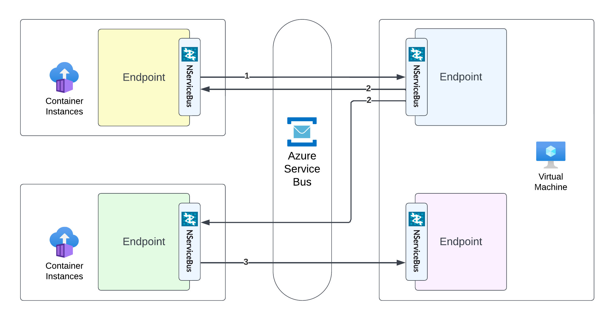

The Azure Architecture Center describes the [event-driven architecture style](https://learn.microsoft.com/en-us/azure/architecture/guide/architecture-styles/event-driven) as consisting of event producers and event consumers which can use the [publish/subscribe](https://learn.microsoft.com/en-us/azure/architecture/patterns/publisher-subscriber) (also called pub/sub) model.

The Particular Service Platform implements [pub/sub](/nservicebus/messaging/publish-subscribe/), with each [NServiceBus endpoint](/nservicebus/endpoints) acting as a publisher (event producer) and/or subscriber (endpoint consumer).

### Components

* NServiceBus publisher (event producer): Publishes events with business meaning in a reliable fire-and-forget style and has no knowledge of subscribers (there may be none).
* NServiceBus subscriber (event consumer): Subscribed to a specific event type and reacts to it. A subscriber may also be an event publisher, since processing an event may lead to publishing more events.
* Azure Service Bus message queue: The message queue brings together publisher and subscriber without them explicitly referencing or depending on each other.

### Challenges

* Event order: Subscribers cannot rely on the order they receive published events, which may be affected by many factors such as concurrency, scaling, retries, partitioning, etc. Events and subscribers should be designed so that they [do not rely on strict ordering to execute business processes](https://particular.net/blog/you-dont-need-ordered-delivery).
* Event data: messages passing through service boundaries should not contain any data. If they do, that may indicate sub-optimal service boundaries, perhaps drawn along technical constraints rather than business rules. Events should be designed as [lightweight contracts](https://particular.net/blog/putting-your-events-on-a-diet).

### Technology choices

In event-driven architectures, components are decoupled, allowing choice of the most suitable [compute](compute.md) and [data store](data-stores.md) options for a specific component or set of components.

An event-driven approach requires the queuing system to support the publish-subscribe model. NServiceBus supports the publish-subscribe model for [both Azure Service Bus and Azure Storage Queues](messaging.md), independent of the underlying queuing system’s capabilities.

## Related content

* [Azure Architecture Center—Event-driven architecture style](https://learn.microsoft.com/en-us/azure/architecture/guide/architecture-styles/event-driven)
