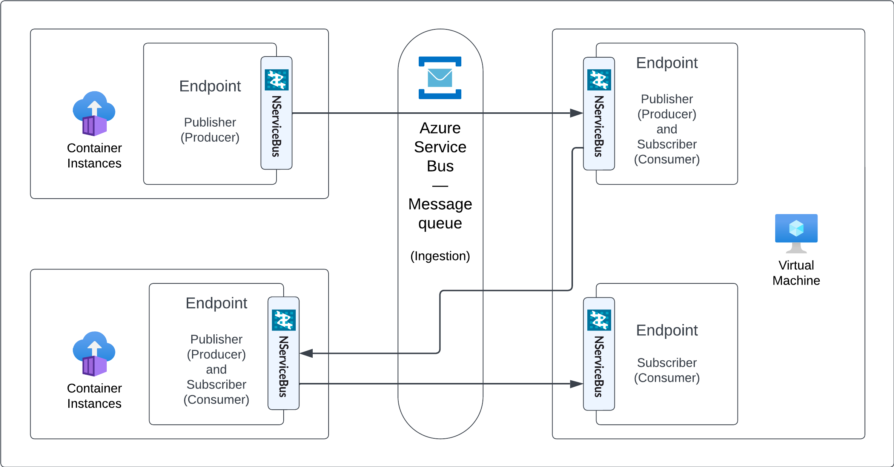

include: architecture-style-note

Event-driven architectures contain decoupled event processing components that asychronously receive and process messages. Using publish/subscribe communication decouples components.

### Components

* Event Publisher: A component publishes events for meaningful business events in a reliable fire-and-forget style. It has no knowledge about the subscribed components (there may be none).
* Event Subscribers: A component that subscribed to a specific event to react to it. A subscriber might also be an event publisher at the same time, as processing events might lead to further business events.
* Message queue: The message queue brings together publisher and subscriber without having the components requiring explicit references or dependencies of each other.

### Challenges

* Message order: Subscribers cannot rely on a strict order of incoming messages. There are many factors like concurrency, scaling, retries, partitioning, etc. that might cause to arrive in different order at subscribers. Well-defined events don't require strict ordering to successfully execute their business processes. Read [this blog post](https://particular.net/blog/you-dont-need-ordered-delivery) for more details.
* event data: messages containing too much data can be an indication of technical instead of domain partitioned service boundaries. In combination with ordering limitations, event-driven architecture is not a good solution to synchronize data across a message queue. Read [putting events on a dient](https://particular.net/blog/putting-your-events-on-a-diet) for more guidance on how to design lightweight event contracts.

### Technology choices

Event-driven architectures are very flexible about technology choices. Due to the strong decoupling between components, the most suitable computing and database option can be chosen for a specific component or set of components.

The message queue requires support for publish/subscribe communication. NServiceBus can provide pub/sub communication for both Azure Service Bus and Azure Storage Queues. Refer to the messaging technology options documentation to read more about finding the appropriate messaging service.