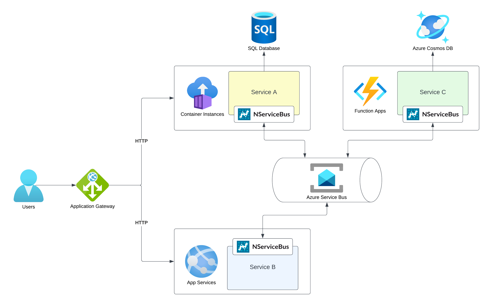
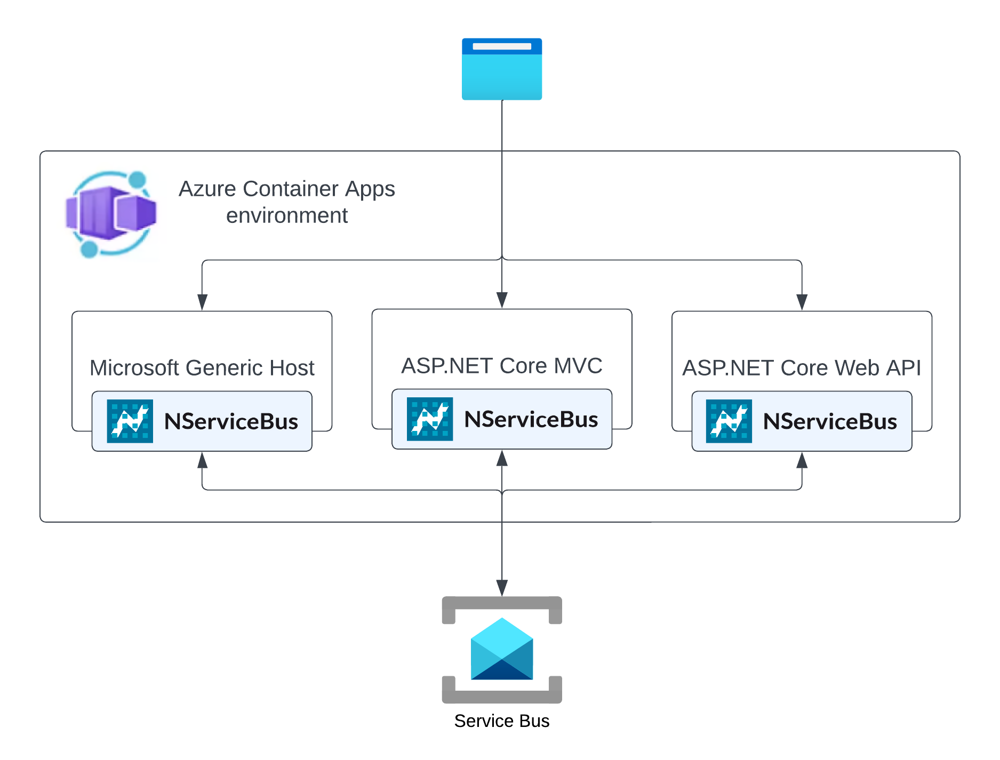

include: architecture-style-note

[Microservices architectures](https://learn.microsoft.com/en-us/azure/architecture/guide/architecture-styles/microservices) structure applications as a collection of small, independently deployable, looosely coupled, and autonomous services. The microservice style is suitable for more complex scenarios where multiple teams are involved building large scale distributed systems.

## Architecture components

Microservices architectures often contain the following components:

* Services: Each service is an autonomously deployable and scalable unit that has its own, private [data storage](data-stores.md).
* [Message broker](messaging.md): Asynchronous communication via messaging provides the necessary decoupling between services while providing a reliable and fault-tolerant communication channel.
* Gateway: Gateways act as a facade to the user, hiding the the actual service implementations to the public. Gateways can also take on further operational responsiblities and cross-cutting concerns, but should not contain domain-specific logic. Azure offers a [range of different gateway services](https://learn.microsoft.com/en-us/azure/architecture/microservices/design/gateway).

## Microservice challenges

### Finding service boundaries

Finding the right service boundaries is one of the biggest challenges of any microservice architecture. Incorrect boundaries will lead violation of data isolation and excessive inter-service communication. This can lead to high coupling between services in order to implement a business processes, often referred to as a distributed monolith. Focusing on domain partitioning instead of technical partitioning is crucial to define autonomous service boundaries. 

<iframe allowfullscreen frameborder="0" height="300" mozallowfullscreen src="https://player.vimeo.com/video/113515335" webkitallowfullscreen width="400"></iframe>

In this presentation Udi Dahan explains the process of finding the right service boundaries. The presentation explains challenges with traditional layered architectures and covers an approach that cuts across all application layers, outlining the inherent lines of loose and tight coupling. Finally, Udi shows how these vertical services collaborate using events, enabling flexible and high performance business processes.

[**Blog post: Goodbye microservices, hello right-sized services →**](https://particular.net/blog/goodbye-microservices-hello-right-sized-services)

###  RPC vs. Messaging

Communication across services is much slower and error-prone due to network limitations compared to communication between modules inside a single process. This can lead to higher latency and increased risk of being affected by network outages. Implementing cross-service interactions using asynchronous communication patterns help to mitigate these risks.

[**Read more about this topic: RPC vs. Messaging – which is faster?  →**](https://particular.net/blog/rpc-vs-messaging-which-is-faster)

### User interfaces

Users interacting with the system often need to see data aggregated from multiple services. Maintaining high decoupling across services while providing meaningful user experiences. A wide range of technologies and patterns exist that are focusing on this problem type, e.g. Microfrontends, GrapQL, ViewModel Composition, etc. 

## Microservice technologies

A major benefit of a microservices architecture is the easy integration of various technologies and services. Since each service runs in its own process and doesn't share the data storage, teams can chose the most appropriate technologies for a service without impacting other services or teams. The Particular Platform supports [Cross-platform integration with native message processing](https://particular.net/blog/cross-platform-integration-with-nservicebus-native-message-processing).

For cloud native microservices architectures, services are commonly hosted using serverless or container hosting models:

### Serverless

Fully managed serverless offerings like [Azure Functions](https://azure.microsoft.com/en-us/products/functions) and [Azure App Services](https://azure.microsoft.com/en-us/products/app-service/) are popular choices when development teams need powerful and scalable hosting environments that require little management effort. 
Serverless hosting models also integrate seamlessly into serverless data storage and messaging technologies.

### Containers

Containerized applications can be hosted in managed container orchestration platforms like Azure Container Apps or Azure Kubernetes Service. However, these applications can can also be hosted in custom managed Kubernetes clusters built upon Azure Virtual Machines. Even in container-focused systems, service communication and data storage might still be handled by serverless services like [Azure Service Bus](https://azure.microsoft.com/de-de/products/service-bus) or [Cosmos DB](https://azure.microsoft.com/de-de/products/cosmos-db/).

## Related content

* [Azure Architecture Center: Microservice architecture style](https://learn.microsoft.com/en-us/azure/architecture/guide/architecture-styles/microservices)
