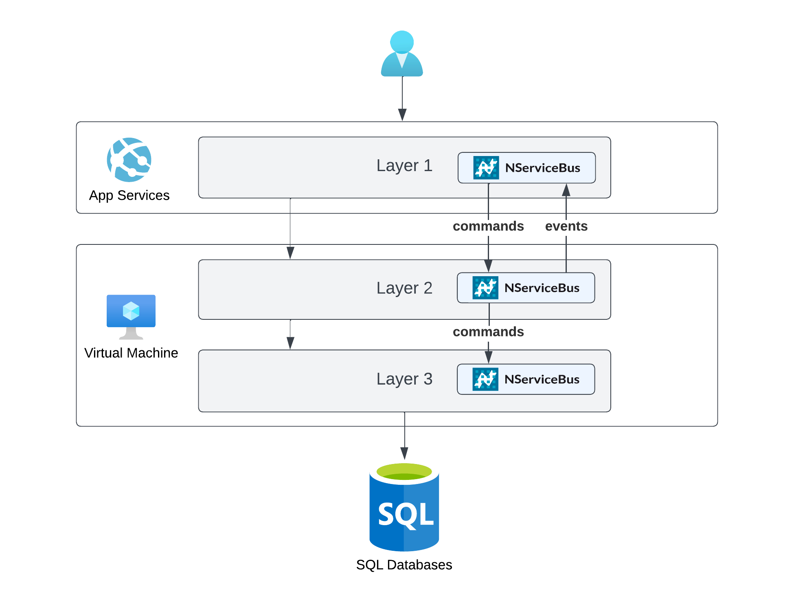

The Azure Architecture Center describes the [N-tier architecture style](https://learn.microsoft.com/en-us/azure/architecture/guide/architecture-styles/n-tier) (also referred to as the "layered" architecture style) as dividing an application into logical layers and physical tiers.

Messaging can help evolving and modernizing existing applications that have been built using layered architectures:

- Use asynchronous communication and clearly defined message contracts to more clearly separate layers.
- Use messaging to route existing messages to [extracted components](https://codeopinion.com/splitting-up-a-monolith-into-microservices/) running in separate processes.
- Use messaging to [get rid of batch jobs](https://particular.net/blog/death-to-the-batch-job).
- Use messaging to implement long-running or [time-dependent business processes](https://particular.net/webinars/got-the-time).

## Components

Typical components within an n-tier application are:

- Front end: Examples of these are web applications, desktop UIs, or mobile applications.
- Business logic: The business rules that model the solution space.
- Data: One or more databases containing all data models of the application.
- Message queue: Used for sending commands or publishing events between tiers.

### Challenges

N-tier architectures come with many benefits, but there are also trade-offs involved in adopting it:

- Physically separating the tiers introduces higher exposure to network related issues that might affect availability. The use of message queues helps to mitigate some of this by decoupling the tiers and increasing resilience across the layers.
- The tiers of an n-tier architecture style often communicate synchronously to execute business processes. Long-running or heavy workloads can negatively impact the user experience and overall system performance. Asynchronous communication using messaging decouples the tiers interacting with the user from the tiers processing the workload.
- Front end tiers often need to reflect changes made by other users or processes. Communication is generally initiated from front end layers to back end layers, but not the other way around. The use of messaging may be used to provide event-based notifications from the back end to the front end without introducing exceptions to this communication flow.

### Technology choices

Systems using n-tier architectures are often limited in their technology choices due to existing dependencies. [Infrastructure-as-a-Service services](/architecture/azure/compute.md#infrastructure-as-a-service) offer flexibility for creating environments that meet these requirements. Web-focused front-end or API layers might use managed hosted options like [Azure App Services](/architecture/azure/compute.md#platform-as-a-service-azure-app-services) without major changes. [Azure SQL services](/architecture/azure/data-stores.md#azure-sql-database) are a great way to move data persistence to the cloud with little effort, unlocking more flexible scaling opportunities.

## Related content

- [Azure Architecture Center—N-tier architecture style](https://learn.microsoft.com/en-us/azure/architecture/guide/architecture-styles/n-tier)
- [Azure migration guide overview](https://learn.microsoft.com/en-us/azure/cloud-adoption-framework/migrate/azure-migration-guide/)
