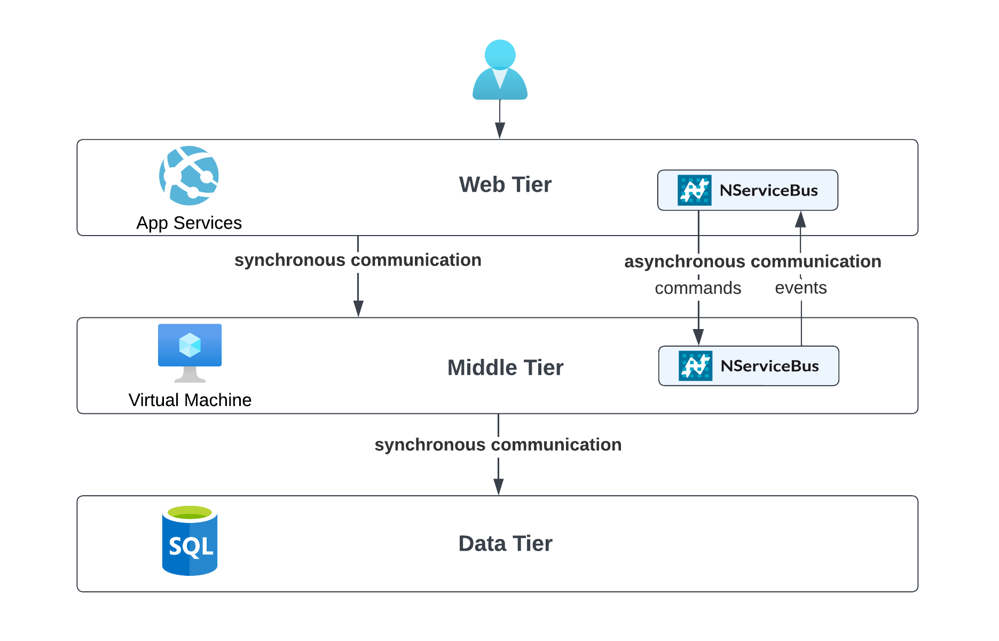

The Azure Architecture Center describes the [N-tier architecture style](https://learn.microsoft.com/en-us/azure/architecture/guide/architecture-styles/microservices) (also referred to as the "layered" architecture style) as dividing an application into logical layers and physical tiers.

Messaging can help evolving and modernizing existing applications that have been built using layered architectures:
* Use asynchronous communication and clearly defined message contracts to more clearly separate layers
* Use messaging to route existing messages to [extracted components](https://codeopinion.com/splitting-up-a-monolith-into-microservices/) running in separate processes
* Use messaging to [get rid of batch jobs](https://particular.net/blog/death-to-the-batch-job)
* Use messaging to implement long-running or [time-dependent business processes](https://particular.net/webinars/got-the-time)

### Components

* Front end layer: Often these are web applications or Desktop UIs physically separated from the other layers.
* Business logic layer: Contains the business logic
* Data layer: One or more databases containing all data models of the application.
* Message queue: used for sending commands from upper to lower layers and publishing events from lower layers to upper layers.

### Challenges

* Physically separating the tiers improves scalability of the application but also introduces higher exposure to network related issues that might affect availability. Message queues help to decouple the layers and increase resiliency across the layers.
* The layers in an N-tier architecture style often communicate synchronously to execute business processes. Long-running or heavy workloads can negatively impact the user experience and overall system performance. Asynchronous communication, using messaging, decouples the layer interacting with the user from the layers processing the workload.
* Front end layers often need to reflect changes made by other users or processes. Notifications from lower layers must respect the constraint that lower layer must not reference upper layers, and may be hosted separately from upper layers. Messaging may be used to provide event-based notifications from lower layers to upper layers, while following these constraints.
* As a technically partioned architecture, any particular business domain is spread throughout all of the layers. Changes to a domain are more difficult to implement as all layers have to be changed. Therefore, this architectural style does not work well with domain-driven design.

### Technology choices

Systems using layered architectures are often limited in their technology choices due to existing dependencies. [Infrastructure-as-a-Service services](/architecture/azure/compute.md#infrastructure-as-a-service) offer great flexibility to setup environments that fulfil these requirements. Web-focused front-end or API layers might use managed hosted options like [Azure App Services](/architecture/azure/compute.md#platform-as-a-service-azure-app-services) without major changes. [Azure SQL services](/architecture/azure/data-stores.md#azure-sql-database) are a great way to move data persistence to the cloud with little effort, unlocking more flexible scaling opportunities.

## Related content

* [Azure Architecture Center—N-tier architecture style](https://learn.microsoft.com/en-us/azure/architecture/guide/architecture-styles/n-tier)
