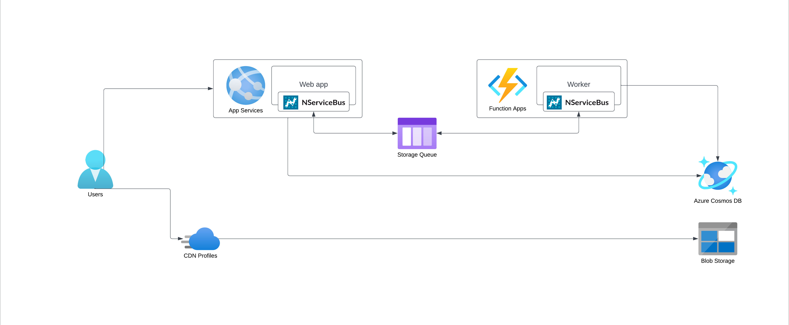

The Azure Architecture Center describes the [web-queue-worker architecture style](https://learn.microsoft.com/en-us/azure/architecture/guide/architecture-styles/web-queue-worker) as having core components that are a web front end that serves client requests, and a worker that performs resource-intensive tasks, long-running workflows, or batch jobs, with the web front end communicating with the worker through a message queue.

## Components

* The **web front end** serves client requests, handles authentication and authorization.
* The front end queues commands for intensive or long-running workloads in the **message queue** for the worker to consume. This allows the web application to remain independent of the worker's workload and to immediately respond to HTTP requests.
* **The worker** receives work from the message queue. Results can be stored in the data store.
* Both worker and front end might access the **data store** directly to access business data and process state. An optional **cache** might be used for performance optimizations.
* A **Content Delivery Network** can help to serve static content even faster and reduce load on the web front end.

## Challenges

This style is suitable for simple business domains. Without careful design, the front end and the worker can become complex, monolithic components that are difficult to maintain. Consider [event-driven](event-driven-architecture.md) and [microservices](microservices.md) architectural styles for more complex business domains.

## Technology choices

The web-queue-worker architecture style can make use of Azure's managed services like [Azure App Services](/architecture/azure/compute.md#platform-as-a-service-azure-app-services), [Azure Static Web Apps](https://azure.microsoft.com/en-us/products/app-service/static), [Azure Functions](/architecture/azure/compute.md#platform-as-a-service-azure-app-services), and [Cosmos DB](/architecture/azure/data-stores.md#azure-cosmos-db). [Azure Storage Queues](https://learn.microsoft.com/en-us/azure/storage/queues/) is a good messaging queuing solution for sending small messages. [Azure Service Bus](/architecture/azure/messaging.md#azure-service-bus) is a powerful alternative which caters to larger messages and provides other advanced features.

## Additional resources

* [Azure Architecture Center—Web-queue-worker architecture style](https://learn.microsoft.com/en-us/azure/architecture/guide/architecture-styles/web-queue-worker)
