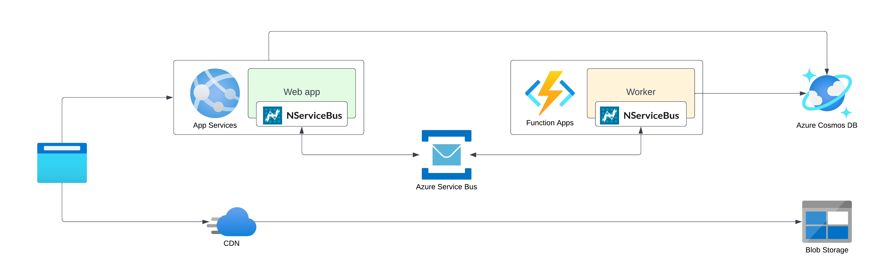

The Azure Architecture Center describes the [web-queue-worker architecture style](https://learn.microsoft.com/en-us/azure/architecture/guide/architecture-styles/web-queue-worker) as having core components that are a web front end that serves client requests, and a worker that performs resource-intensive tasks, long-running workflows, or batch jobs, with the web front end communicating with the worker through a message queue.

The Particular Service Platform... TBD

### Components

* The **web front end** serves client requests, handles authentication and authorization and might even access the database directly to handle time-sensitive requests or access results from the worker.
* The front end queues commands for intensive or long-running workloads in the **message queue** for the worker to consume. This allows the web application to remain independent of the worker's workload and to immediately respond to HTTP requests.
* **The worker** receives work from the message queue. Results can be stored in the data store.
* Both worker and front end might access the **data store** directly to access business data and process state.
* A **Content Delivery Network** can help to serve static content even faster and reduce load on the web front end.

### Technology choices

The web-queue-worker architecture style can make use of Azure's managed services like Azure App Services and Azure Functions, Cosmos DB, Azure SQL, Azure Service Bus, and Azure Queue Storage.

## Related content

* [Azure Architecture Center—Web-queue-worker architecture style](https://learn.microsoft.com/en-us/azure/architecture/guide/architecture-styles/web-queue-worker)