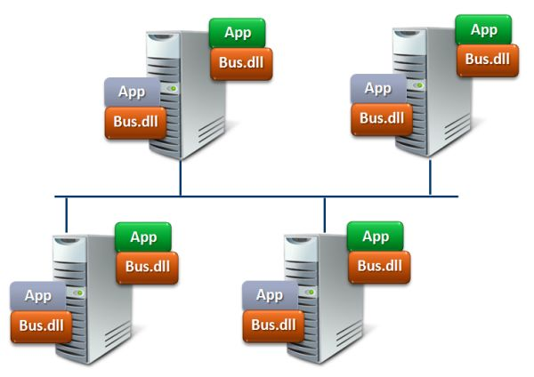

Messaging is typically used for communication and coordination between various components within a system. Messaging plays a crucial role in enabling flexible, robust, and scalable inter-process coordination required to build decoupled and reliable distributed architectures. The principles and patterns underlying messaging are decades old and battle-tested through countless technological shifts.

## Message systems

A message broker like RabbitMQ, Azure Service Bus, or Amazon SQS, can be compared with a database, but instead of storing data and indexing it, it focuses on transferring data from one component to another. A component calls an API to send a message, and the API responds after the message is received. At that point, the calling component is no longer concerned about the delivery of the message to other components. That is the responsibility of the broker.

Due to the asynchronous nature of messaging, the calling component has no knowledge of problems that receiving components might have; as soon as the message is sent, messaging infrastructure takes over. As a result, critical resources like threads are not held waiting for message processing to complete. This allows the calling component to maintain stability while waiting for a response from another component, which may be running in a separate process or on another machine.

Additional benefits of messaging systems:

- **Temporal decoupling:** The sender and receiver are _temporally decoupled_ from each other. This means the sender and receiver execute their work independently in time. As a result, there is no time-based availability dependency between the sender and the receiver. The sender and receiver don't even need to be running at the same time.
- **Load balancing:** Receivers can be scaled up independently from senders to handle messages in a queue.
- **Load leveling:** Senders don't need to worry about the throughput of receivers. They can keep queueing messages regardless of how they are being consumed by receivers.
- **Reliable communication:** Messages are safely stored in the broker, ensuring that no messages are lost during failures.

The Particular Service Platform offers a common set of features available in supported messaging technologies as [transports](/transports), which fill in any missing native capabilities as necessary. Building blocks like [recoverability](/architecture/recoverability.md), the [outbox](/architecture/consistency.md#transactions-outbox-pattern), and [monitoring](/monitoring/) are available on all transports. This simplifies the choice of messaging technology to comparing things like message size, pricing, and portability.

### Messaging vs. RPC

Applications can run using [remote procedure call (RPC)](https://en.wikipedia.org/wiki/Remote_procedure_call) techniques like web services (WCF or ASMX), HTTP API (ASP.NET WebAPI) or WebSockets (SignalR). However, scalability and fault tolerance are inherently hindered when using synchronous, blocking calls. Scaling up with more hardware usually has little effect.

Asynchronous communication using messages enables loose coupling between applications and makes communication more reliable because two or more components do not have to be running at the same time. There are no blocking calls with asynchronous, one-way messaging. Common, transient errors can be resolved automatically with retries, and it's easy to recover from failures that require manual intervention. Above all, even when a part of the system fails, no data is lost.

[**Blog: RPC vs. Messaging – Which is faster? →**](https://particular.net/blog/rpc-vs-messaging-which-is-faster)

## Communication styles

With messaging, communication is one-way and [asynchronous](https://en.wikipedia.org/wiki/Asynchronous_method_invocation). An immediate response with a return value is not possible, although it is possible to respond with another message.

_Asynchronous communication_ should not be confused with _asynchronous execution_, where multiple threads execute code in parallel. The async/await concepts in .NET are an example of asynchronous execution. This is different from asynchronous communication where two components communicate with messages.

### Point-to-point channels

[Point-to-point channels](https://www.enterpriseintegrationpatterns.com/patterns/messaging/PointToPointChannel.html) enable one-way messaging where a component sends a message to another component via a messaging system. Point-to-point channels can be used to send messages to a single, specific consumer.

#### Commands

Messages sent using point-to-point channels are typically called [_commands_](/nservicebus/messaging/messages-events-commands.md). The sender requires knowledge of the intended destination for the message and the message describes an action that the sender wants the receiver to perform. For example: _submit order_, _cancel order_, or _update inventory_. Point-to-point message communication is semantically similar to asynchronous remote procedure calls. Point-to-point channels can be combined into various patterns.

**Read more about [how command are used in NServiceBus](/nservicebus/messaging/messages-events-commands.md). →**

#### Request/reply pattern

Messaging is one way, but requests may still be replied to using the [request/reply pattern](/nservicebus/messaging/reply-to-a-message.md). Request/reply is a common pattern in distributed systems, using two one-way messages, to allow a component to request information from another component. The components retain the benefits of messaging such as temporal decoupling.

From a network perspective, request/response is just two one-way interactions:

This communication pattern is particularly important for servers, allowing them to maintain stability when communicating with clients with problematic network connections or stability issues. If a client crashes or loses its network connection after sending the request, but before the server sends a response, the server will not have resources tied up waiting for a connection to time out.

#### Callback pattern

Occasionally a scenario exists where a message sender has to wait for a response before doing anything else (also referred to as a "blocking call"). This often occurs in existing systems where messaging is introduced but the user interface is designed to wait for a response. Instead of an immediate and partial (but often large) rewrite of the user interface, the [callback pattern](/nservicebus/messaging/callbacks.md) can be used to wait for a response.

### Publish/subscribe pattern

Instead of sending a message to a single specific receiver, with the [publish/subscribe pattern](/nservicebus/messaging/publish-subscribe) the sender is logically unaware of potential receivers.

With this pattern, a message sender has no knowledge of whether any subscribers exist or the details of any subscribers.

Publishing a message differs from sending a message in two ways:

1. There can be multiple receivers (subscribers)
2. The receivers are unknown during the design of the sender

One of the biggest benefits is that additional receivers can be added later, at runtime, without modifying the sender. This means that, in addition to temporal decoupling, the sender is also logically decoupled from any potential receiver. The messaging system takes care of subscriptions and ensures published messages are delivered to subscribers.

#### Events

Messages that are published are called [_events_](/nservicebus/messaging/messages-events-commands.md). Events describe things that have happened. For example: _order canceled_, _product went out of stock_, or _shipping delayed_. Sometimes an event is published after handling a command. For example, successful handling of a _cancel order_ command may result in publishing an _order canceled_ event. A publisher does not have to publish an event after handling a command, but it is a common scenario.

**Read more about [how events are used in NServiceBus](/nservicebus/messaging/messages-events-commands.md).→**

## Command query separation

Many systems provide users with the ability to search, filter, sort, and change data. In some client-server systems, a server simply exposes all [create, read, update, and delete (CRUD)](https://en.wikipedia.org/wiki/Create,_read,_update_and_delete) operations to the client. However, when the same database table is used both to perform CRUD operations in a highly consistent manner while handling commands and to query data for users to read, those commands and queries contend with each other. This often results in poor system performance, both for commands and queries.

This problem can be avoided by separating commands and queries at the system level, above even the client and server. This solution takes advantage of the fact that in many, or even most, scenarios, the data returned to users does not have to be completely up to date; it can be slightly out of date without causing significant problems (also referred to as ["eventual consistency"](https://en.wikipedia.org/wiki/Eventual_consistency)).

With this approach, there are two components that each span both client and server. One component handles commands and the other responds to queries. The components communicate using only messages and their data is held separately, possibly even in separate databases, servers, or storage technologies. One component cannot access the other's data:

The command component publishes messages and the query component subscribes to them. When the query component receives a message, it stores appropriate data in a schema that is optimized for queries, such as a star schema in a database or a cache of JSON documents. It may also cache some query responses in memory.

## Bus versus broker architectural styles

A _service bus_ is often illustrated as a central box, through which all communication goes. Despite the common understanding, that's actually a description of the [_broker architectural pattern_](https://en.wikipedia.org/wiki/Broker_pattern).

A **_message bus_** in the context of the [_bus architectural pattern_](https://www.enterpriseintegrationpatterns.com/patterns/messaging/MessageBus.html), isn't a physical entity. There might be no physical _bus_ one can point to in the network topology. The _bus_ is part of the infrastructure that is run in-process with a given application's code. It's similar to a peer-to-peer mesh that runs alongside code.

## Additional resources

- Gregor Hohpe's [Enterprise Integration Patterns](https://www.enterpriseintegrationpatterns.com/) website and accompanying book.
- [More videos and presentations](https://particular.net/videos) about distributed systems design
